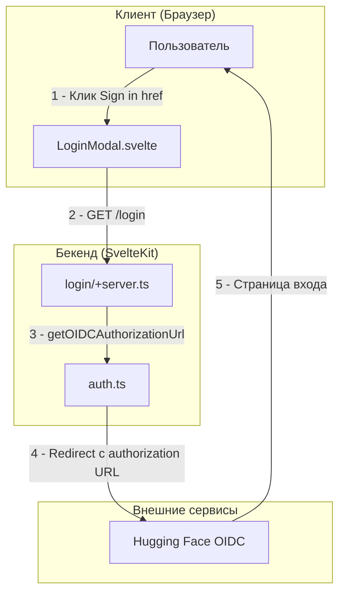

# Поддиаграмма 1: Инициация входа

## Термины и аббревиатуры

**OIDC (OpenID Connect)** - стандарт аутентификации, который позволяет пользователям входить в приложения через внешние провайдеры (например, Google, Facebook, Hugging Face). Это расширение OAuth 2.0, которое добавляет информацию о пользователе.

**CSRF (Cross-Site Request Forgery)** - тип атаки, при которой злоумышленник заставляет пользователя выполнить нежелательные действия в приложении, где пользователь аутентифицирован. Защита от CSRF включает использование специальных токенов.

**Authorization URL** - специальная ссылка, которая перенаправляет пользователя на страницу входа внешнего провайдера. Содержит параметры для идентификации приложения и настройки аутентификации.

**SvelteKit** - фреймворк для создания веб-приложений на основе Svelte. Предоставляет серверный рендеринг, маршрутизацию и API endpoints.

## Визуальная диаграмма



## Передаваемые данные (JSON)

### **Шаг 1: Клик Sign in**

**Действие:** Пользователь нажимает ссылку "Sign in" в модальном окне входа, что инициирует процесс аутентификации.

**Тип данных:** HTML ссылка с href атрибутом, которая перенаправляет браузер на серверный endpoint.

**Результат:** Браузер перенаправляется на серверный endpoint `/login` для начала OIDC процесса аутентификации.

**Пример кода из src/lib/components/LoginModal.svelte (строки 33-43):**
```svelte
<!-- Кнопка входа в модальном окне -->
<a
  href="{base}/login"  <!-- Ссылка на серверный endpoint для инициации входа -->
  class="flex w-full flex-wrap items-center justify-center whitespace-nowrap rounded-full bg-black px-5 py-2 text-center text-lg font-semibold text-gray-100 transition-colors hover:bg-gray-900"
>
  Sign in  <!-- Текст кнопки входа -->
  {#if publicConfig.isHuggingChat}  <!-- Условное отображение для Hugging Face брендинга -->
    <span class="flex items-center">
      &nbsp;with <LogoHuggingFaceBorderless classNames="text-xl mr-1 ml-1.5" /> Hugging Face  <!-- Логотип и текст Hugging Face -->
    </span>
  {/if}
</a>
```

**Данные события:**
```json
{
  "action": "click",                    // Тип действия пользователя
  "element": "sign-in-button",          // ID элемента, на который нажали
  "timestamp": "2024-01-01T12:00:00Z"  // Время клика для логирования
}
```

### **Шаг 2: GET /login**

**Действие:** Браузер отправляет HTTP GET запрос на серверный endpoint `/login` для инициации процесса аутентификации.

**Тип данных:** HTTP GET запрос с заголовками браузера, обрабатываемый SvelteKit route handler.

**Результат:** Сервер определяет redirect URI, создает authorization URL через getOIDCAuthorizationUrl и перенаправляет браузер на OIDC провайдер с HTTP 302 редиректом.

**Пример кода из src/routes/login/+server.ts (строки 1-29):**
```typescript
// src/routes/login/+server.ts
import { getOIDCAuthorizationUrl } from "$lib/server/auth";  // Импорт функции для создания authorization URL
import { base } from "$app/paths";  // Импорт базового пути приложения
import { config } from "$lib/server/config";  // Импорт конфигурации сервера

export async function GET({ request, url, locals }) {  // Обработчик GET запроса
  const referer = request.headers.get("referer");  // Получение referer заголовка для определения origin
  let redirectURI = `${(referer ? new URL(referer) : url).origin}${base}/login/callback`;  // Формирование redirect URI

  // TODO: Handle errors if provider is not responding

  if (url.searchParams.has("callback")) {  // Проверка наличия callback параметра в URL
    const callback = url.searchParams.get("callback") || redirectURI;  // Получение callback URL
    if (config.ALTERNATIVE_REDIRECT_URLS.includes(callback)) {  // Проверка в списке разрешенных URL
      redirectURI = callback;  // Использование альтернативного redirect URI
    }
  }

  const authorizationUrl = await getOIDCAuthorizationUrl(  // Создание authorization URL
    { redirectURI },  // Передача redirect URI
    { sessionId: locals.sessionId }  // Передача session ID для генерации CSRF токена
  );

  return new Response(null, {  // Возврат HTTP 302 редиректа
    status: 302,  // HTTP статус редиректа
    headers: {
      Location: authorizationUrl,  // URL для перенаправления
    },
  });
}
```

**HTTP запрос:**
```json
{
  "method": "GET",                                    // HTTP метод
  "url": "/login",                                    // Путь к endpoint
  "headers": {
    "User-Agent": "Mozilla/5.0 (Windows NT 10.0; Win64; x64) AppleWebKit/537.36", // Информация о браузере
    "Accept": "text/html,application/xhtml+xml,application/xml;q=0.9,*/*;q=0.8",    // Поддерживаемые типы контента
    "Accept-Language": "en-US,en;q=0.5",             // Предпочитаемые языки
    "Accept-Encoding": "gzip, deflate",               // Поддерживаемые методы сжатия
    "Connection": "keep-alive"                        // Тип соединения
  }
}
```

### **Шаг 3: getOIDCAuthorizationUrl()**

**Действие:** Сервер вызывает функцию для создания authorization URL с параметрами OIDC, включая CSRF токен и конфигурацию приложения.

**Тип данных:** Функция принимает объект с настройками OIDC и sessionId, возвращает строку с полным authorization URL для OIDC провайдера.

**Результат:** Создается полный URL для перенаправления пользователя на страницу входа OIDC провайдера с правильными параметрами безопасности.

**Пример кода из src/lib/server/auth.ts (строки 132-144):**
```typescript
// src/lib/server/auth.ts
export async function getOIDCAuthorizationUrl(
  settings: OIDCSettings,  // Настройки OIDC (client_id, redirect_uri, etc.)
  params: { sessionId: string }  // Параметры с session ID для генерации CSRF токена
): Promise<string> {
  const client = await getOIDCClient(settings);  // Создание OIDC клиента с настройками
  const csrfToken = await generateCsrfToken(params.sessionId, settings.redirectURI);  // Генерация CSRF токена с подписью

  return client.authorizationUrl({  // Создание authorization URL через openid-client
    scope: OIDConfig.SCOPES,  // Запрашиваемые разрешения (openid, profile, email)
    state: csrfToken,  // CSRF токен для защиты от атак
    resource: OIDConfig.RESOURCE || undefined,  // Ресурс для Microsoft Entra (опционально)
  });
}
```

**Вызов функции:**
```json
{
  "function": "getOIDCAuthorizationUrl",                 // Название функции
  "parameters": {
    "settings": {
      "redirectURI": "https://chat-ui.example.com/login/callback" // URL для возврата после входа
    },
    "params": {
      "sessionId": "session_id_here"                     // ID сессии для генерации CSRF токена
    }
  },
  "returns": {
    "authorizationUrl": "https://huggingface.co/oauth/authorize?client_id=xxx&redirect_uri=xxx&state=xxx&scope=openid+profile+email&response_type=code"
  }
}
```

### **Шаг 4: Redirect с authorization URL**

**Действие:** Сервер отправляет HTTP 302 редирект с authorization URL, который перенаправляет браузер на страницу входа OIDC провайдера.

**Тип данных:** HTTP ответ с кодом 302 (Found) и заголовком Location, содержащим полный authorization URL.

**Результат:** Браузер автоматически перенаправляется на страницу входа Hugging Face с правильными параметрами OAuth для начала процесса аутентификации.

**HTTP ответ:**
```json
{
  "status": 302,                                          // HTTP код редиректа
  "headers": {
    "Location": "https://huggingface.co/oauth/authorize?client_id=xxx&redirect_uri=xxx&state=xxx&scope=openid+profile+email&response_type=code", // URL для перенаправления
    "Set-Cookie": "oauth_state=csrf_token_here; HttpOnly; Secure; SameSite=Lax; Max-Age=600" // CSRF токен в cookie
  }
}
```

### **Шаг 5: Страница входа**

**Действие:** Браузер загружает страницу входа Hugging Face, где пользователь может ввести свои учетные данные для аутентификации.

**Тип данных:** HTML страница с формой входа, содержащая поля для email/username и пароля, а также параметры OAuth в URL.

**Результат:** Пользователь видит страницу входа и может ввести свои учетные данные для получения доступа к приложению через OIDC.

**Структура страницы:**
```json
{
  "page": "OIDC Login Page",                              // Тип страницы
  "url": "https://huggingface.co/oauth/authorize?...",   // URL страницы входа
  "content": {
    "title": "Sign in to Hugging Face",                   // Заголовок страницы
    "form": {
      "username": "input field",                          // Поле для email/username
      "password": "input field",                          // Поле для пароля
      "submit": "Sign in button"                          // Кнопка отправки формы
    },
    "oauth_params": {                                     // Параметры OAuth в URL
      "client_id": "chat_ui_app_id",                      // ID приложения
      "redirect_uri": "https://chat-ui.example.com/login/callback", // URL возврата
      "state": "csrf_token_here",                         // CSRF токен
      "scope": "openid profile email"                     // Запрашиваемые разрешения
    }
  }
}
```

## Описание блоков

### **Пользователь**

**Что это:** Конечный пользователь системы Chat UI - человек, который хочет войти в приложение

**Задача:** Инициировать процесс аутентификации, предоставить учетные данные для входа в систему

**Файлы проекта:** Не применимо (человек)

**Ключевые функции:**
- Нажатие кнопки "Sign in" в модальном окне
- Ввод учетных данных на странице OIDC провайдера
- Инициация процесса аутентификации

### **LoginModal.svelte**

**Что это:** Svelte компонент модального окна входа - пользовательский интерфейс для инициации аутентификации

**Задача:** Предоставить пользователю интерфейс для начала процесса входа и перенаправить на серверный endpoint

**Файлы проекта** src/lib/components/LoginModal.svelte

**Ключевые функции:**
- Показ модального окна входа
- Обработка клика по ссылке "Sign in"
- Перенаправление на `/login` endpoint через href
- Поддержка Hugging Face брендинга

### **login/+server.ts**

**Что это:** SvelteKit route handler для инициации входа - серверный endpoint, который обрабатывает запросы на `/login`

**Задача:** Обработать запрос на вход, сгенерировать CSRF токен и перенаправить пользователя на OIDC провайдер

**Файлы проекта:** src/routes/login/+server.ts

**Ключевые функции:**
- Определение redirect URI на основе referer или URL
- Поддержка альтернативных redirect URLs
- Создание authorization URL через getOIDCAuthorizationUrl
- HTTP 302 редирект на OIDC провайдер

### **auth.ts**

**Что это:** Основной модуль аутентификации - центральный модуль для работы с OIDC и управлением аутентификацией

**Задача:** Управлять OIDC интеграцией, генерировать authorization URL с CSRF защитой и содержать конфигурацию OIDC

**Файлы проекта:** src/lib/server/auth.ts

**Ключевые функции:**
- `getOIDCAuthorizationUrl()` - создание URL для перенаправления на OIDC
- `getOIDCClient()` - создание OIDC клиента с использованием библиотеки openid-client
- `generateCsrfToken()` - генерация CSRF токена с подписью
- Управление конфигурацией OIDC (client_id, redirect_uri, scopes)
- Поддержка различных OIDC провайдеров

### **Hugging Face OIDC**

**Что это:** OpenID Connect провайдер от Hugging Face - внешний сервис, который предоставляет аутентификацию

**Задача:** Предоставить страницу входа, валидировать учетные данные пользователя и выдать JWT токены после успешной аутентификации

**Файлы проекта:** 
- src/lib/server/auth.ts (строки 38-50, 111-117, 274-276) - конфигурация OIDC и API вызовы
- .env.local - переменные окружения OPENID_CONFIG с настройками подключения

**Ключевые функции:**
- Предоставление страницы входа для пользователей
- Валидация учетных данных (email/username и пароль)
- Выдача JWT токенов после успешной аутентификации
- Поддержка OIDC стандарта для безопасной аутентификации

## Сводка этапа

**Цель:** Инициировать процесс аутентификации через OIDC и перенаправить пользователя на страницу входа внешнего провайдера

**Результат:** Пользователь перенаправлен на страницу входа Hugging Face с правильными параметрами OAuth

**Ключевые моменты:** 
- **Безопасность:** Генерация CSRF токена (state) для защиты от атак Cross-Site Request Forgery
- **OIDC интеграция:** Создание authorization URL с правильными параметрами (client_id, redirect_uri, scope, response_type)
- **Перенаправление:** HTTP 302 редирект на внешний OIDC провайдер (Hugging Face)
- **Конфигурация:** Использование правильных scopes (openid, profile, email) для получения данных пользователя

**Технические детали:**
- CSRF токен сохраняется в cookie с параметрами безопасности (HttpOnly, Secure, SameSite)
- Authorization URL содержит все необходимые параметры OAuth 2.0 Authorization Code Flow
- Используется crypto.randomUUID() для генерации криптографически стойких токенов
- Обработка ошибок с перенаправлением на главную страницу при сбоях

**Следующий этап:** После ввода учетных данных на странице Hugging Face, пользователь будет перенаправлен обратно в приложение с authorization code для обмена на токены доступа.
