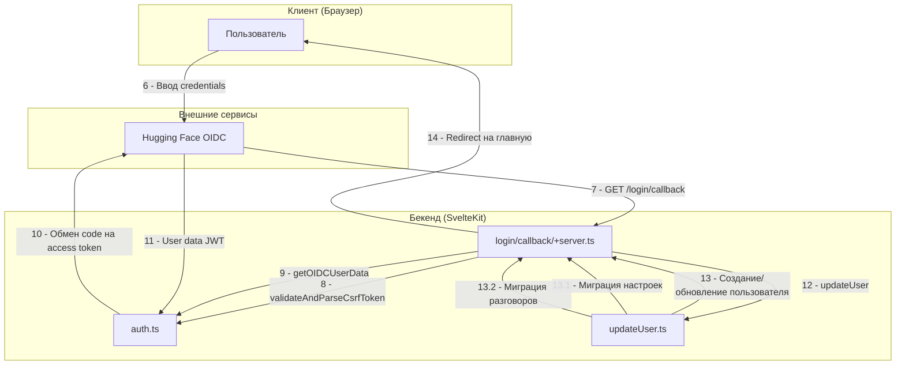

# Поддиаграмма 2: OIDC Callback

## Объяснение терминов

**OIDC Callback** - процесс возврата пользователя на приложение после успешной аутентификации в OIDC провайдере. OIDC провайдер перенаправляет браузер обратно на приложение с authorization code.

**Authorization Code** - временный код, который OIDC провайдер выдает после успешной аутентификации пользователя. Этот код используется для получения access token.

**CSRF Token Validation** - проверка токена защиты от межсайтовых атак. Обеспечивает, что запрос пришел от того же пользователя, который инициировал процесс входа.

**JWT (JSON Web Token)** - стандарт для безопасной передачи информации между сторонами в виде JSON объекта. Содержит данные пользователя и подпись для проверки подлинности.

**Userinfo Endpoint** - API endpoint OIDC провайдера, который возвращает информацию о пользователе после успешной аутентификации.

## Визуальная диаграмма



## Передаваемые данные (JSON)

### **Шаг 6: Ввод credentials**

**Действие:** Пользователь вводит свои учетные данные (email/username и пароль) на странице входа Hugging Face и нажимает кнопку "Sign in".

**Тип данных:** HTML форма с полями ввода, отправляемая через POST запрос на OIDC провайдер.

**Результат:** OIDC провайдер валидирует учетные данные и при успешной аутентификации перенаправляет браузер обратно на приложение с authorization code.

**Данные формы:**
```json
{
  "action": "submit",                                    // Тип действия - отправка формы
  "form": {
    "username": "user@example.com",                      // Email или username пользователя
    "password": "user_password"                          // Пароль пользователя
  },
  "timestamp": "2024-01-01T12:01:00Z"                   // Время отправки формы
}
```

### **Шаг 7: GET /login/callback**

**Действие:** Браузер автоматически перенаправляется на callback endpoint приложения с authorization code и CSRF токеном в URL параметрах.

**Тип данных:** HTTP GET запрос с query параметрами, содержащими authorization code и state (CSRF токен).

**Результат:** Сервер получает authorization code для обмена на access token и проверяет CSRF токен для безопасности.

**HTTP запрос:**
```json
{
  "method": "GET",                                       // HTTP метод
  "url": "/login/callback",                              // Путь к callback endpoint
  "query": {
    "code": "authorization_code_from_oidc",              // Временный код от OIDC провайдера
    "state": "csrf_token_here"                           // CSRF токен для проверки безопасности
  },
  "headers": {
    "User-Agent": "Mozilla/5.0...",                      // Информация о браузере
    "Cookie": "session=existing_session_id"              // Существующая сессия пользователя
  }
}
```

### **Шаг 8: validateAndParseCsrfToken()**

**Действие:** Сервер валидирует CSRF токен, полученный в параметре state, проверяя его подпись и срок действия для защиты от атак.

**Тип данных:** Функция принимает строку с CSRF токеном и sessionId, возвращает объект с redirectUrl или null при невалидном токене.

**Результат:** Подтверждается, что запрос пришел от того же пользователя, который инициировал процесс входа, обеспечивая безопасность от CSRF атак.

**Пример кода из src/lib/server/auth.ts (строки 158-185):**
```typescript
// src/lib/server/auth.ts
export async function validateAndParseCsrfToken(
	token: string,  // Base64-encoded CSRF токен из URL параметра state
	sessionId: string  // Session ID для проверки подписи
): Promise<{
	/** This is the redirect url that was passed to the OIDC provider */
	redirectUrl: string;
} | null> {
	try {
		const { data, signature } = z  // Парсинг JSON структуры токена
			.object({
				data: z.object({
					expiration: z.number().int(),  // Время истечения токена (timestamp)
					redirectUrl: z.string().url(),  // URL для возврата после аутентификации
				}),
				signature: z.string().length(64),  // SHA256 подпись токена (64 символа)
			})
			.parse(JSON.parse(token));  // Декодирование base64 и парсинг JSON

		const reconstructSign = await sha256(JSON.stringify(data) + "##" + sessionId);  // Воссоздание подписи

		if (data.expiration > Date.now() && signature === reconstructSign) {  // Проверка времени и подписи
			return { redirectUrl: data.redirectUrl };  // Возврат redirect URL при успешной валидации
		}
	} catch (e) {
		logger.error(e);  // Логирование ошибок валидации
	}
	return null;  // Возврат null при невалидном токене
}
```

**Вызов функции:**
```json
{
  "function": "validateAndParseCsrfToken",                 // Название функции
  "parameters": {
    "state": "csrf_token_here",                           // CSRF токен из URL параметра
    "sessionState": "stored_csrf_token"                   // SessionId для проверки подписи
  },
  "returns": {
    "valid": true,                                        // Результат валидации
    "csrfToken": "csrf_token_here"                        // Валидный токен
  }
}
```

### **Шаг 9: getOIDCUserData()**

**Действие:** Сервер обменивает authorization code на access token и получает данные пользователя от OIDC провайдера через userinfo endpoint.

**Тип данных:** Функция принимает настройки OIDC, authorization code и issuer, возвращает объект с данными пользователя.

**Результат:** Получаются данные пользователя (имя, email, аватар) в виде JWT токена для создания или обновления пользователя в системе.

**Пример кода из src/lib/server/auth.ts (строки 146-156):**
```typescript
// src/lib/server/auth.ts
export async function getOIDCUserData(
	settings: OIDCSettings,  // Настройки OIDC провайдера
	code: string,  // Authorization code от OIDC провайдера
	iss?: string  // Issuer (опционально для некоторых провайдеров)
): Promise<OIDCUserInfo> {
	const client = await getOIDCClient(settings);  // Создание OIDC клиента
	const token = await client.callback(settings.redirectURI, { code, iss });  // Обмен authorization code на access token
	const userData = await client.userinfo(token);  // Получение данных пользователя через userinfo endpoint

	return { token, userData };  // Возврат токена и данных пользователя
}
```

**Вызов функции:**
```json
{
  "function": "getOIDCUserData",                             // Название функции
  "parameters": {
    "code": "authorization_code_from_oidc",                  // Authorization code от провайдера
    "redirectUri": "https://chat-ui.example.com/login/callback" // URL для возврата
  }
}
```

### **Шаг 10: Обмен code на access token**

**Действие:** OIDC клиент отправляет POST запрос к token endpoint Hugging Face для обмена authorization code на access token.

**Тип данных:** HTTP POST запрос с form-encoded данными, содержащими authorization code и client credentials.

**Результат:** Получается access token и id token, которые используются для доступа к userinfo endpoint и получения данных пользователя.

**HTTP запрос к OIDC провайдеру:**
```json
{
  "method": "POST",                                       // HTTP метод
  "url": "https://huggingface.co/oauth/token",           // Token endpoint OIDC провайдера
  "headers": {
    "Content-Type": "application/x-www-form-urlencoded", // Тип контента для form data
    "Authorization": "Basic base64(client_id:client_secret)" // Basic auth с client credentials
  },
  "body": {
    "grant_type": "authorization_code",                   // Тип grant для OAuth flow
    "code": "authorization_code_from_oidc",              // Authorization code от провайдера
    "redirect_uri": "https://chat-ui.example.com/login/callback" // URL для возврата
  }
}
```

### **Шаг 11: User data JWT**

**Действие:** OIDC провайдер возвращает JWT токены с данными пользователя после успешного обмена authorization code.

**Тип данных:** JSON ответ с access token, id token и метаданными токенов.

**Результат:** Получаются токены для аутентификации и данные пользователя для создания/обновления пользователя в системе.

**Ответ от OIDC провайдера:**
```json
{
  "access_token": "eyJhbGciOiJSUzI1NiIsInR5cCI6IkpXVCJ9...", // Access token для API вызовов
  "token_type": "Bearer",                                  // Тип токена
  "expires_in": 3600,                                      // Время жизни токена в секундах
  "id_token": "eyJhbGciOiJSUzI1NiIsInR5cCI6IkpXVCJ9.eyJzdWIiOiJ1c2VyX2lkIiwibmFtZSI6IlVzZXIgTmFtZSIsImVtYWlsIjoidXNlckBleGFtcGxlLmNvbSIsInBpY3R1cmUiOiJodHRwczovL2F2YXRhci5leGFtcGxlLmNvbS9hdmF0YXIuanBnIiwiaWF0IjoxNzA0MDY3MjAwLCJleHAiOjE3MDQwNzA4MDB9.signature" // JWT с данными пользователя
}
```

### **Шаг 12: updateUser()**

**Действие:** Сервер создает или обновляет пользователя в базе данных на основе полученных данных от OIDC провайдера.

**Тип данных:** Функция принимает данные пользователя, locals, cookies и метаданные запроса, обновляет базу данных.

**Результат:** Пользователь создается или обновляется в системе, устанавливается новая сессия, пользователь получает доступ к приложению.

**Пример кода из src/routes/login/callback/+server.ts (строки 74-80):**
```typescript
// src/routes/login/callback/+server.ts
await updateUser({  // Вызов функции обновления пользователя
	userData,  // Данные пользователя от OIDC провайдера
	locals,  // Локальные данные SvelteKit (sessionId, etc.)
	cookies,  // Объект для работы с cookies
	userAgent: request.headers.get("user-agent") ?? undefined,  // User-Agent браузера для логирования
	ip: getClientAddress(),  // IP адрес клиента для безопасности
});
```

**Пример кода из src/routes/login/callback/updateUser.ts (строки 15-201):**
```typescript
// src/routes/login/callback/updateUser.ts
export async function updateUser(params: {  // Функция обновления/создания пользователя
	userData: UserinfoResponse;  // Данные пользователя от OIDC провайдера
	locals: App.Locals;  // Локальные данные SvelteKit
	cookies: Cookies;  // Объект для работы с cookies
	userAgent?: string;  // User-Agent браузера
	ip?: string;  // IP адрес клиента
}) {
	const { userData, locals, cookies, userAgent, ip } = params;  // Деструктуризация параметров

	// Microsoft Entra v1 tokens do not provide preferred_username, instead the username is provided in the upn
	// claim. See https://learn.microsoft.com/en-us/entra/identity-platform/access-token-claims-reference
	if (!userData.preferred_username && userData.upn) {  // Поддержка Microsoft Entra v1 токенов
		userData.preferred_username = userData.upn as string;  // Использование upn как username
	}

	const {  // Извлечение данных пользователя с валидацией
		preferred_username: username,  // Username пользователя
		name,  // Полное имя
		email,  // Email адрес
		picture: avatarUrl,  // URL аватара
		sub: hfUserId,  // Уникальный ID пользователя в OIDC провайдере
		orgs,  // Организации пользователя (для Hugging Face)
	} = z  // Валидация с помощью Zod
		.object({
			preferred_username: z.string().optional(),  // Username (опционально)
			name: z.string(),  // Имя (обязательно)
			picture: z.string().optional(),  // Аватар (опционально)
			sub: z.string(),  // Subject ID (обязательно)
			email: z.string().email().optional(),  // Email (опционально)
			orgs: z  // Организации (опционально)
				.array(
					z.object({
						sub: z.string(),  // ID организации
						name: z.string(),  // Название организации
						picture: z.string(),  // Аватар организации
						preferred_username: z.string(),  // Username организации
						isEnterprise: z.boolean(),  // Флаг enterprise
					})
				)
				.optional(),
		})
		.setKey(OIDConfig.NAME_CLAIM, z.string())  // Динамическое добавление поля имени
		.refine((data) => data.preferred_username || data.email, {  // Проверка наличия username или email
			message: "Either preferred_username or email must be provided by the provider.",
		})
		.transform((data) => ({  // Трансформация данных
			...data,
			name: data[OIDConfig.NAME_CLAIM],  // Использование правильного поля имени
		}))
		.parse(userData) as {  // Парсинг и типизация
		preferred_username?: string;
		email?: string;
		picture?: string;
		sub: string;
		name: string;
		orgs?: Array<{
			sub: string;
			name: string;
			picture: string;
			preferred_username: string;
			isEnterprise: boolean;
		}>;
	} & Record<string, string>;

	// if using huggingface as auth provider, check orgs for earl access and amin rights
	const isAdmin =  // Проверка прав администратора
		(config.HF_ORG_ADMIN && orgs?.some((org) => org.sub === config.HF_ORG_ADMIN)) || false;
	const isEarlyAccess =  // Проверка раннего доступа
		(config.HF_ORG_EARLY_ACCESS && orgs?.some((org) => org.sub === config.HF_ORG_EARLY_ACCESS)) ||
		false;

	// check if user already exists
	const existingUser = await collections.users.findOne({ hfUserId });  // Поиск существующего пользователя
	let userId = existingUser?._id;  // ID пользователя

	// update session cookie on login
	const previousSessionId = locals.sessionId;  // Сохранение предыдущей сессии
	const secretSessionId = crypto.randomUUID();  // Генерация нового секретного session ID
	const sessionId = await sha256(secretSessionId);  // Хэширование session ID

	if (await collections.sessions.findOne({ sessionId })) {  // Проверка коллизии session ID
		error(500, "Session ID collision");
	}

	locals.sessionId = sessionId;  // Обновление session ID в locals

	if (existingUser) {  // Если пользователь существует
		// update existing user if any
		await collections.users.updateOne(  // Обновление данных пользователя
			{ _id: existingUser._id },
			{ $set: { username, name, avatarUrl, isAdmin, isEarlyAccess } }
		);

		// remove previous session if it exists and add new one
		await collections.sessions.deleteOne({ sessionId: previousSessionId });  // Удаление старой сессии
		await collections.sessions.insertOne({  // Создание новой сессии
			_id: new ObjectId(),
			sessionId: locals.sessionId,
			userId: existingUser._id,
			createdAt: new Date(),
			updatedAt: new Date(),
			userAgent,
			ip,
			expiresAt: addWeeks(new Date(), 2),  // Время жизни 2 недели
		});
	} else {  // Если пользователь новый
		// user doesn't exist yet, create a new one
		const { insertedId } = await collections.users.insertOne({  // Создание нового пользователя
			_id: new ObjectId(),
			createdAt: new Date(),
			updatedAt: new Date(),
			username,
			name,
			email,
			avatarUrl,
			hfUserId,
			isAdmin,
			isEarlyAccess,
		});

		userId = insertedId;  // Сохранение ID нового пользователя

		await collections.sessions.insertOne({  // Создание сессии для нового пользователя
			_id: new ObjectId(),
			sessionId: locals.sessionId,
			userId,
			createdAt: new Date(),
			updatedAt: new Date(),
			userAgent,
			ip,
			expiresAt: addWeeks(new Date(), 2),
		});

		// move pre-existing settings to new user
		const { matchedCount } = await collections.settings.updateOne(  // Миграция настроек от анонимной сессии
			{ sessionId: previousSessionId },
			{
				$set: { userId, updatedAt: new Date() },  // Привязка к пользователю
				$unset: { sessionId: "" },  // Удаление привязки к сессии
			}
		);

		if (!matchedCount) {  // Если настроек не найдено
			// if no settings found for user, create default settings
			await collections.settings.insertOne({  // Создание настроек по умолчанию
				userId,
				ethicsModalAcceptedAt: new Date(),  // Принятие этических правил
				updatedAt: new Date(),
				createdAt: new Date(),
				...DEFAULT_SETTINGS,  // Настройки по умолчанию
			});
		}
	}

	// refresh session cookie
	refreshSessionCookie(cookies, secretSessionId);  // Установка нового session cookie

	// migrate pre-existing conversations
	await collections.conversations.updateMany(  // Миграция разговоров от анонимной сессии
		{ sessionId: previousSessionId },
		{
			$set: { userId },  // Привязка к пользователю
			$unset: { sessionId: "" },  // Удаление привязки к сессии
		}
	);
}
```

### **Шаг 13: Redirect на главную**

**Действие:** После успешного создания/обновления пользователя сервер перенаправляет браузер на главную страницу приложения.

**Тип данных:** HTTP 302 редирект с заголовком Location, указывающим на главную страницу.

**Результат:** Пользователь попадает на главную страницу приложения уже аутентифицированным и может использовать все функции системы.

**HTTP ответ:**
```json
{
  "status": 302,                                          // HTTP код редиректа
  "headers": {
    "Location": "/",                                      // URL главной страницы
    "Set-Cookie": "session=new_session_id; HttpOnly; Secure; SameSite=Lax; Max-Age=1209600" // Новая сессия
  }
}
```

## Описание блоков

### **Пользователь**

**Что это:** Конечный пользователь системы Chat UI - человек, который проходит процесс аутентификации

**Задача:** Ввести учетные данные на странице OIDC провайдера для получения доступа к приложению

**Файлы проекта:** Не применимо (человек)

**Ключевые функции:**
- Ввод email/username и пароля на странице входа
- Подтверждение аутентификации в OIDC провайдере
- Получение доступа к приложению после успешного входа

### **login/callback/+server.ts**

**Что это:** SvelteKit route handler для OIDC callback - серверный endpoint, который обрабатывает возврат пользователя от OIDC провайдера

**Задача:** Обработать callback от OIDC провайдера, валидировать CSRF токен, обменять authorization code на данные пользователя и создать/обновить пользователя в системе

**Файлы проекта:** src/routes/login/callback/+server.ts

**Ключевые функции:**
- Обработка GET /login/callback запросов
- Валидация CSRF токена для безопасности
- Обмен authorization code на access token
- Проверка разрешенных email/доменов пользователей
- Создание или обновление пользователя в базе данных
- Установка новой сессии и перенаправление на главную страницу

### **auth.ts**

**Что это:** Основной модуль аутентификации - центральный модуль для работы с OIDC и управлением аутентификацией

**Задача:** Управлять OIDC интеграцией, валидировать CSRF токены, обменивать authorization code на access token и парсить JWT токены

**Файлы проекта:** src/lib/server/auth.ts

**Ключевые функции:**
- `validateAndParseCsrfToken()` - валидация CSRF токенов с проверкой подписи
- `getOIDCUserData()` - обмен authorization code на access token и получение данных пользователя
- `getOIDCClient()` - создание OIDC клиента для взаимодействия с провайдером
- Управление конфигурацией OIDC и настройками безопасности

### **updateUser.ts**

**Что это:** Модуль для создания и обновления пользователей - функция, которая обрабатывает данные пользователя от OIDC и сохраняет их в базе данных

**Задача:** Создать нового пользователя или обновить существующего на основе данных от OIDC провайдера, установить права доступа и создать новую сессию

**Файлы проекта:** src/routes/login/callback/updateUser.ts

**Ключевые функции:**
- Поддержка Microsoft Entra v1 токенов (upn claim)
- Парсинг данных пользователя из JWT токена с гибкой валидацией
- Проверка прав администратора и раннего доступа на основе организаций
- Создание нового пользователя в базе данных
- Обновление существующего пользователя
- Создание новой сессии с метаданными (IP, User-Agent)
- Миграция настроек от анонимной сессии к пользователю
- Создание настроек по умолчанию для новых пользователей
- Миграция разговоров от анонимной сессии к пользователю
- Установка session cookie для аутентификации

### **Hugging Face OIDC**

**Что это:** OpenID Connect провайдер от Hugging Face - внешний сервис, который предоставляет аутентификацию

**Задача:** Валидировать учетные данные пользователя, выдавать authorization code и обменивать его на JWT токены с данными пользователя

**Файлы проекта:** 
- src/lib/server/auth.ts (строки 111-130, 146-156) - OIDC клиент и обмен токенов
- .env.local - переменные окружения OPENID_CONFIG с настройками подключения

**Ключевые функции:**
- Валидация учетных данных пользователя
- Выдача authorization code после успешной аутентификации
- Обмен authorization code на access token и id token
- Предоставление userinfo endpoint для получения данных пользователя
- Поддержка OIDC стандарта для безопасной аутентификации

## Сводка этапа

**Цель:** Обработать возврат пользователя от OIDC провайдера, получить данные пользователя и создать/обновить пользователя в системе

**Результат:** Пользователь успешно аутентифицирован, создан или обновлен в базе данных, установлена новая сессия, пользователь перенаправлен на главную страницу приложения

**Ключевые моменты:** 
- Валидация CSRF токена для защиты от межсайтовых атак
- Обмен authorization code на access token и id token
- Получение данных пользователя (sub, name, email, picture, orgs) из JWT
- Проверка разрешенных email/доменов пользователей
- Создание или обновление пользователя в базе данных
- Установка прав администратора и раннего доступа на основе организаций
- Создание новой сессии с метаданными (IP, User-Agent)
- Установка session cookie и перенаправление на главную страницу
