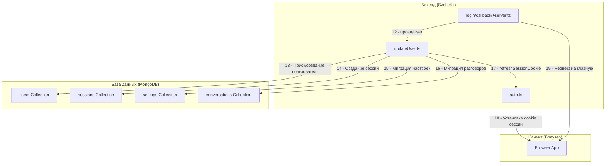

# Поддиаграмма 3: Создание/обновление пользователя

## Объяснение терминов

**Upsert операция** - операция в базе данных, которая создает новый документ, если он не существует, или обновляет существующий, если он уже есть. В MongoDB это реализуется через опцию `upsert: true`.

**Session Management** - управление сессиями пользователей, включая создание, обновление и удаление сессий для обеспечения безопасности и отслеживания активности пользователей.

**Cookie Security** - настройки безопасности для cookies, включая HttpOnly (защита от XSS), Secure (только HTTPS), SameSite (защита от CSRF) и срок действия.

**User Migration** - процесс переноса данных (разговоры, настройки) от анонимной сессии к зарегистрированному пользователю при первом входе.

**Admin Rights** - права администратора, определяемые на основе принадлежности пользователя к определенным организациям в OIDC провайдере.

**Early Access** - ранний доступ к функциям, предоставляемый пользователям из определенных организаций.

## Визуальная диаграмма



## Передаваемые данные (JSON)

### **Шаг 12: updateUser()**

**Действие:** Сервер вызывает функцию updateUser для создания нового пользователя или обновления существующего на основе данных от OIDC провайдера.

**Тип данных:** Функция принимает объект с данными пользователя, locals, cookies и метаданными запроса, выполняет операции с базой данных.

**Результат:** Пользователь создается или обновляется в базе данных, создается новая сессия, устанавливаются права доступа и выполняется миграция данных.

**Пример кода из src/routes/login/callback/+server.ts (строки 74-80):**
```typescript
// src/routes/login/callback/+server.ts
await updateUser({
	userData,
	locals,
	cookies,
	userAgent: request.headers.get("user-agent") ?? undefined,
	ip: getClientAddress(),
});
```

**Вызов функции:**
```json
{
  "function": "updateUser",                               // Название функции
  "parameters": {
    "userData": {                                         // Данные пользователя от OIDC
      "sub": "user_id",                                   // Уникальный ID пользователя
      "name": "User Name",                                // Полное имя пользователя
      "email": "user@example.com",                        // Email адрес
      "picture": "https://avatar.example.com/avatar.jpg", // URL аватара
      "orgs": [                                           // Организации пользователя
        {
          "sub": "org_id",
          "name": "Organization Name",
          "isEnterprise": true
        }
      ]
    },
    "locals": "App.Locals object",                        // Локальные данные SvelteKit
    "cookies": "Cookies object",                          // Объект для работы с cookies
    "userAgent": "Mozilla/5.0...",                        // User-Agent браузера
    "ip": "192.168.1.100"                                 // IP адрес пользователя
  }
}
```

### **Шаг 13: Поиск/создание пользователя**

**Действие:** Система ищет существующего пользователя по hfUserId и либо обновляет его данные, либо создает нового пользователя в базе данных.

**Тип данных:** MongoDB операции findOne и insertOne/updateOne для работы с коллекцией users.

**Результат:** Пользователь создан или обновлен в базе данных с актуальными данными, правами доступа и метаданными.

**Пример кода из src/routes/login/callback/updateUser.ts (строки 108-167):**
```typescript
// src/routes/login/callback/updateUser.ts
// check if user already exists
const existingUser = await collections.users.findOne({ hfUserId });  // Поиск пользователя по ID от OIDC провайдера
let userId = existingUser?._id;  // Сохранение ID пользователя

if (existingUser) {  // Если пользователь уже существует
	// update existing user if any
	await collections.users.updateOne(  // Обновление данных существующего пользователя
		{ _id: existingUser._id },  // Поиск по ID пользователя
		{ $set: { username, name, avatarUrl, isAdmin, isEarlyAccess } }  // Обновление полей
	);
} else {  // Если пользователь новый
	// user doesn't exist yet, create a new one
	const { insertedId } = await collections.users.insertOne({  // Создание нового пользователя
		_id: new ObjectId(),  // Генерация уникального ID
		createdAt: new Date(),  // Дата создания
		updatedAt: new Date(),  // Дата обновления
		username,  // Username пользователя
		name,  // Полное имя
		email,  // Email адрес
		avatarUrl,  // URL аватара
		hfUserId,  // ID в OIDC провайдере
		isAdmin,  // Права администратора
		isEarlyAccess,  // Ранний доступ
	});

	userId = insertedId;  // Сохранение ID нового пользователя
}
```

**MongoDB операции:**
```json
{
  "collection": "users",                                  // Коллекция пользователей
  "operations": [
    {
      "type": "findOne",                                  // Поиск существующего пользователя
      "query": {
        "hfUserId": "user_id_from_oidc"                   // ID пользователя от OIDC провайдера
      }
    },
    {
      "type": "updateOne",                                // Обновление существующего пользователя
      "query": {
        "_id": "user_object_id"                           // ID документа пользователя
      },
      "update": {
        "$set": {
          "name": "User Name",                            // Полное имя пользователя
          "avatarUrl": "https://avatar.example.com/avatar.jpg", // URL аватара
          "isAdmin": true,                                // Права администратора
          "isEarlyAccess": false                          // Ранний доступ
        }
      }
    },
    {
      "type": "insertOne",                                // Создание нового пользователя
      "document": {
        "_id": "new_object_id",                           // Новый ID документа
        "username": "username",                           // Username пользователя
        "name": "User Name",                              // Полное имя
        "email": "user@example.com",                      // Email адрес
        "avatarUrl": "https://avatar.example.com/avatar.jpg", // URL аватара
        "createdAt": "2024-01-01T12:00:00Z",             // Дата создания
        "updatedAt": "2024-01-01T12:00:00Z",             // Дата обновления
        "hfUserId": "user_id_from_oidc",                  // ID пользователя от OIDC
        "isAdmin": true,                                  // Права администратора
        "isEarlyAccess": false                            // Ранний доступ
      }
    }
  ]
}
```

### **Шаг 14: Создание сессии**

**Действие:** Система создает новую сессию для пользователя в базе данных с метаданными (IP, User-Agent) и временем истечения.

**Тип данных:** MongoDB операция insertOne для создания документа сессии в коллекции sessions.

**Результат:** Создается новая сессия, связанная с пользователем, которая используется для аутентификации последующих запросов.

**Пример кода из src/routes/login/callback/updateUser.ts (строки 329-340, 358-367):**
```typescript
// src/routes/login/callback/updateUser.ts
// remove previous session if it exists and add new one
await collections.sessions.deleteOne({ sessionId: previousSessionId });  // Удаление предыдущей сессии
await collections.sessions.insertOne({  // Создание новой сессии для существующего пользователя
	_id: new ObjectId(),  // Уникальный ID сессии
	sessionId: locals.sessionId,  // Хэшированный session ID
	userId: existingUser._id,  // ID пользователя
	createdAt: new Date(),  // Дата создания сессии
	updatedAt: new Date(),  // Дата обновления сессии
	userAgent,  // User-Agent браузера для логирования
	ip,  // IP адрес клиента для безопасности
	expiresAt: addWeeks(new Date(), 2),  // Время истечения (2 недели)
});

// Для нового пользователя:
await collections.sessions.insertOne({  // Создание сессии для нового пользователя
	_id: new ObjectId(),  // Уникальный ID сессии
	sessionId: locals.sessionId,  // Хэшированный session ID
	userId,  // ID нового пользователя
	createdAt: new Date(),  // Дата создания сессии
	updatedAt: new Date(),  // Дата обновления сессии
	userAgent,  // User-Agent браузера для логирования
	ip,  // IP адрес клиента для безопасности
	expiresAt: addWeeks(new Date(), 2),  // Время истечения (2 недели)
});
```

**MongoDB операция:**
```json
{
  "collection": "sessions",                                // Коллекция сессий
  "operation": "insertOne",                               // Создание нового документа
  "document": {
    "_id": "session_object_id",                           // Уникальный ID документа сессии
    "sessionId": "hashed_session_id",                     // Хэшированный ID сессии
    "userId": "user_object_id",                           // ID пользователя
    "createdAt": "2024-01-01T12:00:00Z",                 // Дата создания сессии
    "updatedAt": "2024-01-01T12:00:00Z",                 // Дата обновления сессии
    "userAgent": "Mozilla/5.0 (Windows NT 10.0; Win64; x64) AppleWebKit/537.36", // User-Agent браузера
    "ip": "192.168.1.100",                                // IP адрес пользователя
    "expiresAt": "2024-01-15T12:00:00Z"                   // Время истечения сессии (2 недели)
  }
}
```

### **Шаг 15: Создание настроек пользователя**

**Действие:** Для нового пользователя создаются настройки по умолчанию, включая принятие этических правил и базовые настройки приложения.

**Тип данных:** MongoDB операция insertOne для создания документа настроек в коллекции settings.

**Результат:** Пользователь получает настройки по умолчанию, необходимые для работы с приложением.

**Пример кода из src/routes/login/callback/updateUser.ts (строки 369-386):**
```typescript
// src/routes/login/callback/updateUser.ts
// move pre-existing settings to new user
const { matchedCount } = await collections.settings.updateOne(  // Миграция настроек от анонимной сессии
	{ sessionId: previousSessionId },  // Поиск настроек по предыдущей сессии
	{
		$set: { userId, updatedAt: new Date() },  // Привязка к пользователю
		$unset: { sessionId: "" },  // Удаление привязки к сессии
	}
);

if (!matchedCount) {  // Если настроек не найдено
	// if no settings found for user, create default settings
	await collections.settings.insertOne({  // Создание настроек по умолчанию
		userId,  // ID пользователя
		ethicsModalAcceptedAt: new Date(),  // Дата принятия этических правил
		updatedAt: new Date(),  // Дата обновления
		createdAt: new Date(),  // Дата создания
		...DEFAULT_SETTINGS,  // Настройки по умолчанию из конфигурации
	});
}
```

### **Шаг 16: Миграция разговоров**

**Действие:** Для нового пользователя выполняется миграция разговоров от анонимной сессии к зарегистрированному пользователю.

**Тип данных:** MongoDB операция updateMany для обновления разговоров, связанных с предыдущей сессией.

**Результат:** Разговоры, созданные до входа, переносятся к зарегистрированному пользователю.

**Пример кода из src/routes/login/callback/updateUser.ts (строки 393-400):**
```typescript
// src/routes/login/callback/updateUser.ts
// migrate pre-existing conversations
await collections.conversations.updateMany(  // Миграция разговоров от анонимной сессии
	{ sessionId: previousSessionId },  // Поиск разговоров по предыдущей сессии
	{
		$set: { userId },  // Привязка к пользователю
		$unset: { sessionId: "" },  // Удаление привязки к сессии
	}
);
```

### **Шаг 17: refreshSessionCookie()**

**Действие:** Функция устанавливает безопасный cookie сессии в браузере пользователя с правильными параметрами безопасности.

**Тип данных:** Функция принимает объект cookies и sessionId, устанавливает HTTP cookie с настройками безопасности.

**Результат:** Браузер получает безопасный cookie сессии, который используется для аутентификации последующих запросов.

**Пример кода из src/lib/server/auth.ts (строки 64-73):**
```typescript
// src/lib/server/auth.ts
export function refreshSessionCookie(cookies: Cookies, sessionId: string) {  // Функция установки session cookie
	cookies.set(config.COOKIE_NAME, sessionId, {  // Установка cookie с session ID
		path: "/",  // Путь для cookie (весь сайт)
		// So that it works inside the space's iframe
		sameSite,  // SameSite политика для защиты от CSRF
		secure,  // Только HTTPS соединения
		httpOnly: true,  // Защита от XSS атак (недоступен для JavaScript)
		expires: addWeeks(new Date(), 2),  // Время истечения (2 недели)
	});
}
```

**Вызов функции:**
```json
{
  "function": "refreshSessionCookie",                      // Название функции
  "parameters": {
    "cookies": "Cookies object",                           // Объект для работы с cookies
    "sessionId": "hashed_session_id"                       // Хэшированный ID сессии
  }
}
```

### **Шаг 18: Установка cookie сессии**

**Действие:** Браузер получает HTTP cookie с сессией пользователя, установленный сервером с правильными параметрами безопасности.

**Тип данных:** HTTP Set-Cookie заголовок с зашифрованным sessionId и параметрами безопасности.

**Результат:** Браузер сохраняет cookie сессии для последующих запросов к приложению.

**HTTP Set-Cookie заголовок:**
```json
{
  "cookie": {
    "name": "session",                                     // Имя cookie
    "value": "hashed_session_id",                          // Хэшированный ID сессии
    "options": {
      "httpOnly": true,                                    // Защита от XSS атак
      "secure": true,                                      // Только HTTPS соединения
      "sameSite": "lax",                                   // Защита от CSRF атак
      "maxAge": 1209600,                                   // Время жизни в секундах (2 недели)
      "path": "/"                                          // Путь для cookie
    }
  }
}
```

### **Шаг 19: Redirect на главную**

**Действие:** После успешного создания/обновления пользователя и установки сессии сервер перенаправляет браузер на главную страницу приложения.

**Тип данных:** HTTP 302 редирект с заголовком Location, указывающим на главную страницу.

**Результат:** Пользователь попадает на главную страницу приложения уже аутентифицированным и может использовать все функции системы.

**HTTP ответ:**
```json
{
  "status": 302,                                          // HTTP код редиректа
  "headers": {
    "Location": "/",                                      // URL главной страницы
    "Set-Cookie": "session=hashed_session_id; HttpOnly; Secure; SameSite=Lax; Max-Age=1209600; Path=/" // Cookie сессии
  }
}
```

## Описание блоков

### **login/callback/+server.ts**

**Что это:** SvelteKit route handler для OIDC callback - серверный endpoint, который обрабатывает возврат пользователя от OIDC провайдера

**Задача:** Обработать callback от OIDC провайдера, вызвать updateUser для создания/обновления пользователя и перенаправить на главную страницу

**Файлы проекта:** src/routes/login/callback/+server.ts

**Ключевые функции:**
- Обработка GET /login/callback запросов
- Валидация CSRF токена для безопасности
- Обмен authorization code на данные пользователя
- Проверка разрешенных email/доменов пользователей
- Вызов updateUser для создания/обновления пользователя
- Перенаправление на главную страницу после успешного входа

### **updateUser.ts**

**Что это:** Модуль для создания и обновления пользователей - функция, которая обрабатывает данные пользователя от OIDC и сохраняет их в базе данных

**Задача:** Создать нового пользователя или обновить существующего, создать сессию, установить настройки по умолчанию и выполнить миграцию данных

**Файлы проекта:** src/routes/login/callback/updateUser.ts

**Ключевые функции:**
- Парсинг данных пользователя из JWT токена
- Проверка прав администратора и раннего доступа на основе организаций
- Создание или обновление пользователя в базе данных
- Создание новой сессии с метаданными (IP, User-Agent)
- Создание настроек по умолчанию для нового пользователя
- Миграция разговоров от анонимной сессии к пользователю
- Установка session cookie для аутентификации

### **auth.ts**

**Что это:** Основной модуль аутентификации - центральный модуль для работы с OIDC и управлением аутентификацией

**Задача:** Управлять OIDC интеграцией, устанавливать безопасные cookies сессий и управлять аутентификацией пользователей

**Файлы проекта:** src/lib/server/auth.ts

**Ключевые функции:**
- `refreshSessionCookie()` - установка безопасного cookie сессии
- `validateAndParseCsrfToken()` - валидация CSRF токенов
- `getOIDCUserData()` - получение данных пользователя от OIDC
- `findUser()` - поиск пользователя по sessionId
- Управление конфигурацией OIDC и настройками безопасности

### **users Collection**

**Что это:** MongoDB коллекция для хранения данных пользователей - основная коллекция базы данных для профилей пользователей

**Задача:** Хранить профили пользователей, их настройки, права доступа и метаданные для системы аутентификации

**Файлы проекта:** 
- src/lib/server/database.ts (строки 126, 145) - определение коллекции
- src/lib/types/User.ts - типы данных пользователя

**Ключевые функции:**
- Хранение профилей пользователей (имя, email, аватар)
- Управление правами доступа (isAdmin, isEarlyAccess)
- Связь с OIDC провайдером через hfUserId
- Отслеживание времени создания и обновления
- Поддержка upsert операций для создания/обновления

### **sessions Collection**

**Что это:** MongoDB коллекция для управления сессиями - коллекция для хранения активных сессий пользователей

**Задача:** Хранить активные сессии пользователей, их метаданные и время жизни для обеспечения безопасности и отслеживания активности

**Файлы проекта:** 
- src/lib/server/database.ts (строки 127, 146) - определение коллекции
- src/lib/types/Session.ts - типы данных сессии

**Ключевые функции:**
- Хранение активных сессий пользователей
- Связь сессий с пользователями через userId
- Отслеживание метаданных (IP, User-Agent)
- Управление временем жизни сессий (expiresAt)
- Поддержка автоматического удаления истекших сессий

### **settings Collection**

**Что это:** MongoDB коллекция для хранения настроек пользователей - коллекция для персональных настроек каждого пользователя

**Задача:** Хранить настройки пользователей, включая принятие этических правил и персональные предпочтения приложения

**Файлы проекта:** 
- src/lib/server/database.ts (строки 125, 144) - определение коллекции
- src/lib/types/Settings.ts - типы данных настроек

**Ключевые функции:**
- Хранение персональных настроек пользователей
- Связь настроек с пользователями через userId
- Управление настройками по умолчанию (DEFAULT_SETTINGS)
- Отслеживание принятия этических правил
- Поддержка обновления настроек пользователя

### **conversations Collection**

**Что это:** MongoDB коллекция для хранения разговоров - коллекция для хранения истории чатов пользователей

**Задача:** Хранить разговоры пользователей и поддерживать миграцию данных от анонимных сессий к зарегистрированным пользователям

**Файлы проекта:** 
- src/lib/server/database.ts (строки 118, 137) - определение коллекции
- src/lib/types/Conversation.ts - типы данных разговоров

**Ключевые функции:**
- Хранение истории разговоров пользователей
- Поддержка анонимных разговоров через sessionId
- Миграция разговоров к зарегистрированным пользователям
- Связь разговоров с пользователями через userId
- Управление приватностью и доступом к разговорам

### **Browser App**

**Что это:** Основное клиентское приложение SvelteKit - браузерное приложение, которое взаимодействует с сервером

**Задача:** Получать cookie сессии, отображать интерфейс приложения и обеспечивать взаимодействие пользователя с системой

**Файлы проекта:** 
- src/routes/+layout.svelte - основной layout приложения
- src/routes/+page.svelte - главная страница приложения

**Ключевые функции:**
- Получение и хранение cookie сессии
- Отображение интерфейса приложения
- Обработка перенаправлений от сервера
- Взаимодействие с API endpoints
- Управление состоянием аутентификации

## Сводка этапа

**Цель:** Создать или обновить пользователя в системе, установить сессию и выполнить миграцию данных от анонимной сессии к зарегистрированному пользователю

**Результат:** Пользователь создан или обновлен в базе данных, создана новая сессия с метаданными, установлены настройки по умолчанию, выполнена миграция разговоров, установлен безопасный cookie сессии, пользователь перенаправлен на главную страницу

**Ключевые моменты:** 
- Upsert операция для пользователей (создание или обновление на основе hfUserId)
- Проверка прав администратора и раннего доступа на основе организаций
- Создание новой сессии с метаданными (IP, User-Agent, время истечения)
- Создание настроек по умолчанию для нового пользователя
- Миграция разговоров от анонимной сессии к зарегистрированному пользователю
- Установка безопасного cookie с правильными параметрами (HttpOnly, Secure, SameSite)
- Удаление предыдущей сессии для обеспечения безопасности
- Перенаправление на главную страницу после успешного входа
