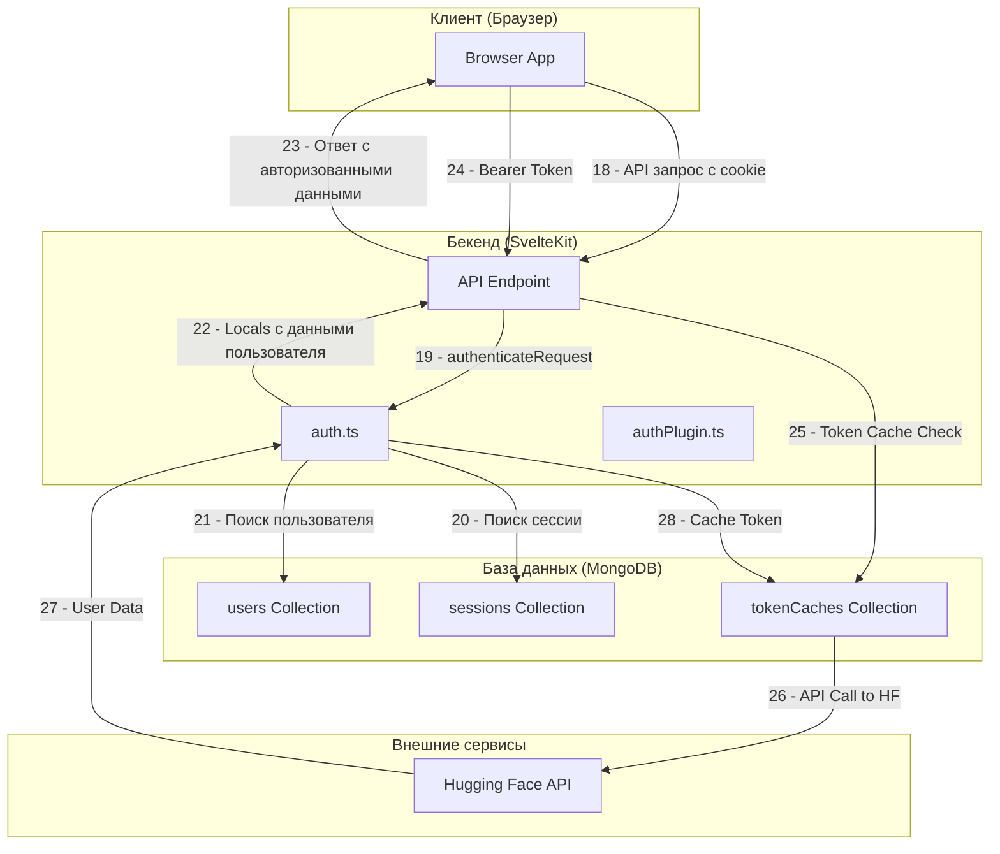

# Поддиаграмма 4: Последующие запросы (аутентификация)

## Объяснение терминов

**Session-based Authentication** - аутентификация на основе сессий, где сервер хранит информацию о сессии в базе данных и использует cookie для идентификации пользователя.

**Locals** - объект в SvelteKit, который содержит данные, доступные во всех обработчиках запросов на сервере, включая информацию о пользователе и сессии.

**Bearer Token Authentication** - альтернативный метод аутентификации через HTTP заголовок Authorization с Bearer токеном, используемый для API интеграций.

**Token Caching** - кэширование токенов в базе данных для повышения производительности и избежания повторных запросов к внешним API.

**Admin Token Management** - система управления административными токенами для предоставления специальных прав доступа.

**Trusted Header Authentication** - аутентификация через доверенные HTTP заголовки, обычно используемая в корпоративных средах с прокси-серверами.

## Визуальная диаграмма



## Передаваемые данные (JSON)

### **Шаг 18: API запрос с cookie**

**Действие:** Браузер отправляет API запрос к серверу с cookie сессии для аутентификации пользователя.

**Тип данных:** HTTP запрос с заголовками, содержащими cookie сессии и данные запроса в JSON формате.

**Результат:** Сервер получает запрос с cookie сессии и может аутентифицировать пользователя для обработки запроса.

**HTTP запрос:**
```json
{
  "method": "POST",                                       // HTTP метод
  "url": "/api/conversation",                             // Путь к API endpoint
  "headers": {
    "Content-Type": "application/json",                   // Тип контента
    "Cookie": "session=encrypted_session_id",             // Cookie сессии для аутентификации
    "User-Agent": "Mozilla/5.0..."                       // Информация о браузере
  },
  "body": {
    "message": "Hello, how are you?",                     // Сообщение пользователя
    "conversationId": "conversation_id_here"              // ID разговора
  }
}
```

### **Шаг 19: authenticateRequest()**

**Действие:** Сервер вызывает функцию authenticateRequest для проверки cookie сессии и получения данных пользователя из базы данных.

**Тип данных:** Функция принимает заголовки и cookies, возвращает объект с данными пользователя и сессии для использования в locals.

**Результат:** Пользователь аутентифицирован, данные загружены в locals, запрос может быть обработан с учетом прав пользователя.

**Пример кода из src/lib/server/auth.ts (строки 194-313):**
```typescript
// src/lib/server/auth.ts
export async function authenticateRequest(
	headers: HeaderRecord,
	cookie: CookieRecord,
	isApi?: boolean
): Promise<App.Locals & { secretSessionId: string }> {
	// once the entire API has been moved to elysia
	// we can move this function to authPlugin.ts
	// and get rid of the isApi && type: "svelte" options
	const token =
		cookie.type === "elysia"
			? cookie.value[config.COOKIE_NAME].value
			: cookie.value.get(config.COOKIE_NAME);

	let email = null;
	if (config.TRUSTED_EMAIL_HEADER) {
		if (headers.type === "elysia") {
			email = headers.value[config.TRUSTED_EMAIL_HEADER];
		} else {
			email = headers.value.get(config.TRUSTED_EMAIL_HEADER);
		}
	}

	let secretSessionId: string | null = null;
	let sessionId: string | null = null;

	if (email) {
		secretSessionId = sessionId = await sha256(email);
		return {
			user: {
				_id: new ObjectId(sessionId.slice(0, 24)),
				name: email,
				email,
				createdAt: new Date(),
				updatedAt: new Date(),
				hfUserId: email,
				avatarUrl: "",
				logoutDisabled: true,
			},
			sessionId,
			secretSessionId,
			isAdmin: adminTokenManager.isAdmin(sessionId),
		};
	}

	if (token) {
		secretSessionId = token;
		sessionId = await sha256(token);
		const user = await findUser(sessionId);
		return {
			user: user ?? undefined,
			sessionId,
			secretSessionId,
			isAdmin: user?.isAdmin || adminTokenManager.isAdmin(sessionId),
		};
	}

	if (isApi) {
		const authorization =
			headers.type === "elysia"
				? headers.value["Authorization"]
				: headers.value.get("Authorization");
		if (authorization?.startsWith("Bearer ")) {
			const token = authorization.slice(7);
			const hash = await sha256(token);
			sessionId = secretSessionId = hash;

			const cacheHit = await collections.tokenCaches.findOne({ tokenHash: hash });
			if (cacheHit) {
				const user = await collections.users.findOne({ hfUserId: cacheHit.userId });
				if (!user) {
					throw new Error("User not found");
				}
				return {
					user,
					sessionId,
					secretSessionId,
					isAdmin: user.isAdmin || adminTokenManager.isAdmin(sessionId),
				};
			}

			const response = await fetch("https://huggingface.co/api/whoami-v2", {
				headers: { Authorization: `Bearer ${token}` },
			});

			if (!response.ok) {
				throw new Error("Unauthorized");
			}

			const data = await response.json();
			const user = await collections.users.findOne({ hfUserId: data.id });
			if (!user) {
				throw new Error("User not found");
			}

			await collections.tokenCaches.insertOne({
				tokenHash: hash,
				userId: data.id,
				createdAt: new Date(),
				updatedAt: new Date(),
			});

			return {
				user,
				sessionId,
				secretSessionId,
				isAdmin: user.isAdmin || adminTokenManager.isAdmin(sessionId),
			};
		}
	}

	// Generate new session if none exists
	secretSessionId = crypto.randomUUID();
	sessionId = await sha256(secretSessionId);

	if (await collections.sessions.findOne({ sessionId })) {
		throw new Error("Session ID collision");
	}

	return { user: undefined, sessionId, secretSessionId, isAdmin: false };
}
```

**Вызов функции:**
```json
{
  "function": "authenticateRequest",                       // Название функции
  "parameters": {
    "headers": {                                          // HTTP заголовки запроса
      "type": "svelte",
      "value": "Headers object"
    },
    "cookie": {                                           // Cookies запроса
      "type": "svelte", 
      "value": "Cookies object"
    },
    "isApi": false                                        // Флаг API запроса
  },
  "returns": {
    "user": {                                             // Данные пользователя
      "_id": "user_object_id",                           // ID пользователя
      "name": "User Name",                               // Имя пользователя
      "email": "user@example.com",                       // Email пользователя
      "isAdmin": false                                   // Права администратора
    },
    "sessionId": "hashed_session_id",                    // Хэшированный ID сессии
    "secretSessionId": "raw_session_id",                 // Исходный ID сессии
    "isAdmin": false                                     // Права администратора
  }
}
```

### **Шаг 20: Поиск сессии**

**Действие:** Система ищет активную сессию в базе данных по хэшированному sessionId и проверяет, не истекла ли она.

**Тип данных:** MongoDB операция findOne для поиска документа сессии в коллекции sessions.

**Результат:** Найдена активная сессия или возвращен null, если сессия не существует или истекла.

**Пример кода из src/lib/server/auth.ts (строки 75-83):**
```typescript
// src/lib/server/auth.ts
export async function findUser(sessionId: string) {  // Функция поиска пользователя по session ID
	const session = await collections.sessions.findOne({ sessionId });  // Поиск сессии в базе данных

	if (!session) {  // Если сессия не найдена
		return null;  // Возврат null
	}

	return await collections.users.findOne({ _id: session.userId });  // Поиск пользователя по ID из сессии
}
```

**MongoDB операция:**
```json
{
  "collection": "sessions",                                // Коллекция сессий
  "operation": "findOne",                                  // Поиск одного документа
  "query": {
    "sessionId": "hashed_session_id"                      // Хэшированный ID сессии
  }
}
```

### **Шаг 21: Поиск пользователя**

**Действие:** Система ищет пользователя в базе данных по userId, полученному из найденной сессии.

**Тип данных:** MongoDB операция findOne для поиска документа пользователя в коллекции users.

**Результат:** Найден пользователь с полными данными профиля или возвращен null, если пользователь не существует.

**MongoDB операция:**
```json
{
  "collection": "users",                                   // Коллекция пользователей
  "operation": "findOne",                                  // Поиск одного документа
  "query": {
    "_id": "user_object_id"                               // ID пользователя из сессии
  }
}
```

### **Шаг 22: Locals с данными пользователя**

**Действие:** Данные пользователя и сессии устанавливаются в объект locals для использования во всех обработчиках запросов.

**Тип данных:** Объект App.Locals с данными пользователя, сессии и правами доступа.

**Результат:** Обработчики запросов получают доступ к данным пользователя через locals для авторизации и персонализации.

**Пример кода из src/routes/api/user/+server.ts (строки 1-15):**
```typescript
// src/routes/api/user/+server.ts
export async function GET({ locals }) {  // Обработчик GET запроса для получения данных пользователя
	if (locals.user) {  // Проверка аутентификации пользователя
		const res = {  // Формирование ответа с данными пользователя
			id: locals.user._id,  // ID пользователя в базе данных
			username: locals.user.username,  // Username пользователя
			name: locals.user.name,  // Полное имя пользователя
			email: locals.user.email,  // Email адрес пользователя
			avatarUrl: locals.user.avatarUrl,  // URL аватара пользователя
			hfUserId: locals.user.hfUserId,  // ID пользователя в Hugging Face
		};

		return Response.json(res);  // Возврат данных пользователя в JSON формате
	}
	return Response.json({ message: "Must be signed in" }, { status: 401 });  // Ошибка аутентификации
}
```

**Объект locals:**
```json
{
  "locals": {
    "user": {                                             // Данные пользователя
      "_id": "user_object_id",                           // ID пользователя
      "name": "User Name",                               // Полное имя
      "email": "user@example.com",                       // Email адрес
      "avatarUrl": "https://avatar.example.com/avatar.jpg", // URL аватара
      "isAdmin": false,                                  // Права администратора
      "createdAt": "2024-01-01T12:00:00Z"               // Дата создания
    },
    "sessionId": "hashed_session_id",                    // Хэшированный ID сессии
    "isAdmin": false                                     // Права администратора
  }
}
```

### **Шаг 23: Ответ с авторизованными данными**

**Действие:** Сервер обрабатывает запрос с учетом данных пользователя из locals и возвращает ответ с результатами.

**Тип данных:** HTTP ответ с JSON данными, содержащими результат обработки запроса.

**Результат:** Клиент получает ответ с данными, обработанными с учетом прав и настроек аутентифицированного пользователя.

**HTTP ответ:**
```json
{
  "status": 200,                                          // HTTP код успеха
  "headers": {
    "Content-Type": "application/json",                   // Тип контента
    "Set-Cookie": "session=encrypted_session_id; HttpOnly; Secure; SameSite=Lax; Max-Age=3600; Path=/" // Обновление cookie
  },
  "body": {
    "success": true,                                      // Статус операции
    "data": {
      "message": "Response from AI",                      // Ответ от AI
      "conversationId": "conversation_id_here"            // ID разговора
    }
  }
}
```

### **Шаг 24: Bearer Token Authentication (Альтернативный путь)**

**Действие:** Для API интеграций используется аутентификация через Bearer токен в заголовке Authorization.

**Тип данных:** HTTP запрос с заголовком Authorization, содержащим Bearer токен.

**Результат:** Система проверяет токен и аутентифицирует пользователя для API доступа.

**HTTP запрос с Bearer токеном:**
```json
{
  "method": "POST",                                       // HTTP метод
  "url": "/api/v2/conversation",                          // API endpoint
  "headers": {
    "Content-Type": "application/json",                   // Тип контента
    "Authorization": "Bearer hf_token_here",              // Bearer токен для аутентификации
    "User-Agent": "API Client 1.0"                       // Информация о клиенте
  },
  "body": {
    "message": "Hello from API",                          // Сообщение
    "conversationId": "conversation_id_here"              // ID разговора
  }
}
```

### **Шаг 25: Token Cache Check**

**Действие:** Система проверяет кэш токенов для повышения производительности и избежания повторных запросов к Hugging Face API.

**Тип данных:** MongoDB операция findOne для поиска кэшированного токена в коллекции tokenCaches.

**Результат:** Найден кэшированный токен или выполняется запрос к Hugging Face API для валидации.

**Пример кода из src/lib/server/auth.ts (строки 260-272):**
```typescript
// src/lib/server/auth.ts
const cacheHit = await collections.tokenCaches.findOne({ tokenHash: hash });
if (cacheHit) {
	const user = await collections.users.findOne({ hfUserId: cacheHit.userId });
	if (!user) {
		throw new Error("User not found");
	}
	return {
		user,
		sessionId,
		secretSessionId,
		isAdmin: user.isAdmin || adminTokenManager.isAdmin(sessionId),
	};
}
```

### **Шаг 26: API Call to Hugging Face**

**Действие:** При отсутствии кэша система отправляет запрос к Hugging Face API для валидации токена и получения данных пользователя.

**Тип данных:** HTTP запрос к Hugging Face API с Bearer токеном в заголовке Authorization.

**Результат:** Получены данные пользователя от Hugging Face API для создания или обновления пользователя в системе.

**HTTP запрос к Hugging Face:**
```json
{
  "method": "GET",                                        // HTTP метод
  "url": "https://huggingface.co/api/whoami-v2",         // Hugging Face API endpoint
  "headers": {
    "Authorization": "Bearer hf_token_here"               // Bearer токен
  }
}
```

### **Шаг 27: User Data from Hugging Face**

**Действие:** Hugging Face API возвращает данные пользователя после успешной валидации токена.

**Тип данных:** JSON ответ с данными пользователя от Hugging Face API.

**Результат:** Получены актуальные данные пользователя для аутентификации и создания/обновления профиля в системе.

**Ответ от Hugging Face API:**
```json
{
  "id": "user_id_from_hf",                               // ID пользователя в Hugging Face
  "name": "User Name",                                   // Полное имя
  "email": "user@example.com",                           // Email адрес
  "avatarUrl": "https://avatar.example.com/avatar.jpg",  // URL аватара
  "orgs": [                                              // Организации пользователя
    {
      "id": "org_id",
      "name": "Organization Name",
      "isEnterprise": true
    }
  ]
}
```

## Описание блоков

### **Browser App**

**Что это:** Основное клиентское приложение SvelteKit - браузерное приложение, которое взаимодействует с сервером

**Задача:** Отправлять API запросы с cookie сессии, получать ответы и обеспечивать взаимодействие пользователя с системой

**Файлы проекта:** 
- src/routes/+layout.svelte - основной layout приложения
- src/routes/+page.svelte - главная страница приложения

**Ключевые функции:**
- Отправка API запросов с cookie сессии
- Получение и обработка ответов от сервера
- Управление состоянием аутентификации
- Отображение интерфейса приложения
- Взаимодействие с пользователем

### **API Endpoint**

**Что это:** Общий API endpoint для авторизованных запросов - серверные обработчики для различных API функций

**Задача:** Обрабатывать API запросы, проверять авторизацию через locals, возвращать данные с учетом прав пользователя

**Файлы проекта:** 
- src/routes/api/*/+server.ts - различные API endpoints
- src/routes/api/user/+server.ts - пользовательские API
- src/routes/api/conversation/[id]/+server.ts - API разговоров
- src/routes/api/tools/+server.ts - API инструментов

**Ключевые функции:**
- Обработка HTTP запросов (GET, POST, PATCH, DELETE)
- Проверка авторизации через locals.user
- Валидация входных данных
- Выполнение бизнес-логики
- Возврат JSON ответов
- Обработка ошибок и исключений

### **auth.ts**

**Что это:** Основной модуль аутентификации - центральный модуль для работы с аутентификацией и управлением сессиями

**Задача:** Валидировать сессии, загружать данные пользователя, устанавливать locals и поддерживать различные методы аутентификации

**Файлы проекта:** src/lib/server/auth.ts

**Ключевые функции:**
- `authenticateRequest()` - основная функция аутентификации запросов
- `findUser()` - поиск пользователя по sessionId
- `refreshSessionCookie()` - обновление cookie сессии
- Поддержка session-based аутентификации
- Поддержка Bearer token аутентификации с кэшированием
- Поддержка trusted header аутентификации
- Интеграция с Hugging Face API для валидации токенов
- Управление правами администратора
- Поддержка Elysia и SvelteKit типов запросов

### **authPlugin.ts**

**Что это:** Elysia плагин для аутентификации - middleware для автоматической аутентификации API запросов

**Задача:** Автоматически аутентифицировать все запросы к API v2 и предоставлять данные пользователя через контекст

**Файлы проекта:** src/lib/server/api/authPlugin.ts

**Ключевые функции:**
- Автоматическая аутентификация всех API запросов
- Интеграция с Elysia framework
- Предоставление locals через контекст
- Поддержка различных типов запросов

### **sessions Collection**

**Что это:** MongoDB коллекция для управления сессиями - коллекция для хранения активных сессий пользователей

**Задача:** Хранить активные сессии пользователей, их метаданные и время жизни для обеспечения безопасности и отслеживания активности

**Файлы проекта:** 
- src/lib/server/database.ts (строки 127, 146) - определение коллекции
- src/lib/types/Session.ts - типы данных сессии

**Ключевые функции:**
- Хранение активных сессий пользователей
- Связь сессий с пользователями через userId
- Отслеживание метаданных (IP, User-Agent)
- Управление временем жизни сессий (expiresAt)
- Поддержка автоматического удаления истекших сессий

### **users Collection**

**Что это:** MongoDB коллекция для хранения данных пользователей - основная коллекция базы данных для профилей пользователей

**Задача:** Хранить профили пользователей, их настройки, права доступа и метаданные для системы аутентификации

**Файлы проекта:** 
- src/lib/server/database.ts (строки 126, 145) - определение коллекции
- src/lib/types/User.ts - типы данных пользователя

**Ключевые функции:**
- Хранение профилей пользователей (имя, email, аватар)
- Управление правами доступа (isAdmin, isEarlyAccess)
- Связь с OIDC провайдером через hfUserId
- Отслеживание времени создания и обновления
- Поддержка поиска по различным критериям

### **tokenCaches Collection**

**Что это:** MongoDB коллекция для кэширования токенов - коллекция для хранения кэшированных Bearer токенов

**Задача:** Кэшировать Bearer токены для повышения производительности и избежания повторных запросов к Hugging Face API

**Файлы проекта:** 
- src/lib/server/database.ts (строки 132, 151) - определение коллекции
- src/lib/types/TokenCache.ts - типы данных кэша токенов

**Ключевые функции:**
- Кэширование Bearer токенов от Hugging Face
- Связь токенов с пользователями через userId
- Отслеживание времени создания и обновления
- Повышение производительности API запросов
- Сокращение нагрузки на внешние API

### **Hugging Face API**

**Что это:** Внешний API Hugging Face - сервис для валидации токенов и получения данных пользователей

**Задача:** Валидировать Bearer токены и предоставлять актуальные данные пользователей для аутентификации

**Файлы проекта:** 
- src/lib/server/auth.ts (строки 274-276) - API вызовы
- .env.local - переменные окружения для API

**Ключевые функции:**
- Валидация Bearer токенов через /api/whoami-v2 endpoint
- Предоставление данных пользователей (ID, имя, email, аватар)
- Информация об организациях пользователя
- Поддержка OAuth токенов Hugging Face

## Сводка этапа

**Цель:** Аутентифицировать пользователя для последующих API запросов и обеспечить безопасный доступ к функциям системы

**Результат:** Пользователь аутентифицирован, данные загружены в locals, запрос обработан с учетом прав доступа, cookie сессии обновлен при необходимости

**Ключевые моменты:** 
- Поддержка множественных методов аутентификации (session-based, Bearer token, trusted headers)
- Проверка валидности сессии по сроку действия в базе данных
- Загрузка данных пользователя из коллекции users по userId из сессии
- Установка данных в locals для использования во всех обработчиках запросов
- Кэширование Bearer токенов для повышения производительности
- Валидация токенов через Hugging Face API при необходимости
- Управление правами администратора и раннего доступа
- Автоматическая аутентификация через Elysia authPlugin для API v2
- Обновление cookie сессии при необходимости для поддержания активности
- Обработка ошибок аутентификации и возврат соответствующих HTTP кодов
