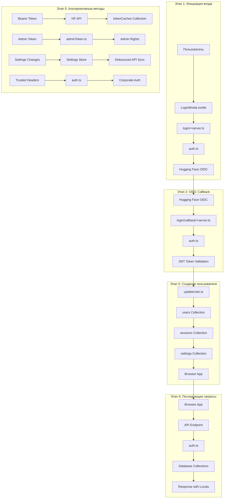

# Индекс: Авторизация и Аутентификация

## Объяснение терминов

**Authentication (Аутентификация)** - процесс проверки личности пользователя, подтверждение того, что пользователь является тем, за кого себя выдает.

**Authorization (Авторизация)** - процесс определения прав доступа пользователя к ресурсам и функциям системы после успешной аутентификации.

**OIDC (OpenID Connect)** - стандарт аутентификации, построенный на OAuth 2.0, который позволяет пользователям аутентифицироваться через внешние провайдеры (например, Hugging Face).

**JWT (JSON Web Token)** - стандарт для безопасной передачи информации между сторонами в виде JSON объекта, подписанного цифровой подписью.

**CSRF (Cross-Site Request Forgery)** - тип атаки, при которой злоумышленник заставляет пользователя выполнить нежелательные действия на веб-сайте, где пользователь аутентифицирован.

**Session Management** - управление пользовательскими сессиями, включая создание, валидацию, обновление и завершение сессий.

**Bearer Token** - тип токена доступа, который передается в HTTP заголовке Authorization для аутентификации API запросов.

**Admin Token** - специальный токен для предоставления административных прав доступа к системным функциям.

**Debouncing** - техника программирования, которая ограничивает частоту выполнения функции, группируя множественные вызовы в один.

**Upsert Operation** - операция базы данных, которая обновляет существующий документ или создает новый, если документ не существует.

## Обзор процесса

Процесс авторизации и аутентификации в Chat UI разбит на 5 логических этапов, каждый из которых детально описан в отдельных файлах:

1. **[Инициация входа](01-1-Инициация-Входа.md)** - Пользователь нажимает "Sign in", система определяет redirect URI и создает authorization URL для OIDC Provider
2. **[OIDC Callback](01-2-OIDC-Callback.md)** - Обработка callback от OIDC Provider, валидация CSRF токена с подписью и получение JWT токена с данными пользователя
3. **[Создание пользователя](01-3-Создание-Пользователя.md)** - Создание/обновление пользователя в БД, установка сессии, миграция данных от анонимных сессий и настройка прав доступа
4. **[Последующие запросы](01-4-Последующие-Запросы.md)** - Аутентификация для API запросов через cookie сессии, Bearer токены с кэшированием и trusted headers
5. **[Альтернативные методы](01-5-Альтернативные-Методы.md)** - Bearer Token аутентификация, Admin Token управление, синхронизация настроек с debouncing

## Общая схема процесса



## Ключевые компоненты системы

### **Клиентская часть**

**LoginModal.svelte** - Модальное окно входа, инициирующее процесс аутентификации через OIDC провайдер

**Browser App** - Основное SvelteKit приложение, обрабатывающее пользовательские запросы и взаимодействующее с сервером

**Settings Store** - Реактивное хранилище настроек пользователя с debounced синхронизацией на сервер

### **Серверная часть**

**login/+server.ts** - SvelteKit endpoint для инициации входа, определения redirect URI и перенаправления на OIDC провайдер

**login/callback/+server.ts** - SvelteKit endpoint для обработки OIDC callback, валидации CSRF токенов и получения JWT токенов

**auth.ts** - Центральный модуль аутентификации, поддерживающий множественные методы аутентификации, управление сессиями и использование библиотеки openid-client

**updateUser.ts** - Модуль для создания/обновления пользователей, управления сессиями, миграции данных от анонимных сессий и поддержки Microsoft Entra

**adminToken.ts** - Система управления административными токенами для предоставления специальных прав доступа

**authPlugin.ts** - Elysia плагин для автоматической аутентификации API запросов

### **База данных (MongoDB)**

**users Collection** - Коллекция для хранения профилей пользователей, их настроек и прав доступа

**sessions Collection** - Коллекция для управления активными сессиями пользователей с метаданными

**tokenCaches Collection** - Коллекция для кэширования Bearer токенов для повышения производительности

**settings Collection** - Коллекция для персистентного хранения пользовательских настроек и предпочтений

### **Внешние сервисы**

**Hugging Face OIDC** - Внешний провайдер аутентификации, предоставляющий OIDC сервис для входа пользователей

**HF API** - API Hugging Face для валидации Bearer токенов и получения данных пользователей

## Типы аутентификации

### **1. OIDC Authentication (Основной)**

**Описание:** Стандартный процесс аутентификации через OpenID Connect провайдер (Hugging Face)

**Процесс:**
- Пользователь нажимает "Sign in" в LoginModal (ссылка href)
- Система определяет redirect URI и создает authorization URL
- Пользователь перенаправляется на Hugging Face OIDC
- После успешной аутентификации получает JWT токен с данными
- Создается сессия в системе и устанавливается безопасный cookie

**Файлы проекта:**
- src/lib/components/LoginModal.svelte - инициация входа
- src/routes/login/+server.ts - определение redirect URI и перенаправление
- src/routes/login/callback/+server.ts - обработка callback
- src/lib/server/auth.ts - валидация JWT токенов и создание authorization URL

### **2. Bearer Token Authentication**

**Описание:** Прямая аутентификация через Bearer токен в HTTP заголовке Authorization

**Процесс:**
- Клиент отправляет API запрос с Bearer токеном в заголовке
- Система проверяет кэш токенов в базе данных
- При отсутствии кэша отправляет запрос к Hugging Face API
- Токен кэшируется для повышения производительности
- Подходит для API интеграций и автоматизации

**Файлы проекта:**
- src/lib/server/auth.ts (строки 150-202) - обработка Bearer токенов
- src/lib/server/database.ts - коллекция tokenCaches
- src/lib/types/TokenCache.ts - типы данных кэша

### **3. Admin Token Authentication**

**Описание:** Специальная система для предоставления административных прав доступа

**Процесс:**
- Администратор использует специальный токен для входа
- Система валидирует токен и предоставляет административные права
- Токен автоматически ротируется после использования
- Управление списком активных административных сессий

**Файлы проекта:**
- src/lib/server/adminToken.ts - управление административными токенами
- src/lib/server/auth.ts - интеграция с системой аутентификации

### **4. Trusted Header Authentication**

**Описание:** Корпоративная аутентификация через доверенные HTTP заголовки

**Процесс:**
- Прокси-сервер устанавливает доверенные заголовки с email пользователя
- Система извлекает email из заголовка и создает пользователя
- Отключается возможность выхода (logoutDisabled: true)
- Подходит для корпоративных сред с внутренними прокси

**Файлы проекта:**
- src/lib/server/auth.ts (строки 107-135) - обработка trusted headers
- .env.local - настройка TRUSTED_EMAIL_HEADER

## Безопасность

### **CSRF Protection**

**Описание:** Защита от Cross-Site Request Forgery атак через генерацию и валидацию уникальных токенов

**Реализация:**
- Генерация CSRF токена с подписью через `generateCsrfToken()`
- Сохранение токена в base64-encoded state параметре
- Валидация токена при обработке OIDC callback через `validateAndParseCsrfToken()`
- Проверка подписи и времени истечения токена

**Пример кода из src/lib/server/auth.ts (строки 158-185):**
```typescript
// src/lib/server/auth.ts
export async function validateAndParseCsrfToken(
	token: string,
	sessionId: string
): Promise<{
	redirectUrl: string;
} | null> {
	try {
		const { data, signature } = z
			.object({
				data: z.object({
					expiration: z.number().int(),
					redirectUrl: z.string().url(),
				}),
				signature: z.string().length(64),
			})
			.parse(JSON.parse(token));

		const reconstructSign = await sha256(JSON.stringify(data) + "##" + sessionId);

		if (data.expiration > Date.now() && signature === reconstructSign) {
			return { redirectUrl: data.redirectUrl };
		}
	} catch (e) {
		logger.error(e);
	}
	return null;
}
```

### **Session Management**

**Описание:** Безопасное управление пользовательскими сессиями с контролем времени жизни и метаданных

**Реализация:**
- Безопасные cookie с правильными параметрами (httpOnly, secure, sameSite)
- Контроль времени жизни сессий через expiresAt поле
- Отслеживание IP адреса и User-Agent для дополнительной безопасности
- Автоматическое удаление истекших сессий
- Хэширование sessionId для дополнительной защиты

**Пример кода из src/routes/login/callback/updateUser.ts (строки 131-140):**
```typescript
// src/routes/login/callback/updateUser.ts
await collections.sessions.insertOne({
	_id: new ObjectId(),
	sessionId: locals.sessionId,
	userId: existingUser._id,
	createdAt: new Date(),
	updatedAt: new Date(),
	userAgent,
	ip,
	expiresAt: addWeeks(new Date(), 2),
});
```

### **Token Validation**

**Описание:** Проверка подписи и валидности JWT токенов с кэшированием для производительности

**Реализация:**
- Проверка подписи JWT токенов от OIDC провайдера
- Валидация срока действия токенов
- Кэширование Bearer токенов для избежания повторных запросов к внешним API
- Проверка структуры и содержимого токенов

**Пример кода из src/lib/server/auth.ts (строки 150-202):**
```typescript
// src/lib/server/auth.ts
if (authorization?.startsWith("Bearer ")) {
    const token = authorization.slice(7);
    const hash = await sha256(token);
    sessionId = secretSessionId = hash;

    const cacheHit = await collections.tokenCaches.findOne({ tokenHash: hash });
    if (cacheHit) {
        const user = await collections.users.findOne({ hfUserId: cacheHit.userId });
        if (!user) {
            throw new Error("User not found");
        }
        return {
            user,
            sessionId,
            secretSessionId,
            isAdmin: user.isAdmin || adminTokenManager.isAdmin(sessionId),
        };
    }

    const response = await fetch("https://huggingface.co/api/whoami-v2", {
        headers: { Authorization: `Bearer ${token}` },
    });

    if (!response.ok) {
        throw new Error("Unauthorized");
    }

    const data = await response.json();
    const user = await collections.users.findOne({ hfUserId: data.id });
    if (!user) {
        throw new Error("User not found");
    }

    await collections.tokenCaches.insertOne({
        tokenHash: hash,
        userId: data.id,
        createdAt: new Date(),
        updatedAt: new Date(),
    });

    return {
        user,
        sessionId,
        secretSessionId,
        isAdmin: user.isAdmin || adminTokenManager.isAdmin(sessionId),
    };
}
```

## Файлы проекта

### **Клиентская часть**
- **src/lib/components/LoginModal.svelte** - Модальное окно входа, инициирующее процесс аутентификации
- **src/lib/stores/settings.ts** - Реактивное хранилище настроек пользователя с debounced синхронизацией
- **src/routes/+layout.svelte** - Основной layout приложения
- **src/routes/+page.svelte** - Главная страница приложения

### **Серверная часть**
- **src/routes/login/+server.ts** - SvelteKit endpoint для инициации входа и определения redirect URI
- **src/routes/login/callback/+server.ts** - SvelteKit endpoint для обработки OIDC callback
- **src/routes/login/callback/updateUser.ts** - Модуль для создания/обновления пользователей, управления сессиями и миграции данных
- **src/lib/server/auth.ts** - Центральный модуль аутентификации с поддержкой множественных методов и библиотеки openid-client
- **src/lib/server/adminToken.ts** - Система управления административными токенами
- **src/lib/server/api/authPlugin.ts** - Elysia плагин для автоматической аутентификации API запросов
- **src/lib/server/database.ts** - Определение коллекций MongoDB и управление подключением

### **Типы данных**
- **src/lib/types/User.ts** - Типы данных пользователя
- **src/lib/types/Session.ts** - Типы данных сессии
- **src/lib/types/Settings.ts** - Типы данных настроек
- **src/lib/types/TokenCache.ts** - Типы данных кэша токенов

### **Конфигурация**
- **.env.local** - Переменные окружения для OIDC, токенов и настроек безопасности

## Последовательность изучения

**1.** Начните с [Инициация входа](01-1-Инициация-Входа.md) для понимания начала процесса аутентификации и генерации CSRF токенов

**2.** Изучите [OIDC Callback](01-2-OIDC-Callback.md) для понимания обработки callback от OIDC провайдера и получения JWT токенов

**3.** Перейдите к [Создание пользователя](01-3-Создание-Пользователя.md) для понимания работы с базой данных, создания сессий и миграции данных

**4.** Изучите [Последующие запросы](01-4-Последующие-Запросы.md) для понимания аутентификации API запросов и различных методов аутентификации

**5.** Завершите [Альтернативные методы](01-5-Альтернативные-Методы.md) для понимания всех способов аутентификации, управления настройками и оптимизации производительности

## Сводка системы аутентификации

**Цель:** Обеспечить безопасную и гибкую систему аутентификации с поддержкой множественных методов входа

**Результат:** Пользователи могут аутентифицироваться через OIDC, Bearer токены, административные токены и trusted headers, с эффективным управлением настройками и сессиями

**Ключевые особенности:**
- **Множественные методы аутентификации** - OIDC, Bearer Token, Admin Token, Trusted Headers
- **Безопасность** - CSRF защита с подписью, безопасные cookie, валидация токенов
- **Производительность** - кэширование токенов, debounced обновления настроек
- **Гибкость** - поддержка корпоративных сред, API интеграций, административных функций, Microsoft Entra
- **Надежность** - управление сессиями, миграция данных от анонимных сессий, обработка ошибок
- **Современность** - использование библиотеки openid-client, поддержка различных OIDC провайдеров
