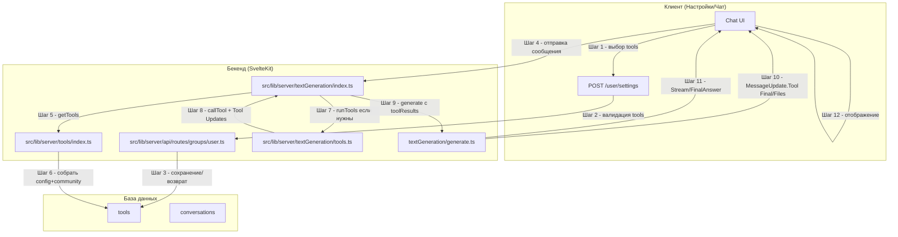

# Поддиаграмма 1: Общий путь инструментов (Шаги 1-12)

## Термины и аббревиатуры

- Config tools - встроенные инструменты из конфигурации.
- Community tools - добавляемые пользователями инструменты (в БД `tools`).
- ToolsPreference - выбранные пользователем/ассистентом ID инструментов.

## Визуальная диаграмма



## Шаг 1: Выбор инструментов пользователем

- Действие: Пользователь включает/выключает инструменты в настройках.
- Тип данных: HTTP POST JSON.
- Результат: Сервер валидирует и сохраняет.

Пример запроса:
```json
{
  "tools": ["00000000000000000000000a", "00000000000000000000000b"]
}
```

## Шаг 2: Валидация tools на сервере

- Действие: Проверка, что все id существуют (в БД или среди `configTools`).
- Тип данных: zod + MongoDB.
- Результат: Корректный список id.

Исходный файл: `src/lib/server/api/routes/groups/user.ts` (строки 100-121)
```typescript
if (settings.tools) {                                         // Если пользователь прислал список tools
  const newTools = [                                          // Сформируем валидный список id
    ...(await collections.tools                                // Проверяем community-инструменты в БД
      .find({ _id: { $in: settings.tools.map((toolId) => new ObjectId(toolId)) } })
      .project({ _id: 1 })
      .toArray()
      .then((tools) => tools.map((tool) => tool._id.toString()))),
    ...toolFromConfigs                                        // Плюс id из встроенных инструментов
      .filter((el) => (settings?.tools ?? []).includes(el._id.toString()))
      .map((el) => el._id.toString()),
  ];
  settings.tools = newTools;                                   // Оставляем только валидные id
}
```

## Шаг 3: Сохранение/возврат настроек

- Действие: upsert настроек и отдача в `GET /user/settings`.
- Тип данных: MongoDB.
- Результат: инструменты закреплены за пользователем.

Исходный файл: `src/lib/server/api/routes/groups/user.ts` (строки 123-138, 79-86)
```typescript
await collections.settings.updateOne(                         // Сохраняем настройки
  authCondition(locals),
  { $set: { ...settings, updatedAt: new Date() }, $setOnInsert: { createdAt: new Date() } },
  { upsert: true }
);
...
// Если нет явных tools - подставить configTools с isOnByDefault
const toolsForUser =                                        // Возвращается в GET /user/settings
  settings?.tools ??
  toolFromConfigs.filter((el) => !el.isHidden && el.isOnByDefault).map((el) => el._id.toString());
```

## Шаг 4: Отправка сообщения с активными инструментами

- Действие: Пользователь отправляет сообщение (см. Чат/Поддиаграмма 2), настройки tools доступны на сервере.
- Тип данных: HTTP FormData.
- Результат: Переходим к пайплайну генерации.

## Шаг 5: Получение активных инструментов

- Действие: На входе генерации вызывается `getTools(toolsPreference, assistant)`.
- Тип данных: массив `Tool[]`.
- Результат: Список активных config+community инструментов.

Исходный файл: `src/lib/server/textGeneration/index.ts` (строки 76-84)
```typescript
let tools = model.tools ? await getTools(toolsPreference, ctx.assistant) : undefined; // Собираем активные tools
if (tools) {                                                            // Если инструменты есть
  const toolCallsRequired = tools.some((t) => !toolHasName(directlyAnswer.name, t)); // Нужен ли вызов
  if (toolCallsRequired) {
    toolResults = yield* runTools(ctx, tools, preprompt);               // Стартуем пайплайн инструментов
  } else tools = undefined;                                             // Иначе инструменты отключаются (ответ напрямую)
}
```

## Шаг 6: Сборка config и community tools

- Действие: `getTools` собирает активные инструменты из конфига и БД, учитывая ассистента.
- Тип данных: MongoDB + фильтрация по предпочтениям.
- Результат: Итоговый `Tool[]`.

Исходный файл: `src/lib/server/textGeneration/tools.ts` (строки 25-61)
```typescript
export async function getTools(toolsPreference, assistant) {
  let preferences = toolsPreference;                               // Базовые предпочтения
  if (assistant) {                                                 // Если выбран ассистент
    if (assistant?.tools?.length) {                                // У ассистента явный список
      preferences = assistant.tools;                               // Заменяем предпочтениями ассистента
      if (assistantHasWebSearch(assistant)) {                      // Автодобавление websearch
        preferences.push(websearch._id.toString());
      }
    } else {                                                       // Нет явного списка
      if (assistantHasWebSearch(assistant)) {                      // Если ассистент с websearch
        return [websearch, directlyAnswer];                        // Возвращаем websearch + directlyAnswer
      }
      return [directlyAnswer];                                     // Иначе только directlyAnswer
    }
  }
  const activeConfigTools = toolFromConfigs.filter((el) => {       // Фильтруем встроенные инструменты
    if (el.isLocked && el.isOnByDefault && !assistant) return true; // Закреплённые по умолчанию
    return preferences?.includes(el._id.toString()) ?? (el.isOnByDefault && !assistant);
  });
  const activeCommunityTools = await collections.tools             // Добавляем community-инструменты
    .find({ _id: { $in: preferences.map((el) => new ObjectId(el)) } })
    .toArray()
    .then((el) => el.map((el) => ({ ...el, call: getCallMethod(el) })));
  return [...activeConfigTools, ...activeCommunityTools];          // Итоговый список
}
```

## Шаг 7: Запуск инструментов (если нужны)

- Действие: `runTools` добавляет файловый контекст к сообщениям, вызывает endpoint с `tools`, собирает tool calls (нативные или из JSON текста).
- Тип данных: асинхронные генераторы `MessageUpdate`.
- Результат: `MessageUpdate.Tool` (Call/Result/Error) + `toolResults`.

Исходный файл: `src/lib/server/textGeneration/tools.ts` (строки 150-171, 186-201)
```typescript
let formattedMessages = messages.map((message, msgIdx) => {          // Добавляем в content список файлов
  let content = message.content;                                     // Базовый контент
  if (message.files && message.files.length > 0) {                   // Если есть файлы
    content += "\n\nAdded files: \n - " +                            // Добавляем их в конец
      message.files
        .map((file, fileIdx) => {                                    // Формируем имена input/output
          const prefix = message.from === "user" ? "input" : "output";
          const fileName = file.name.split(".").pop()?.toLowerCase();
          return `${prefix}_${msgIdx}_${fileIdx}.${fileName}`;
        })
        .join("\n - ");
  }
  return { ...message, content } satisfies Message;                  // Возвращаем обновлённое сообщение
});
...
const mappedTools = tools.map((tool) => ({                           // Преобразуем описание inputs
  ...tool,
  inputs: tool.inputs.map((input) => ({ ...input, type: input.type === "file" ? "str" : input.type }))
}));
for await (const output of await endpoint({                          // Отдаём в endpoint набор tools
  messages: formattedMessages,
  preprompt,
  generateSettings: { temperature: 0.1, ...assistant?.generateSettings },
  tools: mappedTools,
  conversationId: conv._id,
})) {
  if (output.token.toolCalls) { calls.push(...output.token.toolCalls); continue; } // Нативные tool calls
  if (output.generated_text) {                                   // Иначе ищем JSON tool-calls в тексте
    const rawCalls = await extractJson(output.generated_text);
    const newCalls = rawCalls
      .map((call) => externalToToolCall(call, tools))            // Маппим во внутренний формат
      .filter((call) => call !== undefined) as ToolCall[];       // Отбрасываем невалидные
    calls.push(...newCalls);
  }
}
```

## Шаг 8: Вызов одного инструмента и Tool Updates

- Действие: `callTool` находит инструмент, эмитит Call, вызывает `tool.call`, эмитит Result/Error; метрики и счётчики.
- Тип данных: `MessageUpdate.Tool` (Call/Result/Error).
- Результат: `toolResults` пополняется результатами.

Исходный файл: `src/lib/server/textGeneration/tools.ts` (строки 63-106)
```typescript
const tool = tools.find((el) => toolHasName(call.name, el));         // Ищем инструмент по имени
if (!tool) {                                                         // Если не нашли
  return { call, status: ToolResultStatus.Error, message: `Could not find tool "${call.name}"` };
}
if (toolHasName(directlyAnswer.name, tool)) return;                  // Служебный инструмент игнорируем
yield { type: MessageUpdateType.Tool, subtype: MessageToolUpdateType.Call, uuid, call }; // Эмит Call
try {
  const toolResult = yield* tool.call(call.parameters, ctx, uuid);   // Запуск `tool.call`
  yield { type: MessageUpdateType.Tool, subtype: MessageToolUpdateType.Result, uuid, result: { ...toolResult, call, status: ToolResultStatus.Success } }; // Эмит Result
  await collections.tools.findOneAndUpdate({ _id: tool._id }, { $inc: { useCount: 1 } }); // Счётчик использования
  return { ...toolResult, call, status: ToolResultStatus.Success };  // Возвращаем результат
} catch (error) {
  yield { type: MessageUpdateType.Tool, subtype: MessageToolUpdateType.Error, uuid, message: "An error occurred while calling the tool " + call.name + ": " + stringifyError(error) }; // Эмит Error
  return { call, status: ToolResultStatus.Error, message: "An error occurred while calling the tool " + call.name + ": " + stringifyError(error) };                                   // Возврат ошибки
}
```

## Шаг 9: Передача результатов инструментов в генерацию

- Действие: `toolResults` передаются в `generate` как контекст для модели/endpoint’а.
- Тип данных: коллекция результатов.
- Результат: модель учитывает результаты при формировании ответа.

Исходный файл: `src/lib/server/textGeneration/index.ts` (строки 86-89)
```typescript
const processedMessages = await preprocessMessages(messages, webSearchResult, convId); // Предобработка сообщений
yield* generate({ ...ctx, messages: processedMessages }, toolResults, preprompt);     // Генерация с учётом toolResults
done.abort();                                                                          // Завершаем keep-alive
```

## Шаг 10: Доставка Tool-обновлений (файлы/результаты) в поток

- Действие: в процессе вызова инструментов эмитятся `MessageUpdate.Tool` (Call/Result/Error) и `MessageUpdate.File` (если инструмент вернул файлы).
- Тип данных: JSONL (серверный стрим).
- Результат: клиент может отрисовать прогресс инструмента и полученные файлы.

Исходный файл: `src/lib/server/tools/index.ts` (строки 296-305)
```typescript
for (const file of files) {                                 // Для каждого полученного файла
  yield {                                                   // Эмитим обновление типа File
    type: MessageUpdateType.File,
    name: file.name,                                        // Имя файла
    sha: file.value,                                        // Хэш/идентификатор
    mime: file.mime,                                        // MIME-тип
  };
}
return { outputs: toolOutputs, display: tool.showOutput };  // Итоговый объект инструмента
```

## Шаг 11: Поток токенов и финальный ответ модели

- Действие: после инструментов модель продолжает генерировать токены и финальный ответ.
- Тип данных: `MessageUpdate.Stream`/`MessageUpdate.FinalAnswer`.
- Результат: пользователю приходит финальный текст.

Исходный файл: `src/lib/server/textGeneration/generate.ts` (строки 220-235)
```typescript
// Контроль прерывания/завершения
const date = AbortedGenerations.getInstance().getAbortTime(conv._id.toString()); // Проверяем флаг прерывания
if (date && date > promptedAt) { logger.info(`Aborting generation for conversation ${conv._id}`); break; } // Прерываем генерацию
if (!output) break;                                                  // Нет вывода - выходим из цикла
```

## Шаг 12: Отображение в UI

- Действие: UI получает JSONL-обновления (`Tool`/`File`/`Stream`/`FinalAnswer`) и обновляет интерфейс.
- Тип данных: поток `MessageUpdate`.
- Результат: визуальное появление результатов инструмента и ответа модели.

(См. Чат/Поддиаграмма 4: `messageUpdates.ts` - чтение стрима; Чат/Поддиаграмма 2 - вызов.)

## Описание блоков

### userGroup (/user/settings)
- Что это: Группа API для получения/сохранения настроек пользователя (включая tools)
- Задача: Валидировать список инструментов, сохранять в БД и возвращать дефолты
- Файлы проекта: `src/lib/server/api/routes/groups/user.ts`
- Ключевые функции: валидация id инструментов; подстановка configTools по умолчанию

### tools/index.ts
- Что это: Реестр инструментов и фабрика вызова community-инструментов
- Задача: Описать схемы, собрать configTools, подготовить `getCallMethod`
- Файлы проекта: `src/lib/server/tools/index.ts`
- Ключевые функции: `editableToolSchema`, `configTools`, `getCallMethod`

### textGeneration/tools.ts
- Что это: Оркестрация: выбор tools, извлечение tool calls, вызов `tool.call`
- Задача: Отдать `MessageUpdate.Tool` и вернуть `toolResults`
- Файлы проекта: `src/lib/server/textGeneration/tools.ts`
- Ключевые функции: `getTools`, `runTools`, `callTool`, `externalToToolCall`

### textGeneration/index.ts
- Что это: Верхнеуровневый пайплайн генерации
- Задача: Выполнить веб-поиск/инструменты, собрать preprompt, вызвать `generate`
- Файлы проекта: `src/lib/server/textGeneration/index.ts`
- Ключевые функции: `runWebSearch`, `getTools`, `preprocessMessages`, `generate`
