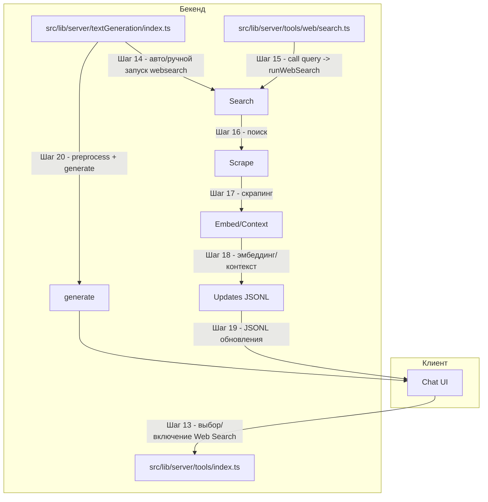

# Поддиаграмма 2: Web Search (продолжение шагов 13+)

## Термины и аббревиатуры
- **Web Search**: встроенный инструмент для поиска в интернете и извлечения релевантного контекста.
- **RAG**: Retrieval-Augmented Generation (настройки ассистента для поиска/ограничений доменов).

## Визуальная диаграмма


## Шаг 13: Выбор/включение Web Search
- Источник: либо пользовательские настройки/предпочтения инструментов, либо ассистент с включенным websearch.
- Результат: `websearch` попадает в список активных инструментов.

Исходный файл: `src/lib/server/textGeneration/tools.ts` (строки 31-43)
```typescript
if (assistant) {                                      // Если выбран ассистент
  if (assistant?.tools?.length) {                     // У ассистента задан список tools
    preferences = assistant.tools;                    // Используем его
    if (assistantHasWebSearch(assistant)) {           // Если у ассистента включен websearch
      preferences.push(websearch._id.toString());     // Добавляем websearch в предпочтения
    }
  } else {                                            // У ассистента нет явных tools
    if (assistantHasWebSearch(assistant)) {           // Но websearch включен
      return [websearch, directlyAnswer];             // Вернуть websearch + directlyAnswer
    }
    return [directlyAnswer];                          // Иначе только directlyAnswer
  }
}
```

## Шаг 14: Авто/ручной запуск websearch в пайплайне генерации
- Условия автозапуска: не `isContinue` и (включён `webSearch` без ассистента) или `assistantHasWebSearch`.
- Результат: запускается `runWebSearch(...)` и стримятся обновления.

Исходный файл: `src/lib/server/textGeneration/index.ts` (строки 60-68)
```typescript
let webSearchResult: WebSearch | undefined;           // Контейнер для результата websearch
// run websearch if:                                   // Условия автозапуска
// - it's not continuing a previous message
// - AND the model doesn't support tools and websearch is selected
// - OR the assistant has websearch enabled (no tools for assistants for now)
if (!isContinue && ((webSearch && !conv.assistantId) || assistantHasWebSearch(assistant))) {
  webSearchResult = yield* runWebSearch(conv, messages, assistant?.rag); // Запуск websearch
}
```

Пример флага в запросе (клиент):
```json
{
  "web_search": true
}
```

## Шаг 15: Вызов инструмента Web Search как Tool
- Вариант: инструмент вызывается напрямую как `tool.call` при наличии явного параметра `query`.
- Результат: генерация контекста источников и возврат `outputs`.

Исходный файл: `src/lib/server/tools/web/search.ts` (строки 26-47)
```typescript
async *call({ query }, { conv, assistant, messages }) {             // Вызов инструмента с параметром query
  const webSearchToolResults = yield* runWebSearch(                 // Запуск общего пайплайна websearch
    conv,
    messages,
    assistant?.rag,
    String(query)
  );

  const webSearchContext = webSearchToolResults?.contextSources     // Формируем текстовый контекст
    .map(({ context }, idx) => `Source [${idx + 1}]\n${context.trim()}`)
    .join("\n\n----------\n\n");

  return {                                                          // Возвращаем результат инструмента
    outputs: [                                                      // Массив выводов (один объект)
      { websearch: webSearchContext + "\n\nWhen answering ... " + new Date().toLocaleDateString("en-US", { year: "numeric", month: "long", day: "numeric" }) },
    ],
    display: false,                                                 // Вывод не отображается отдельным виджетом
  };
}
```

Пример JSON вызова инструмента:
```json
{
  "name": "websearch",
  "parameters": {
    "query": "latest news about sveltekit"
  }
}
```

## Шаг 16: Поиск
- Действие: генерация поискового запроса (если нужно) и выполнение поиска страниц.
- Результат: `{ searchQuery, pages }`.

Исходный файл: `src/lib/server/websearch/runWebSearch.ts` (строки 45-48)
```typescript
const { searchQuery, pages } = yield* search(messages, ragSettings, query); // Поиск по сообщению/запросу
if (pages.length === 0) throw Error("No results found for this search query"); // Обработка пустого результата
```

## Шаг 17: Скрапинг
- Действие: параллельный скрапинг первых результатов, фильтрация пустых страниц.
- Результат: `scrapedPages`.

Исходный файл: `src/lib/server/websearch/runWebSearch.ts` (строки 50-58)
```typescript
yield makeGeneralUpdate({ message: "Browsing search results" });   // Обновление статуса
const allScrapedPages = yield* mergeAsyncGenerators(                 // Параллельно скрапим страницы
  pages.slice(0, 8).map(scrape(embeddingModel.chunkCharLength))
);
const scrapedPages = allScrapedPages                                 // Оставляем непустые
  .filter((p): p is WebSearchScrapedSource => Boolean(p))
  .filter((p) => p.page.markdownTree.children.length > 0)
  .slice(0, 5);
```

## Шаг 18: Эмбеддинг и выделение контекста
- Действие: чанкинг и поиск релевантных кусков; публикация источников в апдейтах.
- Результат: `contextSources` и `yield makeSourcesUpdate(...)`.

Исходный файл: `src/lib/server/websearch/runWebSearch.ts` (строки 64-74)
```typescript
yield makeGeneralUpdate({ message: "Extracting relevant information" }); // Статус
const contextSources = await findContextSources(scrapedPages, prompt, embeddingModel).then(
  (ctxSources) =>
    ctxSources.map((source) => ({                                     // Убираем parent-ссылки из дерева
      ...source,
      page: { ...source.page, markdownTree: removeParents(source.page.markdownTree) },
    }))
);
yield makeSourcesUpdate(contextSources);                               // Публикуем источники в поток
```

## Шаг 19: Потоковые обновления Web Search (JSONL)
- Действие: сервер шлёт `webSearch`-обновления (`general`, `sources`, `final`).
- Результат: UI может показывать ход websearch и список источников.

Исходный файл: `src/lib/server/websearch/runWebSearch.ts` (строки 36, 86-102)
```typescript
MetricsServer.getMetrics().webSearch.requestCount.inc();             // Метрика запроса websearch
...
yield makeFinalAnswerUpdate();                                       // Финал пайплайна websearch
return webSearch;                                                    // Возврат результата (или пустого на ошибке)
```

Пример JSONL-сообщений:
```json
{ "type": "webSearch", "status": "general", "message": "Browsing search results" }
{ "type": "webSearch", "status": "sources", "contextSources": [/* ... */] }
{ "type": "webSearch", "status": "final" }
```

## Шаг 20: Включение результата websearch в основную генерацию
- Действие: `webSearchResult` встраивается в `preprocessMessages(...)` и далее в `generate(...)`.
- Результат: модель использует найденный контекст.

Исходный файл: `src/lib/server/textGeneration/index.ts` (строки 86-88)
```typescript
const processedMessages = await preprocessMessages(messages, webSearchResult, convId); // Инъекция контекста
yield* generate({ ...ctx, messages: processedMessages }, toolResults, preprompt);      // Основная генерация
```

## Описание блоков
- `src/lib/server/tools/web/search.ts`: описание инструмента; параметры `query`; вызов `runWebSearch`.
- `src/lib/server/websearch/runWebSearch.ts`: весь пайплайн - поиск → скрапинг → эмбеддинг → обновления → результат.
- `src/lib/server/textGeneration/index.ts`: условия автозапуска websearch и интеграция результата в генерацию.
- `src/lib/server/tools/index.ts`: регистрация `websearch` как config tool.
