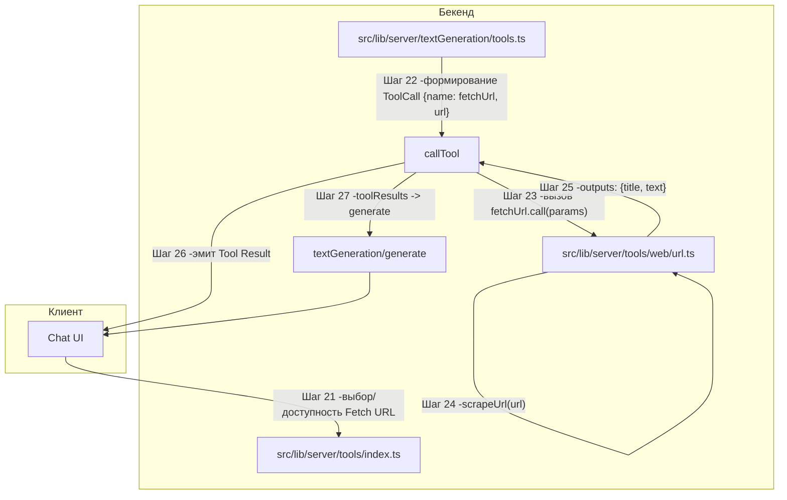

# Поддиаграмма 3: Fetch URL (продолжение шагов 21+)

## Термины и аббревиатуры
- **Fetch URL**: встроенный инструмент для получения содержимого веб‑страницы по URL и преобразования его в текст (markdown).

## Визуальная диаграмма


## Шаг 21: Доступность Fetch URL (регистрация в конфиг‑инструментах)
- Действие: инструмент добавляется к списку `configTools` и может быть выбран пользователем.
- Результат: инструмент появляется среди доступных (если включён по настройкам).

Исходный файл: `src/lib/server/tools/index.ts` (строки 129-131)
```typescript
// add the extra hardcoded tools                             // Добавляем жёстко заданные инструменты
.transform((val) => [...val, calculator, directlyAnswer, fetchUrl, websearch]); // Включая fetchUrl
```

## Шаг 22: Модель формирует вызов инструмента
- Действие: при оркестрации инструментов модель (или парсер JSON в тексте) выдаёт `ToolCall` с именем `fetchUrl` и параметром `url`.
- Результат: диспетчер инструментов готовит вызов конкретного инструмента.

Пример входного ToolCall:
```json
{
  "name": "fetchUrl",
  "parameters": { "url": "https://svelte.dev/blog" }
}
```

## Шаг 23: Диспетчер вызывает инструмент
- Действие: диспетчер находит инструмент по имени, эмитит событие Call, вызывает `tool.call`, затем эмитит Result/Error.
- Результат: формируется `ToolResult` и события `MessageUpdate.Tool` для клиента.

Исходный файл: `src/lib/server/textGeneration/tools.ts` (строки 63-106)
```typescript
const tool = tools.find((el) => toolHasName(call.name, el));      // Ищем инструмент по имени
if (!tool) {                                                       // Если не найден
  return { call, status: ToolResultStatus.Error,                   // Возвращаем ошибку
    message: `Could not find tool "${call.name}"` };
}
if (toolHasName(directlyAnswer.name, tool)) return;                // Служебный инструмент -пропускаем
yield { type: MessageUpdateType.Tool,                              // Эмитим событие начала вызова
  subtype: MessageToolUpdateType.Call, uuid, call };
try {
  const toolResult = yield* tool.call(call.parameters, ctx, uuid); // Запуск реализации инструмента
  yield { type: MessageUpdateType.Tool,                             // Эмитим успешный результат
    subtype: MessageToolUpdateType.Result, uuid,
    result: { ...toolResult, call, status: ToolResultStatus.Success } };
  await collections.tools.findOneAndUpdate({ _id: tool._id }, { $inc: { useCount: 1 } }); // Счётчик
  return { ...toolResult, call, status: ToolResultStatus.Success }; // Возврат результата
} catch (error) {
  yield { type: MessageUpdateType.Tool,                             // Эмит ошибки
    subtype: MessageToolUpdateType.Error, uuid,
    message: "An error occurred while calling the tool " + call.name + ": " + stringifyError(error) };
  return { call, status: ToolResultStatus.Error,                    // Возврат ошибки
    message: "An error occurred while calling the tool " + call.name + ": " + stringifyError(error) };
}
```

Пример выходного события (успех):
```json
{
  "type": "tool",
  "subtype": "result",
  "uuid": "a7c...",
  "result": {
    "outputs": [{ "title": "...", "text": "..." }],
    "display": false,
    "call": { "name": "fetchUrl", "parameters": { "url": "https://svelte.dev" } },
    "status": "success"
  }
}
```

## Шаг 24: Реализация Fetch URL -скрапинг URL
- Действие: инструмент принимает `url`, выполняет скрапинг и превращает DOM в markdown‑дерево, затем -в текст.
- Результат: `{ title, text }` без файлов.

Исходный файл: `src/lib/server/tools/web/url.ts` (строки 6-37)
```typescript
const fetchUrl: ConfigTool = {                                  // Объявление config-инструмента Fetch URL
  _id: new ObjectId("00000000000000000000000B"),               // Статический ObjectId
  type: "config",                                              // Тип инструмента -конфигурационный
  description: "Fetch the contents of a URL",                  // Описание инструмента
  color: "blue",                                               // Цвет бэйджа
  icon: "cloud",                                               // Иконка
  displayName: "Fetch URL",                                    // Отображаемое название
  name: "fetchUrl",                                            // Системное имя
  endpoint: null,                                               // Нет внешнего endpoint -вызов локальный
  inputs: [                                                     // Схема входных параметров
    { name: "url", type: "str",                               // Имя параметра и тип строки
      description: "The URL of the webpage to fetch",          // Описание параметра
      paramType: "required" },                                  // Обязательный параметр
  ],
  outputComponent: null,                                        // Вывод без отдельного компонента
  outputComponentIdx: null,                                     // Индекс компонента не используется
  showOutput: false,                                            // Не показывать отдельный вывод
  async *call({ url }) {                                        // Реализация вызова инструмента
    const blocks = String(url).split("\n");                    // Разбиваем строку по переносам
    const urlStr = blocks[blocks.length - 1];                    // Берём последнюю строку как URL

    const { title, markdownTree } = await scrapeUrl(urlStr, Infinity); // Скрапим страницу целиком

    return {                                                    // Возвращаем результат в формате ToolResult
      outputs: [{ title, text: stringifyMarkdownElementTree(markdownTree) }], // Заголовок и текст
      display: false,                                           // Не отображать отдельным виджетом
    };
  },
};
```

Пример параметров `call`:
```json
{ "url": "https://svelte.dev/blog/whats-new" }
```

Пример результата `outputs`:
```json
{
  "outputs": [
    {
      "title": "What’s new in Svelte",
      "text": "# What’s new in Svelte..."
    }
  ],
  "display": false
}
```

## Шаг 25: Возврат outputs и отсутствие файлов
- Действие: инструмент возвращает только текст/заголовок, без файловых обновлений.
- Результат: клиент получит `MessageUpdate.Tool` (Result) и далее текст модели.

## Шаг 26: Эмиссия MessageUpdate.Tool для клиента
- Действие: диспетчер шлёт `Call`/`Result`/`Error` (см. Шаг 23), в UI это отображается как прогресс инструмента.
- Результат: визуальная индикация использования Fetch URL.

## Шаг 27: Включение результатов инструмента в основную генерацию
- Действие: результаты инструмента включаются в `toolResults` и передаются в `generate(...)` (см. общий путь инструментов, Шаг 9-12).
- Результат: модель учитывает извлечённый текст страницы при формировании финального ответа.

## Описание блоков
- `src/lib/server/tools/web/url.ts`: реализация Fetch URL; вход `url`, скрапинг `scrapeUrl`, вывод `{title, text}`.
- `src/lib/server/textGeneration/tools.ts`: диспетчер вызова инструмента, эмиссия `MessageUpdate.Tool` и возврат `ToolResult`.
- `src/lib/server/tools/index.ts`: регистрация Fetch URL среди config‑инструментов.
