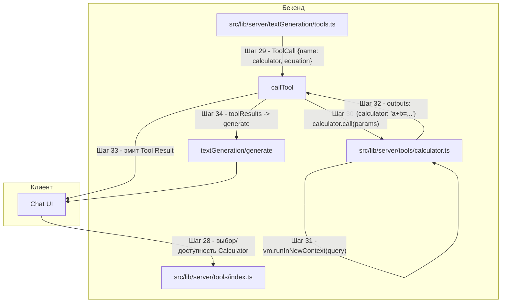

# Поддиаграмма 4: Calculator (продолжение шагов 28+)

## Термины и аббревиатуры
- **Calculator**: встроенный инструмент для вычисления математического выражения на сервере.

## Визуальная диаграмма


## Шаг 28: Доступность Calculator (регистрация среди config‑инструментов)
- Действие: инструмент включён в список фиксированных `configTools`.
- Результат: может быть выбран пользователем или ассистентом.

Исходный файл: `src/lib/server/tools/index.ts` (строки 129–131)
```typescript
// add the extra hardcoded tools
.transform((val) => [...val, calculator, directlyAnswer, fetchUrl, websearch]);
```

JSON (фрагмент активных инструментов пользователя):
```json
{ "tools": ["00000000000000000000000C"] }
```

## Шаг 29: Формирование ToolCall для калькулятора
- Действие: модель/парсер формирует вызов инструмента с параметром `equation`.
- Результат: диспетчер готов к вызову реализации.

Пример входного ToolCall:
```json
{ "name": "calculator", "parameters": { "equation": "(2+3)*4" } }
```

## Шаг 30: Вызов calculator.call
- Действие: диспетчер находит инструмент, эмитит `Call`, вызывает `tool.call`, ловит `Result`/`Error`.
- Результат: `ToolResult` попадает в `toolResults` и стрим апдейтов.

Исходный файл: `src/lib/server/textGeneration/tools.ts` (строки 63–106)
```typescript
// См. детальный код вызова инструмента в поддиаграмме Fetch URL (Шаг 23)
```

## Шаг 31: Вычисление выражения
- Действие: калькулятор очищает вход от лишних символов и вычисляет с помощью `vm.runInNewContext`.
- Результат: строка с выражением и значением.

Исходный файл: `src/lib/server/tools/calculator.ts` (строки 26–37)
```typescript
async *call({ equation }) {
  try {
    const blocks = String(equation).split("\n");            // Делим по переносам
    const query = blocks[blocks.length - 1]                    // Берём последнюю строку
      .replace(/[^-()\d/*+.]/g, "");                        // Убираем все кроме цифр и операторов

    return {                                                   // Возвращаем ответ
      outputs: [{ calculator: `${query} = ${vm.runInNewContext(query)}` }], // Формируем строку результата
    };
  } catch (cause) {
    throw new Error("Invalid expression", { cause });         // Ошибка неверного выражения
  }
}
```

Пример параметров `call`:
```json
{ "equation": "(2 + 3) * 4" }
```

## Шаг 32: Возврат outputs
- Действие: инструмент возвращает один объект в `outputs`.
- Результат: `{ "calculator": "(2+3)*4 = 20" }`.

Пример результата:
```json
{ "outputs": [{ "calculator": "(2+3)*4 = 20" }] }
```

## Шаг 33: Эмиссия MessageUpdate.Tool (Result)
- Действие: отправка на клиент события о результате.
- Результат: UI может отрисовать результат инструмента.

Пример событий:
```json
{ "type": "tool", "subtype": "call", "uuid": "b12...", "call": { "name": "calculator", "parameters": { "equation": "(2+3)*4" } } }
{ "type": "tool", "subtype": "result", "uuid": "b12...", "result": { "outputs": [{ "calculator": "(2+3)*4 = 20" }], "display": false, "call": { "name": "calculator", "parameters": { "equation": "(2+3)*4" } }, "status": "success" } }
```

## Шаг 34: Включение результатов инструмента в основную генерацию
- Действие: добавление `ToolResult` к `toolResults` и вызов `generate(...)`.
- Результат: модель получает дополнительный контекст.

Пример структуры (укор.):
```json
{
  "toolResults": [
    { "outputs": [{ "calculator": "(2+3)*4 = 20" }], "display": false,
      "call": { "name": "calculator", "parameters": { "equation": "(2+3)*4" } },
      "status": "success" }
  ]
}
```

## Описание блоков
- `src/lib/server/tools/calculator.ts`: реализация калькулятора -очистка и вычисление выражения.
- `src/lib/server/textGeneration/tools.ts`: диспетчер инструментов -эмиссия Call/Result/Error и сбор ToolResult.
- `src/lib/server/tools/index.ts`: регистрация Calculator в списке config‑инструментов.
