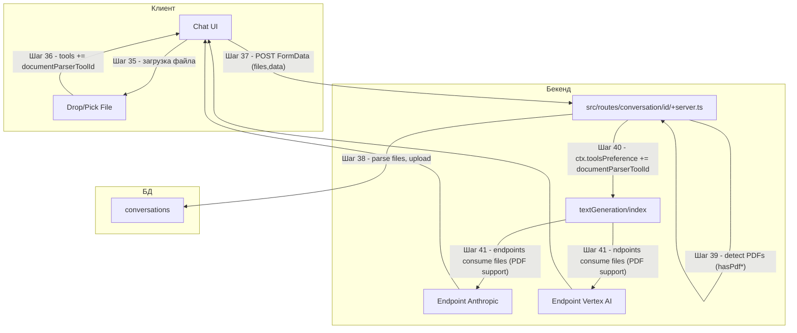

# Поддиаграмма 5: Document Parser (продолжение шагов 35+)

## Термины и аббревиатуры
- **Document Parser**: авто-инструмент для работы с документами (PDF и др.). Не является config‑инструментом; используется как флаг, который включает обработку файлов в пайплайне и на endpoint’ах модели.

## Визуальная диаграмма


## Шаг 35: Загрузка файла на клиенте
- Действие: пользователь прикрепляет файл (drag&drop или через file input).
- Результат: файл появляется в состоянии компонента.

Исходный файл: `src/lib/components/chat/FileDropzone.svelte` (строки 66-72)
```svelte
// При добавлении файла в дропзону
files = [...files, file];                                   // Добавляем файл в массив
settings.instantSet({                                       // Немедленно обновляем настройки пользователя
  tools: [...($settings.tools ?? []), documentParserToolId] // Добавляем флаг Document Parser
});
```

Исходный файл: `src/lib/components/chat/ChatInput.svelte` (строки 61–67)
```svelte
files = [...files, ...(target.files ?? [])];               // Добавляем выбранные файлы
if (files.some((file) => file.type.startsWith("application/"))) {
  await settings.instantSet({
    tools: [...($settings.tools ?? []), documentParserToolId] // Включаем флаг при документе
  });
}
```

Пример JSON настроек (фрагмент):
```json
{ "tools": ["000000000000000000000002"] }
```

## Шаг 36: Добавление `documentParserToolId` в выбранные инструменты
- Действие: клиент сохраняет в сторе id инструмента документа.
- Результат: UI показывает бейдж Document Parser, разрешает нужные MIME-типы.

Пример UI-состояния:
```json
{ "documentParserIsOn": true, "acceptedMimeTypes": ["application/pdf"] }
```

## Шаг 37: Отправка FormData на сервер
- Действие: клиент отправляет `POST /conversation/:id` с `FormData`: поле `data` (JSON) и `files` (File).
- Результат: сервер получает файлы для последующей загрузки и обработки.

Пример FormData.data (фрагмент JSON):
```json
{
  "inputs": "Пожалуйста, ответь с учётом прикреплённого PDF",
  "tools": ["000000000000000000000002"],
  "files": [ /* для base64-режима, см. Чат/Поддиаграмма 2 */ ]
}
```

## Шаг 38: Разбор и загрузка файлов на сервере
- Действие: сервер извлекает файлы из FormData, валидирует, загружает и формирует `uploadedFiles`.
- Результат: новые файлы сохраняются и доступны в разговоре.

Исходный файл: `src/routes/conversation/[id]/+server.ts` (строки 183–231)
```typescript
const inputFiles = await Promise.all( /* ... */ );            // Читаем файлы из FormData
const hashFiles = inputFiles?.filter((f) => f.type === "hash") ?? [];
const b64Files = inputFiles                                   // Готовим к загрузке base64
  ?.filter((file) => file.type !== "hash")
  .map((file) => new File([Buffer.from(file.value, "base64")], file.name, { type: file.mime })) ?? [];
if (b64Files.some((f) => f.size > 10 * 1024 * 1024)) {        // Ограничение 10MB
  error(413, "File too large, should be <10MB");
}
const uploadedFiles = await Promise.all(b64Files.map((f) => uploadFile(f, conv)))
  .then((files) => [...files, ...hashFiles]);                  // Получаем список загруженных
```

JSON (фрагмент файлов в сообщении):
```json
{
  "files": [
    { "type": "hash", "name": "report.pdf", "value": "<sha256>", "mime": "application/pdf" }
  ]
}
```

## Шаг 39: Детекция PDF в запросе/разговоре
- Действие: сервер проверяет, были ли загружены PDF сейчас или ранее в этой беседе.
- Результат: вычисляются флаги `hasPdfFiles` и `hasPdfInConversation`.

Исходный файл: `src/routes/conversation/[id]/+server.ts` (строки 199–206)
```typescript
const hasPdfFiles = inputFiles?.some((f) => f.mime === "application/pdf") ?? false; // Новые PDF
const hasPdfInConversation =                                                            // Исторические PDF
  conv.messages?.some((m) => m.files?.some((f) => f.mime === "application/pdf")) ?? false;
```

JSON (флаги):
```json
{ "hasPdfFiles": true, "hasPdfInConversation": false }
```

## Шаг 40: Автодобавление `documentParserToolId` в контекст генерации
- Действие: если есть PDF, сервер добавляет `documentParserToolId` в `toolsPreference` генерации.
- Результат: downstream‑обработка файлов будет активирована на стороне endpoint’ов.

Исходный файл: `src/routes/conversation/[id]/+server.ts` (строки 450–466, фрагмент 460–462)
```typescript
const ctx: TextGenerationContext = { /* ... */
  toolsPreference: [
    ...(toolsPreferences ?? []),
    ...(hasPdfFiles || hasPdfInConversation ? [documentParserToolId] : []), // автодобавление
  ],
  /* ... */
};
```

JSON (фрагмент контекста):
```json
{ "toolsPreference": ["000000000000000000000002"] }
```

## Шаг 41: Обработка PDF на endpoint’ах модели (не как Tool)
- Действие: сами endpoint’ы объявляют поддержку `application/pdf` и конвертируют PDF в приемлемые блоки ввода.
- Результат: модель получает содержимое документов; Document Parser при этом не резолвится как config tool.

Исходный файл: `src/lib/server/endpoints/anthropic/endpointAnthropic.ts` (строки 39)
```typescript
supportedMimeTypes: ["application/pdf"],                          // Антропик поддерживает PDF
```

Исходный файл: `src/lib/server/endpoints/anthropic/utils.ts` (строки 34–35, 74)
```typescript
opts: FileProcessorOptions<"application/pdf">                     // Обработчик PDF
/* ... */
else if (file.mime === "application/pdf" && multimodal.document) { // Ветка PDF
```

Исходный файл: `src/lib/server/endpoints/google/endpointVertex.ts` (строки 49, 126)
```typescript
supportedMimeTypes: ["application/pdf", "text/plain"],           // Vertex: PDF и текст
/* ... */
else if (file.mime === "application/pdf" || file.mime === "text/plain") { // Ветка PDF/текст
```

Примечание: `documentParserToolId` не присутствует в `configTools` и не резолвится в `getTools`; он выступает маркером для UI/пайплайна. Сами файлы подключаются к endpoint’ам через поддержку `supportedMimeTypes` и блоков сообщений.

## Шаг 42: Результат генерации и файлы в сообщениях
- Действие: поток `MessageUpdate` включает события `File` при загрузке и финальный ответ модели.
- Результат: клиент видит прикреплённые файлы и ответ, учитывающий содержимое документа.

Исходный файл: `src/routes/conversation/[id]/+server.ts` (строки 402–408, 432–438)
```typescript
else if (event.type === MessageUpdateType.File) {                  // Добавление файла к сообщению
  messageToWriteTo.files = [...(messageToWriteTo.files ?? []),
    { type: "hash", name: event.name, value: event.sha, mime: event.mime }];
}
/* ... */
controller.enqueue(JSON.stringify(event) + "\n");               // JSONL-стрим к клиенту
if (event.type === MessageUpdateType.FinalAnswer) {
  controller.enqueue(" ".repeat(4096));                          // Сброс буфера браузера
}
```

JSONL (пример):
```json
{ "type": "file", "name": "report.pdf", "sha": "<sha>", "mime": "application/pdf" }
{ "type": "finalAnswer", "text": "Резюме по PDF: ..." }
```

## Описание блоков
- `src/lib/components/chat/FileDropzone.svelte` и `src/lib/components/chat/ChatInput.svelte`: автодобавление `documentParserToolId` при загрузке документа.
- `src/routes/conversation/[id]/+server.ts`: парсинг/загрузка файлов, детекция PDF, добавление `documentParserToolId` в контекст генерации.
- Endpoint’ы (`anthropic`, `google/vertex`): нативная поддержка PDF через `supportedMimeTypes` и преобразование документа в входные блоки.
