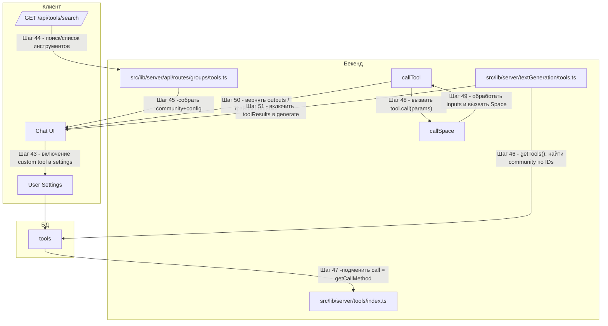

# Поддиаграмма 6: Интеграция своего инструмента (продолжение шагов 43+)

## Термины и аббревиатуры
- **Community tool**: пользовательский инструмент, хранящийся в коллекции `tools` БД и вызываемый через общий механизм `getCallMethod`/`callSpace`.
- **Config tool**: встроенный инструмент из конфигурации (не про этот файл).

## Визуальная диаграмма


## Шаг 43: Включение своего инструмента в настройки пользователя
- Действие: в настройках сохраняется ID community‑инструмента (строковый ObjectId), после чего инструмент доступен для вызова.
- Результат: ID попадает в `settings.tools` и возвращается клиенту в `GET /user/settings` (см. Общий путь инструментов, Шаги 1–3).

Пример JSON (фрагмент настроек):
```json
{ "tools": ["65f1e2a7c1b3a9d8f0123456"] }
```

## Шаг 44: Поиск/список доступных инструментов
- Действие: клиент запрашивает каталог инструментов (config + community) через API.
- Результат: сервер возвращает список и метаданные.

Исходный файл: `src/lib/server/api/routes/groups/tools.ts` (строки 70–153)
```typescript
.get("/search", async ({ query, locals, error }) => {         // Поиск/каталог инструментов
  if (config.COMMUNITY_TOOLS !== "true") {                    // Фича-флаг community tools
    error(403, "Community tools are not enabled");
  }
  // Построение фильтра, сортировки, токенов поиска...
  const communityTools = await collections.tools               // Инструменты из БД
    .find(filter)
    .skip(NUM_PER_PAGE * pageIndex)
    .sort({ ...(sort === SortKey.TRENDING && { last24HoursUseCount: -1 }), useCount: -1 })
    .limit(NUM_PER_PAGE)
    .toArray();
  const configTools = toolFromConfigs                           // Встроенные инструменты
    .filter((tool) => !tool?.isHidden)
    .filter(/* по токенам поиска */);
  const tools = [...(pageIndex == 0 && !username ? configTools : []), ...communityTools];
  return { tools, numTotalItems, numItemsPerPage: NUM_PER_PAGE, query: search, sort, showUnfeatured };
})
```

Пример ответа (укор.):
```json
{
  "tools": [
    { "_id": "65f1e2a7c1b3a9d8f0123456", "name": "my_tool", "displayName": "My Tool", "description": "...", "icon": "bolt", "color": "purple" }
  ],
  "numTotalItems": 25,
  "numItemsPerPage": 16
}
```

## Шаг 45: Активные инструменты пользователя
- Действие: `GET /api/tools/active` возвращает объединение `communityTools` и `configTools`, отфильтрованных по настройкам.
- Результат: клиент знает, какие инструменты активны.

Исходный файл: `src/lib/server/api/routes/groups/tools.ts` (строки 19–68)
```typescript
.get("/active", async ({ locals }) => {                       // Активные инструменты пользователя
  const settings = await collections.settings.findOne(authCondition(locals));
  const activeCommunityToolIds = settings?.tools ?? [];        // IDs из настроек
  const communityTools = await collections.tools               // Подтягиваем описание из БД
    .find({ _id: { $in: activeCommunityToolIds.map((id) => new ObjectId(id)) } })
    .toArray()
    .then((tools) => tools.map((tool) => ({ ...tool, isHidden: false, isOnByDefault: true, isLocked: true })));
  const fullTools = [...communityTools, ...toolFromConfigs];   // Склеиваем с конфиг-инструментами
  return fullTools.filter((tool) => !tool.isHidden)            // Фильтруем скрытые
    .map((tool) => ({ _id: tool._id.toString(), name: tool.name, displayName: tool.displayName, /* ... */ }));
})
```

JSON (укор.):
```json
[{ "_id": "65f1e2a7c1b3a9d8f0123456", "name": "my_tool", "displayName": "My Tool" }]
```

## Шаг 46: Сбор активных инструментов для генерации
- Действие: при запуске генерации вызывается `getTools(toolsPreference, assistant)`.
- Результат: community‑инструменты подтягиваются из БД, и им назначается `call = getCallMethod(tool)`.

Исходный файл: `src/lib/server/textGeneration/tools.ts` (строки 52–61)
```typescript
const activeCommunityTools = await collections.tools            // Берём community-инструменты по IDs
  .find({ _id: { $in: preferences.map((el) => new ObjectId(el)) } })
  .toArray()
  .then((el) => el.map((el) => ({ ...el, call: getCallMethod(el) })));
return [...activeConfigTools, ...activeCommunityTools];        // Склеиваем с config-инструментами
```

## Шаг 47: Правила входов/выходов кастомного инструмента
- Действие: схема `editableToolSchema` описывает допустимую структуру community‑инструмента.
- Результат: валидация формы создания/редактирования инструмента, преобразование `outputComponent` и пр.

Исходный файл: `src/lib/server/tools/index.ts` (строки 70–98)
```typescript
export const editableToolSchema = z.object({                   // Схема редактируемого инструмента
  name: z.string().regex(/^[a-zA-Z_][a-zA-Z0-9_]*$/).min(1).max(40),
  baseUrl: z.union([ z.string().regex(/^[^/]+\/[^/]+$/),     // namespace/space или URL Space
    z.string().regex(/^https:\/\/huggingface\.co\/spaces\/[a-zA-Z0-9-]+\/[a-zA-Z0-9-]+$/)
      .transform((url) => url.split("/").slice(-2).join("/")) ]),
  endpoint: z.string().min(1).max(100),                       // Имя endpoint в Space
  inputs: z.array(toolInputSchema),                            // Описание входов
  outputComponent: z.string().min(1).max(100),                 // Индекс;ТипКомпонента (например "0;TEXT")
  showOutput: z.boolean(),
  displayName: z.string().min(1).max(40),
  color: ToolColor,
  icon: ToolIcon,
  description: z.string().min(1).max(100),
}).transform((tool) => ({
  ...tool,
  outputComponentIdx: parseInt(tool.outputComponent.split(";")[0]),
  outputComponent: ToolOutputComponents.parse(tool.outputComponent.split(";")[1]),
}));
```

Пример JSON (документ инструмента в БД):
```json
{
  "_id": "65f1e2a7c1b3a9d8f0123456",
  "type": "community",
  "name": "my_tool",
  "displayName": "My Tool",
  "description": "Short description",
  "baseUrl": "username/my-space",
  "endpoint": "/run",
  "inputs": [
    { "name": "q", "type": "str", "paramType": "required" }
  ],
  "outputComponent": "0;TEXT",
  "outputComponentIdx": 0,
  "showOutput": false,
  "color": "blue",
  "icon": "bolt"
}
```

## Шаг 48: Вызов своего инструмента (через callTool)
- Действие: общий диспетчер ищет инструмент по имени, эмитит Call, вызывает `tool.call` (для community это `getCallMethod`).
- Результат: события `MessageUpdate.Tool` (Call/Result/Error) и `ToolResult`.

Исходный файл: `src/lib/server/textGeneration/tools.ts` (строки 63–106)
```typescript
// См. реализацию: поиск инструмента, эмиссия Call/Result/Error, инкремент useCount, возврат ToolResult
```

## Шаг 49: Как формируется `tool.call` для community‑инструмента
- Действие: `getCallMethod` подготавливает прокси‑вызов в Hugging Face Space: преобразует inputs, скачивает файлы, вызывает `callSpace`.
- Результат: возврат outputs/файлов согласно `outputComponent`.

Исходный файл: `src/lib/server/tools/index.ts` (строки 132–307)
```typescript
export function getCallMethod(tool: Omit<BaseTool, "call">): BackendCall {
  return async function* (params, ctx, uuid) {
    if (tool.endpoint === null || !tool.baseUrl || !tool.outputComponent || tool.outputComponentIdx === null) {
      throw new Error(`Tool function ${tool.name} has no endpoint`); // Проверки обязательных полей
    }
    const ipToken = await getIpToken(ctx.ip, ctx.username);         // Токен для вызова
    const inputs = tool.inputs.map(async (input) => {               // Преобразование входов
      if (input.type === "file" && input.paramType !== "required") throw new Error("File inputs are always required");
      if (input.paramType === "fixed") return coerceInput(input.value, input.type);
      if (input.paramType === "optional") return coerceInput(params[input.name] ?? input.default, input.type);
      if (input.paramType === "required") {                        // Обязательный параметр
        if (params[input.name] === undefined) throw new Error(`Missing required input ${input.name}`);
        if (input.type === "file") {                               // Загрузка файла из сообщения
          // parse file reference input_X_Y.ext -> извлечь blob через downloadFile(...)
          /* ... */
        } else return coerceInput(params[input.name], input.type);
      }
    });
    const outputs = yield* callSpace(tool.baseUrl, tool.endpoint, await Promise.all(inputs), ipToken, uuid); // Вызов Space
    // Разбор outputs согласно ToolOutputPaths, загрузка файлов через uploadFile(...), эмиссия MessageUpdate.File
    /* ... */
    return { outputs: toolOutputs, display: tool.showOutput };
  };
}
```

## Шаг 50: Как описывать files/outputs в инструменте
- Действие: тип вывода определяется парой `outputComponentIdx` + `outputComponent`; пути выбираются из `ToolOutputPaths`.
- Результат: для файлов -скачивание и загрузка в чат; для текста -возврат строк.

Исходный файл: `src/lib/server/tools/index.ts` (строки 225–306, фрагменты)
```typescript
if (!isValidOutputComponent(tool.outputComponent)) throw new Error("Tool output component is not defined");
const { type, path } = ToolOutputPaths[tool.outputComponent];  // Выбираем тип/путь
// Если не объект -вернуть напрямую; иначе извлечь поля по JSONPath и собрать outputs
// Для files: скачать URL -> blob -> определить mime -> загрузить -> эмитить MessageUpdate.File
return { outputs: toolOutputs, display: tool.showOutput };
```

Пример результата (текст):
```json
{ "outputs": [{ "my_tool-0": "Answer snippet..." }], "display": false }
```

## Шаг 51: Включение `toolResults` в генерацию
- Действие: после выполнения инструментов результаты передаются в генерацию.
- Результат: модель использует данные инструмента.

Исходный файл: `src/lib/server/textGeneration/index.ts` (строки 86–88)
```typescript
const processedMessages = await preprocessMessages(messages, webSearchResult, convId);
yield* generate({ ...ctx, messages: processedMessages }, toolResults, preprompt);
```

## Шаг 52: Что важно знать (ограничения)
- API создания/редактирования community‑инструментов (POST/PATCH/DELETE) в текущем коде помечены как Not implemented.
- Интеграция возможна путём прямой записи документа в коллекцию `tools` по схеме `editableToolSchema`.
- Для файловых входов инструмент обязан объявлять `inputs` с `type = "file"` и корректно обрабатывать имена ссылок на файлы `input_<msgIdx>_<fileIdx>.<ext>`.
- Валидация и безопасность параметров -на стороне инструмента (Space): сервер передаёт приведённые значения.
