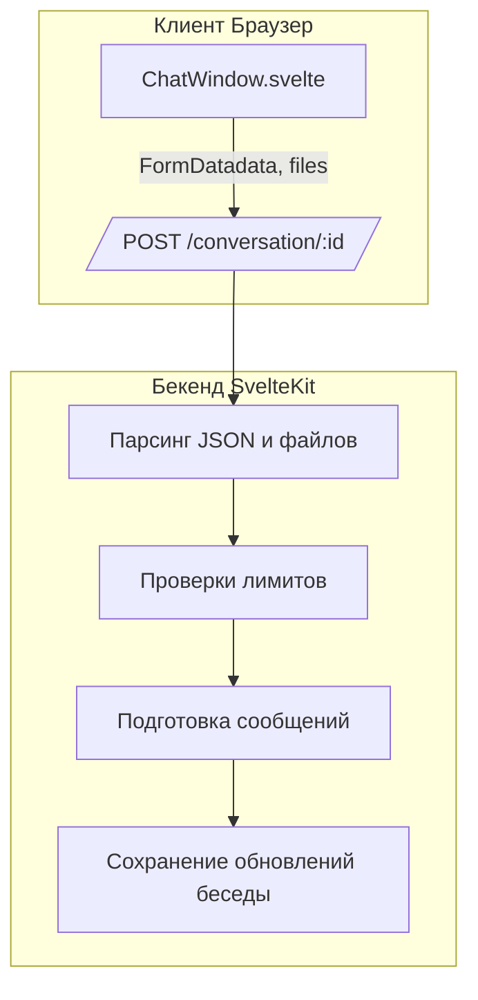

# Поддиаграмма 1: Инициация сообщения (шаги 1–8)

## Термины и аббревиатуры

**Conversation** – сущность беседы с полем `messages`, выбранной `model`, `preprompt`, `assistantId` и др.

**FormData** – формат отправки данных из клиента: JSON-поле `data` + коллекция файлов `files`.

**Message** – узел дерева сообщений с полями `from`, `content`, `files`, `children`, `ancestors`.

## Визуальная диаграмма



## Передаваемые данные (JSON)

### Шаг 1: Отправка формы (клиент → сервер)

**Действие:** Клиент отправляет форму с `data` (JSON) и `files` (опционально).

**Тип данных:** `multipart/form-data`.

**Пример JSON поля `data`:**
```json
{
  "id": "parent-or-message-id",
  "inputs": "User message...",
  "is_retry": false,
  "is_continue": false,
  "web_search": false,
  "tools": ["00000000000000000000000A"],
  "files": [
    { "type": "base64", "name": "image.png", "value": "<base64>", "mime": "image/png" }
  ]
}
```

```json
{
  "method": "POST",
  "url": "/conversation/{id}",
  "headers": { "Content-Type": "multipart/form-data" },
  "form": {
    "data": "{...see above...}",
    "files": [
      { "name": "base64;image.png", "type": "image/png", "size": 12345 }
    ]
  }
}
```

### Шаг 2: Серверный обработчик (валидация входа)

**Файл проекта:** `src/routes/conversation/[id]/+server.ts`

```typescript
// src/routes/conversation/[id]/+server.ts (lines 30–181)
export async function POST({ request, locals, params, getClientAddress }) { // Обработчик POST для отправки сообщения
	// 3. Парсинг form-data
	const form = await request.formData(); // Читаем multipart/form-data из запроса
	const json = form.get("data"); // Достаем поле "data" с JSON строкой
	if (!json || typeof json !== "string") error(400, "Invalid request"); // Валидируем наличие JSON

	// 4. Валидация json деталей сообщения и опций
	const { inputs, id, is_retry, is_continue, web_search, tools } = // Распаковка валидированных полей
		z.object({ // Описание схемы тела запроса
			id: z.string().uuid().refine(isMessageId).optional(), // ИД сообщения/родителя (опционально)
			inputs: z.optional(z.string().min(1).transform((s) => s.replace(/\r\n/g, "\n"))), // Текст пользователя
			is_retry: z.optional(z.boolean()), // Признак повтора
			is_continue: z.optional(z.boolean()), // Признак продолжения
			web_search: z.optional(z.boolean()), // Включить веб-поиск
			tools: z.array(z.string()).optional(), // Список предпочитаемых инструментов
			files: z.optional(z.array(z.object({ // Массив файлов
				type: z.literal("base64").or(z.literal("hash")), // Тип представления файла
				name: z.string(), // Имя файла
				value: z.string(), // Значение (base64 или sha256-хэш)
				mime: z.string(), // MIME-тип
			})))
		}).parse(JSON.parse(json)); // Парсим строку и валидируем
```

### Шаг 3: Преобразование загруженных файлов

```typescript
// src/routes/conversation/[id]/+server.ts (lines 183–231)
const inputFiles = await Promise.all( // Преобразуем файлы из FormData в унифицированную структуру
	form.getAll("files") // Берем все записи поля files
		.filter((entry): entry is File => entry instanceof File && entry.size > 0) // Оставляем реальные файлы
		.map(async (file) => { // Преобразуем каждый файл
			const [type, ...name] = file.name.split(";"); // Имя содержит type;filename
			return { // Формируем объект
				type: z.literal("base64").or(z.literal("hash")).parse(type), // Тип файла
				value: await file.text(), // Содержимое файла
				mime: file.type, // MIME-тип
				name: name.join(";") // Имя файла
			};
		})
);

// Ограничения размера и загрузка в хранилище, получение хэшей
const hashFiles = inputFiles?.filter((f) => f.type === "hash") ?? []; // Уже сохраненные (по хэшу)
const b64Files = (inputFiles?.filter((f) => f.type !== "hash") ?? []) // Base64 файлы, требующие загрузки
	.map((f) => new File([Buffer.from(f.value, "base64")], f.name, { type: f.mime })); // Декодируем в Blob
if (b64Files.some((f) => f.size > 10 * 1024 * 1024)) error(413, "File too large, should be <10MB"); // Лимит размера 10МБ
const uploadedFiles = await Promise.all(b64Files.map((f) => uploadFile(f, conv))) // Загружаем и получаем хэши
	.then((files) => [...files, ...hashFiles]); // Склеиваем с уже хэшированными
```

### Шаг 4: Ответ при создании беседы (если это создание)

```typescript
// src/routes/conversation/+server.ts (lines 118–123)
return new Response( // Возвращаем ответ клиенту
	JSON.stringify({ conversationId: res.insertedId.toString() }), // Тело: созданный ID беседы
	{ headers: { "Content-Type": "application/json" } } // Заголовки ответа
);
```

```json
{ "conversationId": "65f..." }
```

**Результат:** Формируются `messagesForPrompt`, файлы преобразуются и/или загружаются, подготавливается контекст для генерации.

## Описание блоков

### ChatWindow.svelte

**Что это:** Клиентская форма отправки в чат.

**Задача:** Отправить текст и файлы в формате `FormData`.

**Файлы проекта:** `src/lib/components/chat/ChatWindow.svelte`

### /conversation/[id]/+server.ts

**Что это:** Основной входной серверный обработчик сообщений беседы.

**Задача:** Принять форму, распарсить JSON, преобразовать файлы, проверить лимиты, подготовить данные к генерации.

**Файлы проекта:** `src/routes/conversation/[id]/+server.ts`

## Сводка этапа

**Цель:** Корректно принять пользовательский ввод и подготовить беседу к генерации.

**Результат:** Данные валидированы и готовы для предобработки и запуска пайплайна генерации.


