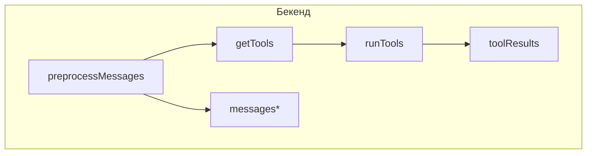

# Поддиаграмма 2: Предобработка и инструменты (шаги 9–14)

## Термины

**preprocessMessages** – добавляет контекст web-search, скачивает файлы в базу/хранилище, инжектит буфер обмена.

**Tools** – набор инструментов (websearch, document_parser, community tools) вызываемых моделью.

## Визуальная диаграмма (с продолжением нумерации)



## Передаваемые данные (JSON) и код по шагам

### Шаг 9: preprocessMessages() — добавление web‑контекста, скачивание файлов, инъекция буфера обмена

**Вход (сформировано на шаге 1–8):**
```json
{
  "messages": [
    { "from": "system", "content": "...preprompt..." },
    { "from": "user", "content": "Question...", "files": [ {"type":"hash","value":"<sha256>","mime":"image/png","name":"image.png"} ] }
  ],
  "webSearch": null,
  "convId": "65f..."
}
```

```typescript
// src/lib/server/endpoints/preprocessMessages.ts (lines 1–76)
export async function preprocessMessages( // Экспортируем асинхронную функцию предобработки сообщений
	messages: Message[], // Входной массив сообщений для обработки
	webSearch: Message["webSearch"], // Результаты веб-поиска (может быть null)
	convId: ObjectId // ID беседы для загрузки файлов
): Promise<EndpointMessage[]> { // Возвращаем Promise с массивом обработанных сообщений
	return Promise.resolve(messages) // Создаем Promise из массива сообщений
		.then((msgs) => addWebSearchContext(msgs, webSearch)) // Шаг 1: добавляем контекст веб-поиска
		.then((msgs) => downloadFiles(msgs, convId)) // Шаг 2: скачиваем файлы по хэшам
		.then((msgs) => injectClipboardFiles(msgs)); // Шаг 3: внедряем содержимое буфера обмена
}
```

**Выход:** список `EndpointMessage` готов к преобразованию в формат провайдера.

### Шаг 10: addWebSearchContext() — вшивание результатов поиска в последний вопрос пользователя

**Код:**
```typescript
// src/lib/server/endpoints/preprocessMessages.ts (lines 18–48)
function addWebSearchContext(messages: Message[], webSearch: Message["webSearch"]) { // Функция добавления контекста веб-поиска
	const webSearchContext = webSearch?.contextSources // Получаем источники контекста из результатов поиска
		.map(({ context }, idx) => `Source [${idx + 1}]\n${context.trim()}`) // Форматируем каждый источник с номером
		.join("\n\n----------\n\n"); // Объединяем источники с разделителями
	if (!webSearch || !webSearchContext?.trim()) return messages; // Если нет поиска или контекста - возвращаем как есть
	if (messages.length === 0) return messages; // Если нет сообщений - возвращаем пустой массив

	const lastQuestion = messages.findLast((el) => el.from === "user")?.content ?? ""; // Находим последний вопрос пользователя
	const previousQuestions = messages // Собираем все предыдущие вопросы пользователя
		.filter((el) => el.from === "user") // Фильтруем только сообщения от пользователя
		.slice(0, -1) // Исключаем последний вопрос
		.map((el) => el.content); // Извлекаем содержимое вопросов

	const finalMessage = { // Создаем финальное сообщение с контекстом
		...messages[messages.length - 1], // Копируем последнее сообщение
		content: `I searched the web using the query: ${webSearch.searchQuery}. ...\n=====================\n${webSearchContext}\n=====================\n${previousQuestions.length > 0 ? `Previous questions: \n- ${previousQuestions.join("\n- ")}` : ""}\nAnswer the question: ${lastQuestion}`, // Формируем новый контент с контекстом поиска
	};
	return [...messages.slice(0, -1), finalMessage]; // Возвращаем все сообщения кроме последнего + новое финальное
}
```

**Выход (пример):**
```json
{
  "messages": [
    { "from": "system", "content": "..." },
    { "from": "user", "content": "I searched the web using the query: ...\n=====================\nSource [1]\n...\n=====================\nAnswer the question: ..." }
  ]
}
```

### Шаг 11: downloadFiles() — преобразование ссылок-хэшей в реальные base64‑файлы

```typescript
// src/lib/server/endpoints/preprocessMessages.ts (lines 50–58)
async function downloadFiles(messages: Message[], convId: ObjectId): Promise<EndpointMessage[]> { // Асинхронная функция скачивания файлов
	return Promise.all( // Обрабатываем все сообщения параллельно
		messages.map<Promise<EndpointMessage>>((message) => // Мапим каждое сообщение в Promise
			Promise.all((message.files ?? []).map((file) => downloadFile(file.value, convId))).then( // Скачиваем все файлы сообщения параллельно
				(files) => ({ ...message, files }) // Возвращаем сообщение с обновленными файлами
			)
		)
	);
}
```

**Вход:** `files[].value` содержит sha256.  
**Выход:** `files` заменены на `{ type:"base64", value:"...", mime, name }` — удобно для эндпоинтов.

### Шаг 12: injectClipboardFiles() — внедрение содержимого буфера обмена как текст перед промптом

```typescript
// src/lib/server/endpoints/preprocessMessages.ts (lines 60–76)
async function injectClipboardFiles(messages: EndpointMessage[]) { // Асинхронная функция внедрения содержимого буфера обмена
	return Promise.all( // Обрабатываем все сообщения параллельно
		messages.map((message) => { // Мапим каждое сообщение
			const plaintextFiles = message.files // Получаем файлы сообщения
				?.filter((file) => file.mime === "application/vnd.chatui.clipboard") // Фильтруем только файлы буфера обмена
				.map((file) => Buffer.from(file.value, "base64").toString("utf-8")); // Декодируем base64 в текст
			if (!plaintextFiles || plaintextFiles.length === 0) return message; // Если нет файлов буфера - возвращаем как есть
			return { // Возвращаем обновленное сообщение
				...message, // Копируем все поля сообщения
				content: `${plaintextFiles.join("\n\n")}\n\n${message.content}`, // Добавляем текст буфера перед контентом
				files: message.files?.filter((file) => file.mime !== "application/vnd.chatui.clipboard"), // Удаляем файлы буфера из списка файлов
			};
		})
	);
}
```

**Результат:** текст из клипборда не теряется и учитывается при генерации.

### Шаг 13: getTools() — формирование списка активных инструментов

**Вход (пример):**
```json
{
  "toolsPreference": ["00000000000000000000000A"],
  "assistant": { "tools": [], "rag": {"allowAllDomains": false, "allowedDomains":[], "allowedLinks":[]} }
}
```

```typescript
// src/lib/server/textGeneration/tools.ts (lines 1–61)
export async function getTools( // Экспортируем асинхронную функцию получения инструментов
	toolsPreference: Array<string>, // Предпочтения пользователя по инструментам
	assistant: Pick<Assistant, "rag" | "tools"> | undefined // Ассистент с настройками RAG и инструментов
): Promise<Tool[]> { // Возвращаем Promise с массивом активных инструментов
	let preferences = toolsPreference; // Инициализируем предпочтения пользователя
	if (assistant) { // Если передан ассистент
		if (assistant?.tools?.length) { // Если у ассистента есть список инструментов
			preferences = assistant.tools; // Используем инструменты ассистента
			if (assistantHasWebSearch(assistant)) { // Если ассистент поддерживает веб-поиск
				preferences.push(websearch._id.toString()); // Добавляем веб-поиск в предпочтения
			}
		} else { // Если у ассистента нет инструментов
			if (assistantHasWebSearch(assistant)) { // Если поддерживает веб-поиск
				return [websearch, directlyAnswer]; // Возвращаем только веб-поиск и прямой ответ
			}
			return [directlyAnswer]; // Иначе только прямой ответ
		}
	}
	const activeConfigTools = toolFromConfigs.filter((el) => { // Фильтруем инструменты из конфигурации
		if (el.isLocked && el.isOnByDefault && !assistant) return true; // Заблокированные по умолчанию без ассистента
		return preferences?.includes(el._id.toString()) ?? (el.isOnByDefault && !assistant); // Включенные в предпочтения или по умолчанию
	});
	const activeCommunityTools = await collections.tools // Получаем инструменты из базы данных
		.find({ _id: { $in: preferences.map((el) => new ObjectId(el)) } }) // Ищем по ID из предпочтений
		.toArray() // Преобразуем в массив
		.then((el) => el.map((el) => ({ ...el, call: getCallMethod(el) }))); // Добавляем метод вызова к каждому инструменту
	return [...activeConfigTools, ...activeCommunityTools]; // Объединяем инструменты из конфига и сообщества
}
```

**Выход:** массив активных `Tool`, готовых к вызову.

### Шаг 14: runTools() — выполнение инструментов и возврат результатов в поток генерации

```typescript
// src/lib/server/textGeneration/tools.ts (lines 127–170)
export async function* runTools( // Экспортируем асинхронный генератор выполнения инструментов
	ctx: TextGenerationContext, // Контекст генерации с данными беседы
	tools: Tool[], // Массив активных инструментов для выполнения
	preprompt?: string // Опциональный системный промпт
): AsyncGenerator<MessageUpdate, ToolResult[], undefined> { // Возвращаем генератор событий и результатов инструментов
	// ... // Здесь выполняется логика вызова инструментов и эмита событий
}
```

Пример включенного веб‑поиска как инструмента:
```typescript
// src/lib/server/tools/web/search.ts (lines 1–51)
const websearch: ConfigTool = { // Конфигурация инструмента веб-поиска
	_id: new ObjectId("00000000000000000000000A"), // Уникальный ID инструмента
	name: "websearch", // Название инструмента
	async *call({ query }, { conv, assistant, messages }) { // Асинхронный генератор вызова инструмента
		const webSearchToolResults = yield* runWebSearch(conv, messages, assistant?.rag, String(query)); // Выполняем веб-поиск и получаем результаты
		// формирование контекста и скрытый вывод // Комментарий о формировании контекста
		return { outputs: [{ websearch: "...context..." }], display: false }; // Возвращаем результаты поиска без отображения
	}
}
```

**Результат шага:** массив `toolResults` для последующего включения в промпт или специальные поля запроса провайдерам.

## Описание блоков

### preprocessMessages.ts
**Задача:** Подмешать контекст web-search, скачать вложенные файлы по хешу, добавить содержимое буфера обмена как текст.

### tools.ts
**Задача:** Определить активные инструменты, вызывать их, эмитить события и результаты в поток генерации.

## Сводка этапа

**Цель:** Подготовить сообщения к генерации, расширив их внешними данными и результатами инструментов.

**Результат:** Готовые к инференсу сообщения и `toolResults` для промпта.


