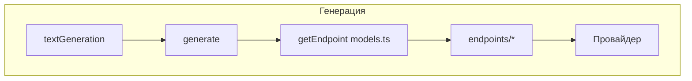

# Поддиаграмма 3: Генерация на моделях (шаги 15–22)

## Термины

**Endpoint** – функция-адаптер, приводящая сообщения к формату провайдера и возвращающая поток токенов/ответа.

**buildPrompt** – построение текстового промпта по шаблону модели и сообщениям (для `completions` режимов).

## Визуальная диаграмма (с продолжением нумерации)



## Данные и код по шагам

### Шаг 15: Входные данные для генерации

**Вход (после 9–14):**
```json
{
  "model": "openai/gpt-4o-mini",
  "messages": [
    { "from": "system", "content": "...preprompt..." },
    { "from": "user", "content": "Question with web context and files...", "files": [ {"type":"base64","mime":"image/png","name":"image.png","value":"..."} ] }
  ],
  "toolResults": [],
  "assistant": null,
  "isContinue": false,
  "promptedAt": "2025-01-01T12:00:00Z"
}
```

### Шаг 16: textGeneration() — запуск пайплайна

**Файл проекта:** `src/lib/server/textGeneration/index.ts`

```typescript
// src/lib/server/textGeneration/index.ts (lines 35–89)
export async function* textGeneration(ctx: TextGenerationContext) { // Главная корутина генерации
	// ... объединение генераторов заголовка, основного текста и keepAlive
}
```

### Шаг 17: Обработка ассистента, web‑поиска и инструментов

```typescript
// src/lib/server/textGeneration/index.ts (lines 47–89)
async function* textGenerationWithoutTitle(
	ctx: TextGenerationContext,
	done: AbortController
): AsyncGenerator<MessageUpdate, undefined, undefined> {
	yield { type: MessageUpdateType.Status, status: MessageUpdateStatus.Started }; // Сообщаем клиенту о старте

	ctx.assistant ??= await getAssistantById(ctx.conv.assistantId); // Загружаем ассистента беседы
	const { model, conv, messages, assistant, isContinue, webSearch, toolsPreference } = ctx; // Распаковка контекста
	const convId = conv._id; // ID беседы

	let webSearchResult: WebSearch | undefined; // Результат веб-поиска
	if (!isContinue && ((webSearch && !conv.assistantId) || assistantHasWebSearch(assistant))) { // Условия запуска поиска
		webSearchResult = yield* runWebSearch(conv, messages, assistant?.rag); // Запуск web‑search как встроенного шага
	}

	let preprompt = conv.preprompt; // Базовый preprompt из беседы
	if (assistantHasDynamicPrompt(assistant) && preprompt) { // Подстановка динамических данных, если включено
		preprompt = await processPreprompt(preprompt, messages.at(-1)?.content);
		if (messages[0].from === "system") messages[0].content = preprompt; // Обновляем system сообщение
	}

	let toolResults: ToolResult[] = []; // Сюда соберутся результаты инструментов
	let tools = model.tools ? await getTools(toolsPreference, ctx.assistant) : undefined; // Определяем список инструментов

	if (tools) {
		const toolCallsRequired = tools.some((tool) => !toolHasName(directlyAnswer.name, tool)); // Нужны ли реальные вызовы
		if (toolCallsRequired) {
			toolResults = yield* runTools(ctx, tools, preprompt); // Запуск инструментов, эмит событий в поток
		} else tools = undefined; // Только directlyAnswer — отключаем инструменты
	}

	const processedMessages = await preprocessMessages(messages, webSearchResult, convId); // Итоговые сообщения к провайдеру
	yield* generate({ ...ctx, messages: processedMessages }, toolResults, preprompt); // Переход к генерации
	done.abort(); // Завершение
}
```

### Шаг 18: Выбор эндпоинта модели (весовой) и переключение по провайдерам

**Файл проекта:** `src/lib/server/models.ts`

```typescript
// src/lib/server/models.ts (lines 286–345)
getEndpoint: async (): Promise<Endpoint> => { // Возврат функции-эндпоинта для модели
	if (!m.endpoints) { // Если кастомные эндпоинты не заданы — используем TGI по умолчанию
		return endpointTgi({ type: "tgi", url: `${config.HF_API_ROOT}/${m.name}`, accessToken: config.HF_TOKEN ?? config.HF_ACCESS_TOKEN, weight: 1, model: m });
	}
	const totalWeight = sum(m.endpoints.map((e) => e.weight)); // Сумма весов
	let random = Math.random() * totalWeight; // Рандом для рулетки
	for (const endpoint of m.endpoints) { // Идем по списку
		if (random < endpoint.weight) { // Выбор по весу
			const args = { ...endpoint, model: m }; // Подготовка аргументов
			switch (args.type) { // Переключение по провайдеру
				case "tgi": return endpoints.tgi(args);
				case "local": return endpoints.local(args);
				case "inference-client": return endpoints.inferenceClient(args);
				case "anthropic": return endpoints.anthropic(args);
				case "anthropic-vertex": return endpoints.anthropicvertex(args);
				case "bedrock": return endpoints.bedrock(args);
				case "aws": return await endpoints.aws(args);
				case "openai": return await endpoints.openai(args);
				case "llamacpp": return endpoints.llamacpp(args);
				case "ollama": return endpoints.ollama(args);
				case "vertex": return await endpoints.vertex(args);
				case "genai": return await endpoints.genai(args);
				case "cloudflare": return await endpoints.cloudflare(args);
				case "cohere": return await endpoints.cohere(args);
				case "langserve": return await endpoints.langserve(args);
				default: return endpoints.tgi(args); // Legacy fallback
			}
		}
		random -= endpoint.weight; // Сдвигаем окно
	}
	throw new Error(`Failed to select endpoint`); // Ошибка выбора
}
```

### Шаг 19: buildPrompt() — построение текстового промпта (для режимов completions)

**Файл проекта:** `src/lib/buildPrompt.ts`

```typescript
// src/lib/buildPrompt.ts (lines 11–59)
export async function buildPrompt({ messages, model, preprompt, continueMessage, tools, toolResults }: buildPromptOptions): Promise<string> {
    const filteredMessages = messages; // Входные сообщения
    if (filteredMessages[0].from === "system" && preprompt) { // Подмена system контента
        filteredMessages[0].content = preprompt;
    }
    let prompt = model
        .chatPromptRender({ // Рендер шаблона чата модели
            messages: filteredMessages.map((m) => ({ ...m, role: m.from })),
            preprompt, tools, toolResults, continueMessage,
        })
        .split(" ")
        .slice(-(model.parameters?.truncate ?? 0)) // Грубое усечение по словам
        .join(" ");
    if (continueMessage && model.parameters?.stop) { // Для режима продолжения удаляем стоп-символы в конце
        let trimmedPrompt = prompt.trimEnd();
        let hasRemovedStop = true;
        while (hasRemovedStop) { // Итеративно удаляем хвостовые стоп-токены
            hasRemovedStop = false;
            for (const stopToken of model.parameters.stop) {
                if (trimmedPrompt.endsWith(stopToken)) {
                    trimmedPrompt = trimmedPrompt.slice(0, -stopToken.length);
                    hasRemovedStop = true;
                    break;
                }
            }
            trimmedPrompt = trimmedPrompt.trimEnd();
        }
        prompt = trimmedPrompt;
    }
    return prompt; // Итоговый промпт
}
```

### Шаг 20: endpointOpenAI (пример провайдера): подготовка сообщений и запуск потока

**Файл проекта:** `src/lib/server/endpoints/openai/endpointOai.ts`

```typescript
// src/lib/server/endpoints/openai/endpointOai.ts (lines 123–200)
export async function endpointOai(input: z.input<typeof endpointOAIParametersSchema>): Promise<Endpoint> { // Конструируем эндпоинт OpenAI
    const { baseURL, apiKey, completion, model, defaultHeaders, defaultQuery, multimodal, extraBody, useCompletionTokens, streamingSupported } = endpointOAIParametersSchema.parse(input); // Парсим вход
    const openai = new OpenAI({ apiKey: apiKey || "sk-", baseURL, defaultHeaders, defaultQuery }); // Инициализируем SDK
    const imageProcessor = makeImageProcessor(multimodal.image); // Подготовка изображений

    if (completion === "completions") { // Старый формат completions
        if (model.tools) throw new Error("Tools are not supported for 'completions' mode, switch to 'chat_completions' instead"); // Ограничение
        return async ({ messages, preprompt, continueMessage, generateSettings, conversationId }) => { // Возврат функции вызова
            const prompt = await buildPrompt({ messages, continueMessage, preprompt, model }); // Строим промпт
            const parameters = { ...model.parameters, ...generateSettings }; // Сливаем параметры
            const body = { model: model.id ?? model.name, prompt, stream: true, max_tokens: parameters?.max_new_tokens, stop: parameters?.stop, temperature: parameters?.temperature, top_p: parameters?.top_p, frequency_penalty: parameters?.repetition_penalty, presence_penalty: parameters?.presence_penalty }; // Тело запроса
            const openAICompletion = await openai.completions.create(body, { body: { ...body, ...extraBody }, headers: { "ChatUI-Conversation-ID": conversationId?.toString() ?? "", "X-use-cache": "false" } }); // Вызов API
            return openAICompletionToTextGenerationStream(openAICompletion); // Преобразуем к общему потоку
        };
    } else if (completion === "chat_completions") { // Современный формат chat
        return async ({ messages, preprompt, generateSettings, tools, toolResults, conversationId }) => {
            // ... подготовка messagesOpenAI с учетом файлов и imageProcessor, формирование body
        };
    } else {
        throw new Error("Invalid completion type"); // Неверный режим
    }
}
```

### Шаг 21: generate() — объединение токенов, reasoning и финальный ответ

**Файл проекта:** `src/lib/server/textGeneration/generate.ts`

```typescript
// src/lib/server/textGeneration/generate.ts (lines 17–131)
export async function* generate(
    { model, endpoint, conv, messages, assistant, isContinue, promptedAt }: GenerateContext,
    toolResults: ToolResult[],
    preprompt?: string,
    tools?: Tool[]
): AsyncIterable<MessageUpdate> {
    let reasoning = false; let reasoningBuffer = ""; // Флаги и буфер рассуждений
    // ... настройка режима reasoning
    for await (const output of await endpoint({ // Вызываем выбранный эндпоинт
        messages, preprompt, continueMessage: isContinue, generateSettings: assistant?.generateSettings, tools, toolResults, isMultimodal: model.multimodal, conversationId: conv._id,
    })) {
        if (output.generated_text) { // Если провайдер вернул финальный текст
            let interrupted = !output.token.special && !model.parameters.stop?.includes(output.token.text); // Признак обрыва
            let text = output.generated_text.trimEnd(); // Текст без хвостовых пробелов
            for (const stopToken of model.parameters.stop ?? []) { // Отрезаем стоп‑токены в конце
                if (!text.endsWith(stopToken)) continue; interrupted = false; text = text.slice(0, text.length - stopToken.length);
            }
            let finalAnswer = text; // По умолчанию – как есть
            // ... обработка режимов reasoning (regex/summarize/tokens)
            yield { type: MessageUpdateType.FinalAnswer, text: finalAnswer, interrupted, webSources: output.webSources }; // Отправляем финальный ответ
            continue;
        }
        if (output.token.special) continue; // Пропускаем специальные токены
        if (reasoning) { // Стримим токены рассуждений
            reasoningBuffer += output.token.text;
            // ... разделение reasoning и обычного текста при endToken
            yield { type: MessageUpdateType.Reasoning, subtype: MessageReasoningUpdateType.Stream, token: output.token.text }; // Событие reasoning
        } else {
            yield { type: MessageUpdateType.Stream, token: output.token.text }; // Обычный токен пользователя
        }
        // ... проверки на принудительное прерывание и отсутствие вывода
    }
}
```

### Шаг 22: Выходные события генерации (SSE)

**Выход (пример финального события):**
```json
{
  "type": "FinalAnswer",
  "text": "Ответ модели...",
  "interrupted": false,
  "webSources": []
}
```

## Описание блоков

### endpoints/openai, anthropic, tgi, vertex, local и др.
**Задача:** Конвертировать сообщения (включая файлы), вызывать API провайдера, вернуть поток, поддерживать инструменты/мультимодальность.

### buildPrompt.ts
**Задача:** Сформировать промпт для режимов `completions`, применить `stop`/`truncate`.

## Сводка этапа

**Цель:** Выполнить инференс выбранной модели с учетом инструментов и шаблонов.

**Результат:** Стрим ответов до клиента и финальный ответ.


