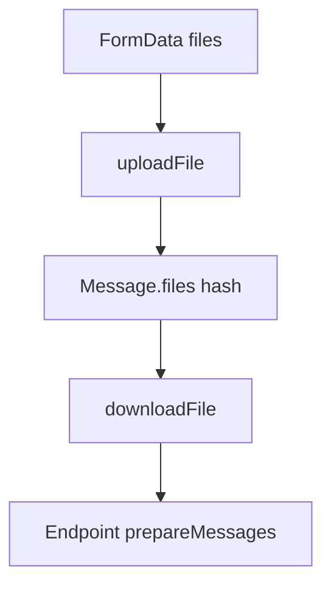

# Поддиаграмма 4: Мультимодальность и файлы (шаги 23–28)

## Термины

**ImageProcessor / DocumentProcessor** – преобразование изображений/документов к нужному формату для конкретного провайдера.

**downloadFile / uploadFile** – сохранение и получение файлов по хэшу в пределах беседы.

## Визуальная диаграмма (с продолжением нумерации)



## Данные и код по шагам

### Шаг 23: Проверка размеров и загрузка файлов (продолжение шага 3)

```typescript
// src/routes/conversation/[id]/+server.ts (lines 183–231)
const inputFiles = await Promise.all( // Преобразуем файлы FormData
	form.getAll("files")
		.filter((entry): entry is File => entry instanceof File && entry.size > 0) // Фильтруем пустые
		.map(async (file) => { // Приводим к единому формату
			const [type, ...name] = file.name.split(";"); // Имя представлен как type;filename
			return { // Формируем объект файла
				type: z.literal("base64").or(z.literal("hash")).parse(type), // Тип файла
				value: await file.text(), // Содержимое файла
				mime: file.type, // MIME-тип
				name: name.join(";") // Имя файла
			};
		})
);
const hashFiles = inputFiles?.filter((f) => f.type === "hash") ?? []; // Уже загруженные
const b64Files = (inputFiles?.filter((f) => f.type !== "hash") ?? [])
	.map((f) => new File([Buffer.from(f.value, "base64")], f.name, { type: f.mime })); // Декодирование base64 → Blob
if (b64Files.some((f) => f.size > 10 * 1024 * 1024)) error(413, "File too large, should be <10MB"); // Лимит размера
const uploadedFiles = await Promise.all(b64Files.map((f) => uploadFile(f, conv))) // Загрузка и получение sha256
	.then((files) => [...files, ...hashFiles]); // Объединяем с hash
```

### Шаг 24: Документ-процессор (PDF/TXT) – проверка типа и размера, перевод в Buffer

```typescript
// src/lib/server/endpoints/document.ts (lines 44–61)
export function makeDocumentProcessor<TMimeType extends string = string>( // Фабрика процессора
	options: FileProcessorOptions<TMimeType>
): AsyncDocumentProcessor<TMimeType> {
	return async (file) => { // Возвращаем асинхронный процессор
		const { supportedMimeTypes, maxSizeInMB } = options; // Разрешенные MIME и лимит
		const { mime, value } = file; // Текущий MIME и base64 значение
		const buffer = Buffer.from(value, "base64"); // Декодируем в Buffer
		const tooLargeInBytes = buffer.byteLength > maxSizeInMB * 1000 * 1000; // Проверяем размер
		if (tooLargeInBytes) { // Ошибка если превышен
			throw Error("Document is too large");
		}
		const outputMime = validateMimeType(supportedMimeTypes, mime); // Валидация MIME
		return { file: buffer, mime: outputMime }; // Возвращаем Buffer + фактический MIME
	};
}
```

### Шаг 25: Подготовка изображений и документов для Anthropic (мультимодальность)

```typescript
// src/lib/server/endpoints/anthropic/utils.ts (lines 47–86)
export async function endpointMessagesToAnthropicMessages(
    messages: EndpointMessage[],
    multimodal: { image: ImageProcessorOptions<"image/png"|"image/jpeg"|"image/webp">; document?: FileProcessorOptions<"application/pdf">; },
    conversationId?: ObjectId
): Promise<BetaMessageParam[]> {
    return await Promise.all(
        messages
            .filter((m): m is NonSystemMessage => m.from !== "system") // Убираем system
            .map(async (message) => ({ // Мапим каждое сообщение
                role: message.from, // Роль user/assistant
                content: [
                    ...(message.from === "user"
                        ? await Promise.all((message.files ?? []).map(async (file) => { // Обрабатываем файлы
                            if (file.type === "hash" && conversationId) { file = await downloadFile(file.value, conversationId); } // Скачиваем по хэшу
                            if (file.mime.startsWith("image/")) { return fileToImageBlock(file, multimodal.image); } // Конвертируем изображение
                            else if (file.mime === "application/pdf" && multimodal.document) { return fileToDocumentBlock(file, multimodal.document); } // Конвертируем PDF
                            else { throw new Error(`Unsupported file type: ${file.mime}`); } // Иначе ошибка
                        }))
                        : []),
                    { type: "text", text: message.content }, // Текстовая часть
                ],
            }))
    );
}
```

### Шаг 26: Подготовка мультимодальных частей для Vertex (изображения/PDF/TXT)

```typescript
// src/lib/server/endpoints/google/endpointVertex.ts (lines 113–151)
const vertexMessages = await Promise.all(
    messages.map(async ({ from, content, files }) => { // Конвертируем каждое сообщение
        const imageProcessor = makeImageProcessor(multimodal.image); // Подготовка изображений
        const documentProcessor = makeDocumentProcessor(multimodal.document); // Подготовка документов
        const processedFilesWithNull = files && files.length > 0
            ? await Promise.all(files.map(async (file) => { // Обрабатываем файлы
                if (file.mime.includes("image")) { const { image, mime } = await imageProcessor(file); return { file: image, mime }; } // Изображение
                else if (file.mime === "application/pdf" || file.mime === "text/plain") { return documentProcessor(file); } // Документ
                return null; // Иначе пропуск
            }))
            : [];
        const processedFiles = processedFilesWithNull.filter((f) => f !== null); // Удаляем null
        return {
            role: from === "user" ? "user" : "model", // Роль
            parts: [
                ...processedFiles.map((pf) => ({ inlineData: { data: pf.file.toString("base64"), mimeType: pf.mime } })), // Встраиваем файл
                { text: content }, // Текст
            ],
        };
    })
);
```

### Шаг 27: Подготовка изображений для Bedrock (Nova) и обычных моделей

```typescript
// src/lib/server/endpoints/aws/endpointBedrock.ts (lines 169–190)
async function prepareFiles(imageProcessor, isNova: boolean, files: MessageFile[]) { // Подготовка файлов
    const processedFiles = await Promise.all(files.map(imageProcessor)); // Обрабатываем все изображения
    if (isNova) { // Формат для Nova
        return processedFiles.map((file) => ({ image: { format: file.mime.substring("image/".length), source: { bytes: file.image.toString("base64") } } }));
    } else { // Формат для остальных
        return processedFiles.map((file) => ({ type: "image", source: { type: "base64", media_type: file.mime, data: file.image.toString("base64") } }));
    }
}
```

### Шаг 28: Подготовка изображений для OpenAI (через imageProcessor)

```typescript
// src/lib/server/endpoints/openai/endpointOai.ts (lines 153–161)
const imageProcessor = makeImageProcessor(multimodal.image); // Готовим обработчик изображений для OpenAI
// Далее messages преобразуются в формат OpenAI, где для user-части могут быть добавлены image parts
```

## Сводка этапа

**Цель:** Надежно принять и передать файлы в модели.

**Результат:** Изображения/документы доступны провайдерам в корректном формате и с ограничениями по размеру/типу.


