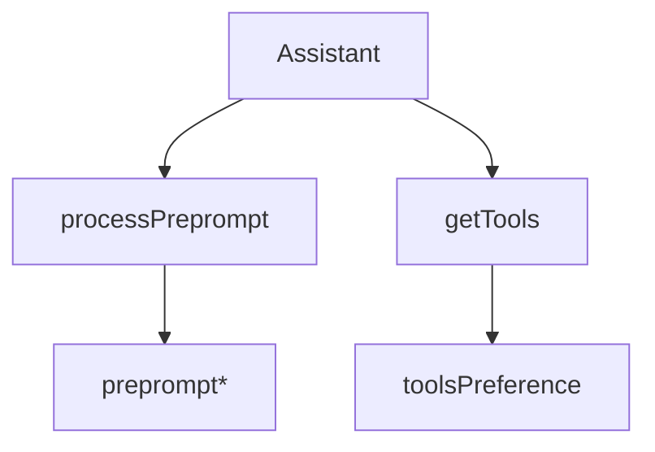

# Поддиаграмма 5: Ассистенты и параметры (шаги 29–34)

## Термины

**Assistant** – сущность с `modelId`, `preprompt`, `tools`, `dynamicPrompt`, `rag` и generateSettings.

**Dynamic Prompt** – подстановка данных и внешних fetch в `preprompt` (`{{get=...}}`, `{{today}}`).

## Визуальная диаграмма (с продолжением нумерации)



## Данные и код по шагам

### Шаг 29: Структура ассистента

```typescript
// src/lib/types/Assistant.ts (lines 1–33)
export interface Assistant extends Timestamps { // Тип ассистента
    _id: ObjectId; // Идентификатор
    createdById: User["_id"] | string; // Автор
    createdByName?: User["username"]; // Имя автора
    avatar?: string; // Аватар
    name: string; // Название ассистента
    description?: string; // Описание
    modelId: string; // Используемая модель
    exampleInputs: string[]; // Примеры запросов
    preprompt: string; // Системный промпт
    userCount?: number; // Метрика
    review: ReviewStatus; // Статус модерации
    rag?: { allowAllDomains: boolean; allowedDomains: string[]; allowedLinks: string[]; }; // RAG настройки
    generateSettings?: { temperature?: number; top_p?: number; repetition_penalty?: number; top_k?: number; }; // Параметры генерации
    dynamicPrompt?: boolean; // Флаг динамического промпта
    searchTokens: string[]; // Токены поиска
    last24HoursCount: number; // Метрика
    tools?: string[]; // Id инструментов
}
```

### Шаг 30: Получение ассистента в пайплайне генерации

```typescript
// src/lib/server/textGeneration/index.ts (lines 56–66)
ctx.assistant ??= await getAssistantById(ctx.conv.assistantId); // Если есть ассистент у беседы — получить из БД
```

### Шаг 31: Динамический промпт ассистента — макросы/фетч

```typescript
// src/lib/server/textGeneration/assistant.ts (lines 7–52)
export async function processPreprompt(preprompt: string, user_message: string | undefined) { // Обработка preprompt
	// Replace {{today}} with formatted date
	const today = new Intl.DateTimeFormat("en-US", { // Текущая дата
		weekday: "long", // День недели
		day: "numeric", // День месяца
		month: "long", // Месяц
		year: "numeric", // Год
	}).format(new Date()); // Форматируем текущую дату
	preprompt = preprompt.replaceAll("{{today}}", today); // Макрос даты
	const requestRegex = /{{\s?(get|post|url)=(.*?)\s?}}/g; // Макросы сетевых запросов

	for (const match of preprompt.matchAll(requestRegex)) { // Ищем все вхождения
		const method = match[1].toUpperCase(); // Метод
		const urlString = match[2]; // URL
		try {
			const url = new URL(urlString); // Парсим URL
			if ((await isURLLocal(url)) && config.ENABLE_LOCAL_FETCH !== "true") { // Защита от локальных адресов
				throw new Error("URL couldn't be fetched, it resolved to a local address.");
			}

			let res; // Ответ
			if (method == "POST") { // POST
				res = await fetch(url.href, {
					method: "POST",
					body: user_message,
					headers: {
						"Content-Type": "text/plain",
					},
				});
			} else if (method == "GET" || method == "URL") { // GET/URL
				res = await fetch(url.href);
			} else { // Неверный метод
				throw new Error("Invalid method " + method);
			}

			if (!res.ok) { // Ошибка статуса
				throw new Error("URL couldn't be fetched, error " + res.status);
			}
			const text = await res.text(); // Тело ответа
			preprompt = preprompt.replaceAll(match[0], text); // Подмена шаблона
		} catch (e) { // Вставляем текст ошибки
			preprompt = preprompt.replaceAll(match[0], (e as Error).message);
		}
	}

	return preprompt; // Итоговый preprompt
}
```

### Шаг 32: Применение generateSettings ассистента

```typescript
// src/lib/server/textGeneration/generate.ts (lines 46–55)
for await (const output of await endpoint({ // Вызов провайдера
	messages, // Сообщения для генерации
	preprompt, // Системный промпт
	continueMessage: isContinue, // Режим продолжения
	generateSettings: assistant?.generateSettings, // Параметры ассистента передаются сюда
	tools, // Инструменты
	toolResults, // Результаты инструментов
	isMultimodal: model.multimodal, // Поддержка мультимодальности
	conversationId: conv._id, // ID беседы
})) {
	// ... // Обработка выходных данных
}
```

### Шаг 33: Инструменты ассистента (включая веб‑поиск)

```typescript
// src/lib/server/textGeneration/tools.ts (lines 25–41)
if (assistant) { // Если передан ассистент
	if (assistant?.tools?.length) { // Есть список инструментов
		preferences = assistant.tools; // Используем его
		if (assistantHasWebSearch(assistant)) { // Если поддерживает веб-поиск
			preferences.push(websearch._id.toString()); // Добавляем websearch
		}
	} else { // Если у ассистента нет инструментов
		if (assistantHasWebSearch(assistant)) { // Если поддерживает веб-поиск
			return [websearch, directlyAnswer]; // Только веб‑поиск и direct
		}
		return [directlyAnswer]; // Иначе только direct
	}
}
```

### Шаг 34: API формы ассистента (валидация настроек)

```typescript
// src/routes/api/assistant/utils.ts (lines 8–51)
export const asssistantSchema = z.object({ // Схема формы ассистента
	name: z.string().min(1), // Имя
	modelId: z.string().min(1), // Модель
	preprompt: z.string().min(1), // Промпт
	description: z.string().optional(), // Описание
	exampleInput1: z.string().optional(), // Примеры
	exampleInput2: z.string().optional(),
	exampleInput3: z.string().optional(),
	exampleInput4: z.string().optional(),
	avatar: z.union([z.instanceof(File), z.literal("null")]).optional(), // Аватар
	ragLinkList: z.preprocess(parseStringToList, z.string().url().array().max(10)), // Ссылки
	ragDomainList: z.preprocess(parseStringToList, z.string().array()), // Домены
	ragAllowAll: z.preprocess((v) => v == "true", z.boolean()), // Разрешать все домены
	dynamicPrompt: z.preprocess((v) => v == "on", z.boolean()), // Флаг динамики
	temperature: z.union([z.literal(""), z.coerce.number().min(0.1).max(2)]).transform((v) => (v === "" ? undefined : v)), // Темп
	top_p: z.union([z.literal(""), z.coerce.number().min(0.05).max(1)]).transform((v) => (v === "" ? undefined : v)), // Top-p
	repetition_penalty: z.union([z.literal(""), z.coerce.number().min(0.1).max(2)]).transform((v) => (v === "" ? undefined : v)), // Penalty
	top_k: z.union([z.literal(""), z.coerce.number().min(5).max(100)]).transform((v) => (v === "" ? undefined : v)), // Top-k
	tools: z.string().optional().transform((v) => (v ? v.split(",") : [])) // Инструменты
		.transform(async (v) => [ // Приведение к id
			...(await collections.tools // Получаем инструменты из БД
				.find({ _id: { $in: v.map((toolId) => new ObjectId(toolId)) } }) // Ищем по ID
				.project({ _id: 1 }) // Только ID
				.toArray() // В массив
				.then((tools) => tools.map((tool) => tool._id.toString()))), // Преобразуем в строки
			...toolFromConfigs // Добавляем инструменты из конфига
				.filter((el) => (v ?? []).includes(el._id.toString())) // Фильтруем по ID
				.map((el) => el._id.toString()), // Преобразуем в строки
		]).optional(),
});
```

## Сводка этапа

**Цель:** Влиять на промпт, выбор инструментов и параметры генерации через ассистента.

**Результат:** Контекст запроса адаптирован под профиль ассистента.


