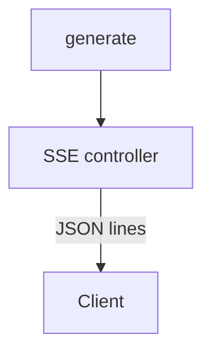

# Поддиаграмма 6: Поток ответа и статусы (шаги 35–40)

## Термины

**SSE-стрим** – сервер отправляет построчные JSON события `MessageUpdate` (Stream, FinalAnswer, Tool, Status и др.).

**Reasoning** – режим, когда модель стримит рассуждения отдельно от финального ответа (regex/tokens/summarize).

## Визуальная диаграмма (с продолжением нумерации)



## Данные и код по шагам

### Шаг 35: Создание SSE потока и обработка событий

```typescript
// src/routes/conversation/[id]/+server.ts (lines 341–497)
const stream = new ReadableStream({ // Создаем поток ответа
	async start(controller) {
		messageToWriteTo.updates ??= []; // Инициализация массива апдейтов
		async function update(event: MessageUpdate) { // Функция отправки события
			// ... здесь выполняется запись в БД статусов/токенов при необходимости
			controller.enqueue(JSON.stringify(event) + "\n"); // Отправляем строку JSON + перенос строки
			if (event.type === MessageUpdateType.FinalAnswer) { // По финальному ответу
				controller.enqueue(" ".repeat(4096)); // Пэддинг, чтобы браузер не буферизовал
			}
		}
		// ... подготовка состояния беседы, запуск генерации
		for await (const event of textGeneration(ctx)) await update(event); // Проксируем все события генерации
		controller.close(); // Закрываем поток
	}
});
```

### Шаг 36: Типы событий потока

```typescript
// src/lib/server/textGeneration/types.ts (lines 7–19)
export interface TextGenerationContext { // Контекст генерации
	// ...
}
```

```typescript
// src/lib/types/MessageUpdate.ts
// Файл определяет: MessageUpdateType.Stream, FinalAnswer, Reasoning (Status/Stream), Tool (Call/Result) и т.д.
```

### Шаг 37: Пример события токена

```json
{ "type": "Stream", "token": "промежуточный токен" }
```

### Шаг 38: Пример финального ответа

```json
{ "type": "FinalAnswer", "text": "Готовый ответ", "interrupted": false }
```

### Шаг 39: Ошибка генерации

```json
{ "type": "Status", "status": "Error", "message": "Подробности ошибки" }
```

### Шаг 40: Закрытие потока и завершение

```typescript
// src/routes/conversation/[id]/+server.ts (lines 496–497)
controller.close(); // Закрываем поток после завершения генерации
```

## Сводка этапа

**Цель:** Доставить пользователю потоковый ответ и финальный результат.

**Результат:** UI получает токены и статусы в реальном времени.


