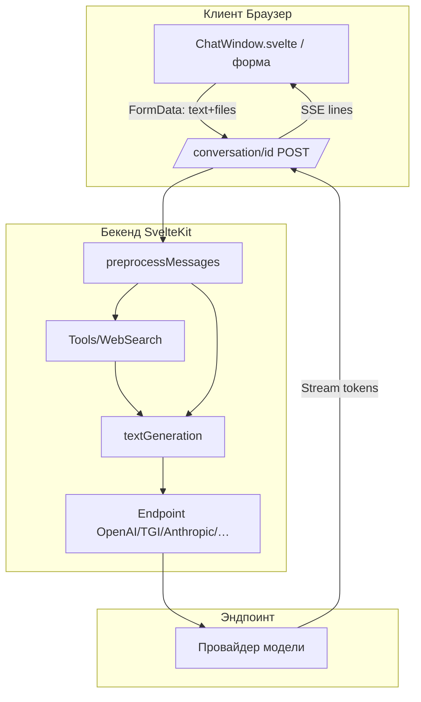

# Индекс: AI Модели и путь данных чата

## Объяснение терминов

**Модель** – конфигурация генерации текста/мультимодальности и список поддерживаемых эндпоинтов (OpenAI, TGI, Anthropic, Vertex, локальные и др.).

**Эндпоинт** – адаптер-провайдер для конкретного API/рантайма модели. Формирует запросы, конвертирует сообщения, обрабатывает файлы и поток ответов.

**Tool Calling (инструменты)** – механизм, при котором модель вызывает внешние инструменты (веб-поиск, парсер документов и др.) и использует их результаты в ответе.

**Assistant (ассистент)** – преднастроенный профиль: выбранная модель, `preprompt`, опциональные `tools`, параметры генерации и RAG-настройки. Может динамически изменять промпт.

**Мультимодальность** – поддержка изображений и документов во входных данных. Конвертация выполняется на этапе подготовки сообщений к конкретному провайдеру.

## Обзор процесса (сквозная нумерация)

Сквозная нумерация шагов сохраняется между файлами и продолжается от 1 до N:

1–8. [Инициация сообщения](01-1-Инициация-Сообщения.md)
9–14. [Предобработка и инструменты](01-2-Предобработка-и-Тулы.md)
15–22. [Генерация на моделях](01-3-Генерация-на-Моделях.md)
23–28. [Мультимодальность и файлы](01-4-Мультимодальность-и-Файлы.md)
29–34. [Ассистенты и параметры](01-5-Ассистенты-и-Параметры.md)
35–40. [Поток ответа и статусы](01-6-Поток-Ответа-и-Статусы.md)

## Общая схема



```typescript
// Псевдокод: последовательность шагов пайплайна
// 1–8: прием ввода, загрузка файлов, подготовка сообщений
// 9–14: предобработка (web-search, файлы, clipboard), выбор инструментов
// 15–22: запуск textGeneration → выбор эндпоинта → buildPrompt/prepareMessages → поток
// 23–28: подготовка мультимодальных частей (image/pdf/txt)
// 29–34: применение ассистента (preprompt, tools, generateSettings)
// 35–40: SSE поток событий к клиенту
```

## Ключевые компоненты

- `src/lib/server/models.ts` – реестр моделей, весовой выбор эндпоинта, шаблон промпта
- `src/lib/server/endpoints/*` – реализации провайдеров (OpenAI, TGI, Anthropic, Vertex, Local и др.)
- `src/lib/server/textGeneration/*` – пайплайн генерации: ассистент, web-search, инструменты, стрим
- `src/routes/conversation/[id]/+server.ts` – обработка входящих сообщений, файлов и стрим ответа

## Последовательность изучения

1. [Инициация сообщения](01-1-Инициация-Сообщения.md)
2. [Предобработка и инструменты](01-2-Предобработка-и-Тулы.md)
3. [Генерация на моделях](01-3-Генерация-на-Моделях.md)
4. [Мультимодальность и файлы](01-4-Мультимодальность-и-Файлы.md)
5. [Ассистенты и параметры](01-5-Ассистенты-и-Параметры.md)
6. [Поток ответа и статусы](01-6-Поток-Ответа-и-Статусы.md)

## Принцип документирования

Основой служит реальный код проекта. Перед документированием конкретной сущности – проанализировать весь связанный код.


