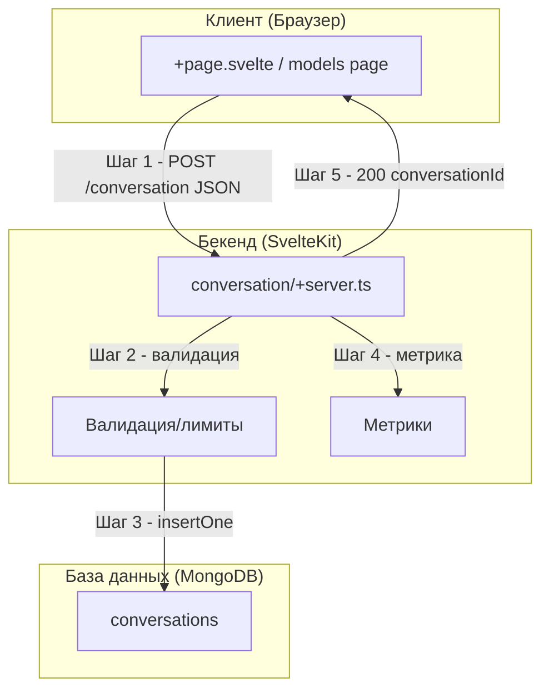

# Поддиаграмма 1: Создание разговора (Шаги 1-5)

## Термины и аббревиатуры

- Preprompt - системное сообщение для инициализации поведения модели.
- Assistant - преднастроенный профиль (preprompt, модель).

## Визуальная диаграмма



## Шаг 1: POST /conversation (входной JSON и обращение клиента)

- Действие: Клиент создаёт новый разговор с выбранной моделью и опциональным preprompt.
- Тип данных: HTTP JSON.
- Результат: Сервер принимает запрос и переходит к валидации.

Пример запроса:
```json
{
  "model": "gpt-4o",
  "preprompt": "You are a helpful assistant",
  "assistantId": "656f..."
}
```

Исходный файл: `src/routes/+page.svelte` (строки 42–52)
```typescript
const res = await fetch(`${base}/conversation`, {      // Отправляем запрос на создание беседы
  method: "POST",                                     // Метод POST
  headers: { "Content-Type": "application/json" },   // Тело — JSON
  body: JSON.stringify({                               // Формируем полезную нагрузку
    model,                                             // Идентификатор выбранной модели
    preprompt: $settings.customPrompts[$settings.activeModel], // Кастомный preprompt из настроек
    assistantId: data.assistant?._id                   // Необязательный ассистент (если выбран)
  })                                                   // Сериализация объекта в JSON-строку
});                                                    // Возвращается Response (успех/ошибка)
```

## Шаг 2: Валидация запроса (сервер)

- Действие: Сервер валидирует model/assistantId/preprompt и проверяет лимиты по числу разговоров.
- Тип данных: Валидация через zod / чтение из БД.
- Результат: Либо продолжение, либо ошибка 4xx/429.

Пример ошибки:
```json
{ "message": "You have reached the maximum number of conversations. Delete some to continue." }
```

Исходный файл: `src/routes/conversation/+server.ts` (строки 15–44)
```typescript
export const POST: RequestHandler = async ({ locals, request }) => { // Обработчик создания
  const body = await request.text();             // Читаем сырое тело запроса
  let title = "";                                // Заголовок по умолчанию (может переопределиться)
  const parsedBody = z                            // Описываем схему валидного тела
    .object({
      fromShare: z.string().optional(),           // Импорт из общей ссылки (необязателен)
      model: validateModel(models),               // Допустимое значение модели
      assistantId: z.string().optional(),         // Идентификатор ассистента (необязателен)
      preprompt: z.string().optional(),           // Текст preprompt (необязателен)
    })
    .safeParse(JSON.parse(body));                 // Пытаемся распарсить/провалидировать JSON
  if (!parsedBody.success) {                      // Если валидация не прошла
    error(400, "Invalid request");              // Возвращаем 400 Bad Request
  }
  const values = parsedBody.data;                 // Достаём валидированные значения
  const convCount = await collections.conversations.countDocuments(authCondition(locals)); // Считаем беседы пользователя/сессии
  if (usageLimits?.conversations && convCount > usageLimits?.conversations) {              // Превышен лимит бесед?
    error(429, "You have reached the maximum number of conversations. Delete some to continue."); // 429 Too Many Requests
  }
  const model = models.find((m) => (m.id || m.name) === values.model); // Ищем модель в реестре
  if (!model) {                                   // Если не найдено совпадение
    error(400, "Invalid model");                 // 400 Неверная модель
  }
```

## Шаг 3: Вставка разговора (сервер → БД)

- Действие: Сервер собирает начальные данные и вставляет документ разговора.
- Тип данных: MongoDB insertOne.
- Результат: Новый документ в `conversations` с `_id`.

Исходный файл: `src/routes/conversation/+server.ts` (строки 46–58)
```typescript
let messages: Message[] = [                        // Формируем массив сообщений беседы
  {
    id: v4(),                                      // Генерируем UUID сообщения
    from: "system",                               // Системное сообщение (preprompt)
    content: values.preprompt ?? "",              // Текст preprompt (или пусто)
    createdAt: new Date(),                          // Метка создания
    updatedAt: new Date(),                          // Метка обновления
    children: [],                                   // Деревянная структура: дети
    ancestors: [],                                  // Деревянная структура: предки
  },
];
```

Исходный файл: `src/routes/conversation/+server.ts` (строки 85–98)
```typescript
const assistant = await collections.assistants.findOne({ _id: new ObjectId(values.assistantId) }); // Пытаемся найти ассистента
if (assistant) {                                    // Если ассистент существует
  values.preprompt = assistant.preprompt;           // Используем его preprompt
} else {                                            // Иначе
  values.preprompt ??= model?.preprompt ?? "";     // Берём preprompt из модели или пустой
}
if (messages && messages.length > 0 && messages[0].from === "system") { // Если первое — system
  messages[0].content = values.preprompt;          // Синхронизируем текст system-сообщения
}
```

Исходный файл: `src/routes/conversation/+server.ts` (строки 100–114)
```typescript
const res = await collections.conversations.insertOne({ // Вставляем документ беседы в БД
  _id: new ObjectId(),                                  // Новый ObjectId
  title: title || "New Chat",                          // Заголовок (или дефолтный)
  rootMessageId,                                        // Корневой id в дереве
  messages,                                             // Массив сообщений (с system)
  model: values.model,                                  // Выбранная модель
  preprompt: values.preprompt,                          // Текущий preprompt
  assistantId: values.assistantId ? new ObjectId(values.assistantId) : undefined, // Ссылка на ассистента
  createdAt: new Date(),                                // Метка создания
  updatedAt: new Date(),                                // Метка обновления
  userAgent: request.headers.get("User-Agent") ?? undefined, // UA клиента
  embeddingModel,                                       // Модель эмбеддингов
  ...(locals.user ? { userId: locals.user._id } : { sessionId: locals.sessionId }), // Привязка к пользователю/сессии
  ...(values.fromShare ? { meta: { fromShareId: values.fromShare } } : {}),          // Метаданные импорта из шары
});
```

## Шаг 4: Метрики (сервер)

- Действие: Запись метрики по модели.
- Тип данных: Внутренняя метрика.
- Результат: Учёт использования модели.

Исходный файл: `src/routes/conversation/+server.ts` (строки 116)
```typescript
MetricsServer.getMetrics().model.conversationsTotal.inc({ model: values.model }); // Инкремент счётчика бесед по модели
```

## Шаг 5: Ответ 200 (сервер → клиент)

- Действие: Возврат `conversationId` клиенту.
- Тип данных: HTTP JSON.
- Результат: Клиент может перейти к созданному разговору.

Пример ответа:
```json
{ "conversationId": "656f1a2b3c4d5e6f7a8b9c0d" }
```

Исходный файл: `src/routes/conversation/+server.ts` (строки 118–123)
```typescript
return new Response(                                  // Возвращаем HTTP-ответ
  JSON.stringify({                                    // Сериализуем объект
    conversationId: res.insertedId.toString(),        // Строковый id созданной беседы
  }),
  { headers: { "Content-Type": "application/json" } } // Заголовок контента JSON
);
```

## Описание блоков

### Пользователь

- Что это: Конечный пользователь системы Chat UI - человек, который создаёт новый разговор
- Задача: Выбрать модель/ассистента, инициировать создание разговора
- Файлы проекта: Не применимо (человек)
- Ключевые функции:
  - Переход на главную страницу/страницу модели
  - Ввод первого сообщения (опционально)
  - Инициация создания разговора через интерфейс

### +page.svelte / models page

- Что это: Клиентские страницы, откуда инициируется создание разговора
- Задача: Отправить POST /conversation с выбранной моделью и preprompt
- Файлы проекта: `src/routes/+page.svelte`, `src/routes/models/[...model]/+page.svelte`
- Ключевые функции:
  - Определение активной модели (из настроек/ассистента/списка моделей)
  - Формирование JSON-запроса (model, preprompt, assistantId)
  - Вызов `fetch` для POST /conversation и обработка ответа

### conversation/+server.ts

- Что это: SvelteKit route handler создания разговора - серверный endpoint `/conversation`
- Задача: Провести валидацию, учесть лимиты, собрать начальные данные и записать разговор
- Файлы проекта: `src/routes/conversation/+server.ts`
- Ключевые функции:
  - Валидация тела запроса через zod
  - Проверка лимитов на число разговоров
  - Наследование preprompt из ассистента/модели
  - Вставка документа в `conversations`
  - Запись метрики `conversationsTotal`

### models registry

- Что это: Реестр поддерживаемых моделей и их параметров
- Задача: Обеспечить контроль допустимых идентификаторов моделей и дефолтных параметров
- Файлы проекта: `src/lib/server/models.ts`
- Ключевые функции:
  - Список моделей с параметрами
  - Валидация `model` с помощью `validateModel`
  - Настройки по умолчанию (preprompt, embeddingModel)

### assistants collection

- Что это: Коллекция ассистентов (preprompt, связанная модель)
- Задача: Предоставлять преднастройки для быстрого старта разговора
- Файлы проекта: `collections.assistants` (обращения из `conversation/+server.ts`)
- Ключевые функции:
  - Чтение ассистента по `_id`
  - Подстановка `preprompt` при создании разговора

### conversations collection

- Что это: MongoDB коллекция разговоров
- Задача: Хранить разговоры, их сообщения и метаданные
- Файлы проекта: `collections.conversations` (обращения из `conversation/+server.ts`)
- Ключевые функции:
  - `insertOne` нового разговора
  - Хранение `rootMessageId`, `messages`, `model`, `preprompt`, `assistantId`
  - Привязка по `userId` либо `sessionId`

### Метрики

- Что это: Система метрик по моделям
- Задача: Считает количество созданных разговоров по модели
- Файлы проекта: `src/lib/server/metrics.ts`
- Ключевые функции:
  - `model.conversationsTotal.inc({ model })`

## Сводка этапа

- Цель: Создать разговор с корректно настроенным preprompt и моделью.
- Результат: Документ в conversations, возвращён conversationId.
- Ключевые моменты: Лимиты, ассистент/шара, метрики, preprompt в system-сообщении.
