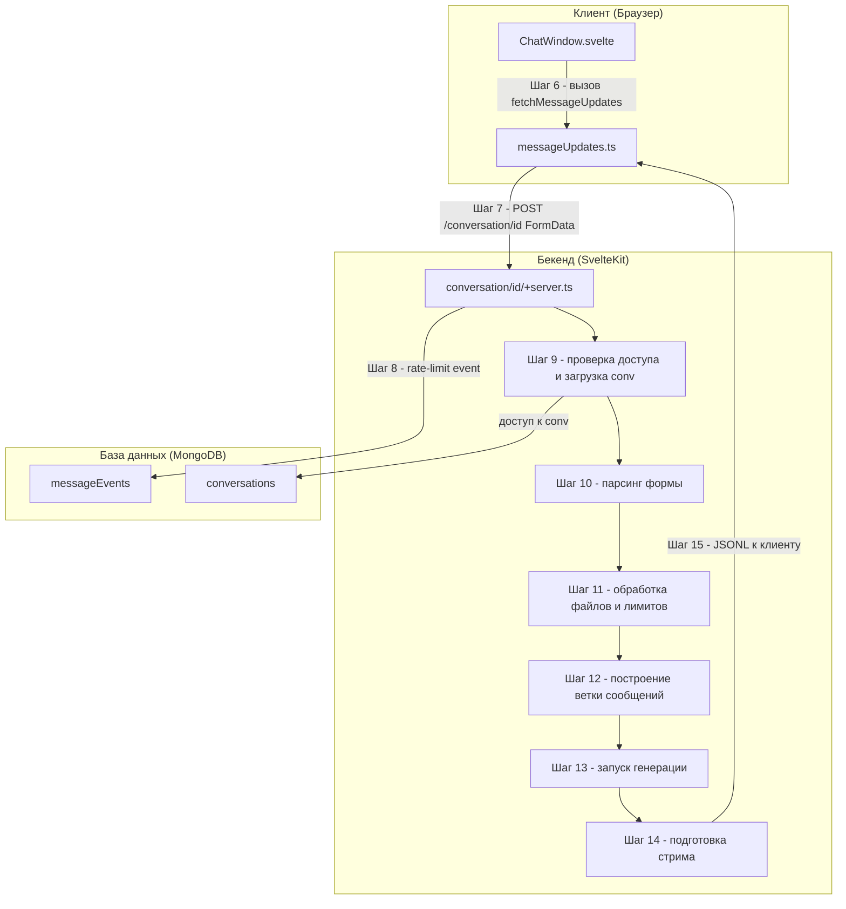

# Поддиаграмма 2: Отправка сообщения (Шаги 6-15)

## Объяснение терминов

- FormData - контейнер для `data` (JSON) и `files` (вложения).
- Rate limiting - ограничение частоты запросов и сообщений до/после входа.

## Визуальная диаграмма



## Шаг 6: Вызов отправки на клиенте

- Действие: пользователь вводит текст/добавляет файлы; UI вызывает `fetchMessageUpdates`.
- Тип данных: параметры вызова (inputs, id, is_retry, is_continue, web_search, tools, files).
- Результат: подготовка FormData.

Исходный файл: `src/lib/utils/messageUpdates.ts` (строки 56-60)
```typescript
export async function fetchMessageUpdates( // Объявление экспортируемой async-функции
  conversationId: string,                 // Идентификатор разговора для адресации запроса
  opts: MessageUpdateRequestOptions,      // Опции запроса (текст, флаги, вложения, инструменты)
  abortSignal: AbortSignal                 // Внешний AbortSignal для отмены запроса
): Promise<AsyncGenerator<MessageUpdate>> { // Возвращаем асинхронный генератор обновлений сообщений
```

Пример входных параметров:
```json
{
  "inputs": "Hello, how are you?",          // Текст пользователя
  "id": "optional-message-id",              // Идентификатор сообщения для ветвления/редакции
  "is_retry": false,                          // Признак повтора генерации
  "is_continue": false,                       // Признак продолжения последней ветки
  "web_search": false,                        // Разрешение веб-поиска
  "tools": ["web-search"],                   // Предпочтительные инструменты
  "files": []                                 // Вложения (при наличии)
}
```

## Шаг 7: POST /conversation/{id} (FormData)

- Действие: клиент собирает FormData (`data` + `files`) и отправляет POST.
- Тип данных: multipart/form-data.
- Результат: сервер принимает запрос на генерацию.

Исходный файл: `src/lib/utils/messageUpdates.ts` (строки 64-87)
```typescript
const form = new FormData(); // Создаём контейнер для полей формы и файлов
const optsJSON = JSON.stringify({ // Сериализуем полезные поля запроса в JSON-строку
  inputs: opts.inputs,           // Текстовое содержимое
  id: opts.messageId,            // Целевой messageId (ветка/редакция)
  is_retry: opts.isRetry,        // Повтор генерации
  is_continue: opts.isContinue,  // Продолжение генерации
  web_search: opts.webSearch,    // Флаг веб-поиска
  tools: opts.tools              // Список инструментов
});
opts.files?.forEach((file) => {  // Для каждого вложения из опций
  const name = file.type + ";" + file.name; // Кодируем тип и имя во имя файла поля
  form.append(                     // Добавляем файл к форме
    "files",                     // Поле формы
    new File([file.value], name, { type: file.mime }) // Создаём Blob-файл с MIME-типом
  );
});
form.append("data", optsJSON);   // Добавляем JSON-параметры в поле data
const response = await fetch(     // Отправляем POST-запрос на серверный endpoint
  `${opts.base}/conversation/${conversationId}`, // URL с идентификатором разговора
  { method: "POST", body: form, signal: abortController.signal } // Тело-форма и сигнал отмены
);                                // Получаем потоковый ответ сервера
```

## Шаг 8: Регистрация события rate-limit

- Действие: запись события `message` с userId/IP на 60 секунд.
- Тип данных: MongoDB insertOne в `messageEvents`.
- Результат: возможность подсчитать сообщения/мин и ограничить спам.

Исходный файл: `src/routes/conversation/[id]/+server.ts` (строки 75-82)
```typescript
await collections.messageEvents.insertOne({ // Регистрируем событие для ограничения частоты
  type: "message",           // Тип события
  userId,                     // Пользователь или сессия (для гостей)
  createdAt: new Date(),      // Время создания
  expiresAt: new Date(Date.now() + 60_000), // Срок жизни (1 минута)
  ip: getClientAddress(),     // IP клиента для доп. ограничения
});
```

## Шаг 9: Проверка доступа и загрузка разговора

- Действие: проверка, что пользователь/сессия имеет доступ; загрузка документа разговора.
- Тип данных: чтение MongoDB, authCondition.
- Результат: либо 404/401, либо продолжение.

Исходный файл: `src/routes/conversation/[id]/+server.ts` (строки 35-47, 66-73)
```typescript
const userId = locals.user?._id ?? locals.sessionId; // Извлекаем идентификатор пользователя или сессии
if (!userId) { error(401, "Unauthorized"); }       // Если нет — запрещаем доступ
const convBeforeCheck = await collections.conversations.findOne({ // Загружаем разговор по доступу
  _id: convId,                                        // Идентификатор разговора
  ...authCondition(locals),                           // Условие доступа (userId/sessionId)
});
// Если разговор legacy-формата без rootMessageId — конвертируем (опущены детали)
const conv = await collections.conversations.findOne({ // Повторно загружаем актуальный документ
  _id: convId,
  ...authCondition(locals),
});
if (!conv) { error(404, "Conversation not found"); } // Если не нашли — 404
```

## Шаг 10: Парсинг формы и JSON `data`

- Действие: чтение FormData, извлечение `data`, валидация полей запроса.
- Тип данных: form-data + zod схема.
- Результат: подготовленные значения для генерации.

Исходный файл: `src/routes/conversation/[id]/+server.ts` (строки 141-181)
```typescript
const form = await request.formData();               // Получаем форму из тела POST
const json = form.get("data");                      // Извлекаем поле data (JSON-строка)
if (!json || typeof json !== "string") {            // Проверяем наличие и тип
  error(400, "Invalid request");                    // Ошибка, если некорректно
}
const {                                              // Парсим и валидируем структуру запроса
  inputs: newPrompt,                                 // Текст пользователя
  id: messageId,                                     // Идентификатор исходного сообщения (ветка)
  is_retry: isRetry,                                 // Повтор
  is_continue: isContinue,                           // Продолжение
  web_search: webSearch,                             // Веб-поиск
  tools: toolsPreferences                            // Предпочит. инструменты
} = z.object({                                       // Ожидаемая схема запроса
  id: z.string().uuid().refine(isMessageId).optional(), // Валидный messageId для дерева
  inputs: z.optional( z.string().min(1).transform((s) => s.replace(/\r\n/g, "\n")) ), // Текст
  is_retry: z.optional(z.boolean()),                 // Флаг повтора
  is_continue: z.optional(z.boolean()),              // Флаг продолжения
  web_search: z.optional(z.boolean()),               // Флаг веб-поиска
  tools: z.array(z.string()).optional(),             // Инструменты
  files: z.optional(                                 // Вложения (если переданы в JSON)
    z.array(
      z.object({ type: z.literal("base64").or(z.literal("hash")), name: z.string(), value: z.string(), mime: z.string() })
    )
  )
}).parse(JSON.parse(json));                          // Парсим JSON и валидируем
```

## Шаг 11: Обработка файлов и лимитов

- Действие: преобразование base64 файлов, загрузка, проверка размеров, лимиты длины сообщения.
- Тип данных: чтение/загрузка файлов, проверки.
- Результат: массив `uploadedFiles` и проверки ограничений.

Исходный файл: `src/routes/conversation/[id]/+server.ts` (строки 183-231, 199-209, 223-231)
```typescript
const inputFiles = await Promise.all(                 // Преобразуем входные File-объекты формы в структуру
  form.getAll("files")                               // Извлекаем все значения поля files
    .filter((entry): entry is File => entry instanceof File && entry.size > 0) // Только непустые файлы
    .map(async (file) => {                            // Для каждого — нормализуем и читаем содержимое
      const [type, ...name] = file.name.split(";");  // Имя формата "тип;оригинальноеИмя"
      return {
        type: z.literal("base64").or(z.literal("hash")).parse(type), // Валидация типа
        value: await file.text(),                 // Содержимое файла (base64 при type=base64)
        mime: file.type,                          // MIME-тип
        name: name.join(";")                      // Восстанавливаем оригинальное имя
      };
    })
);
const hasPdfFiles = inputFiles?.some((f) => f.mime === "application/pdf") ?? false; // Есть ли PDF во входе
const hasPdfInConversation =                          // Есть ли PDF в уже сохранённых сообщениях
  conv.messages?.some((m) => m.files?.some((f) => f.mime === "application/pdf")) ?? false;
if (usageLimits?.messageLength &&                    // Лимит длины сообщения
   (newPrompt?.length ?? 0) > usageLimits.messageLength) {
  error(400, "Message too long.");                  // Ошибка при превышении
}
const hashFiles = inputFiles?.filter((f) => f.type === "hash") ?? []; // Файлы-ссылки (уже загружены ранее)
const b64Files = inputFiles                           // Файлы, требующие загрузки (base64 -> Blob)
  ?.filter((f) => f.type !== "hash")
  .map((f) => new File([Buffer.from(f.value, "base64")], f.name, { type: f.mime })) ?? [];
if (b64Files.some((f) => f.size > 10 * 1024 * 1024)) { // Проверка размера (10МБ)
  error(413, "File too large, should be <10MB");        // Ошибка при превышении
}
const uploadedFiles = await Promise.all(               // Загружаем новые файлы, добавляем hash-файлы
  b64Files.map((file) => uploadFile(file, conv))
).then((files) => [...files, ...hashFiles]);
```

## Шаг 12: Построение ветки сообщений (retry/continue/обычный)

- Действие: модификация дерева сообщений и подготовка `messagesForPrompt`.
- Тип данных: операции над документом разговора.
- Результат: корректный `messageToWriteToId` и `messagesForPrompt`.

Исходный файл: `src/routes/conversation/[id]/+server.ts` (строки 233-335)
```typescript
let messageToWriteToId: Message["id"] | undefined = undefined; // Сообщение, в которое будет писаться ответ
let messagesForPrompt: Message[] = [];                         // Ветка сообщений для подсказки модели
if (isContinue && messageId) {                                 // Ветвь: продолжить последнюю реплику
  if ((conv.messages.find((m) => m.id === messageId)?.children?.length ?? 0) > 0) {
    error(400, "Can only continue the last message");        // Можно продолжать только последнюю
  }
  messageToWriteToId = messageId;                              // Пишем в это сообщение
  messagesForPrompt = buildSubtree(conv, messageId);           // Строим ветку до корня
} else if (isRetry && messageId) {                             // Ветвь: повторить ответ/редактировать
  const messageToRetry = conv.messages.find((m) => m.id === messageId); // Ищем сообщение
  if (!messageToRetry) { error(404, "Message not found"); }
  if (messageToRetry.from === "user" && newPrompt) {          // Редактируем пользовательское
    const newUserMessageId = addSibling(                       // Добавляем соседнее (новая версия юзера)
      conv,
      { from: "user", content: newPrompt, files: uploadedFiles, createdAt: new Date(), updatedAt: new Date() },
      messageId
    );
    messageToWriteToId = addChildren(                          // Под него — пустое сообщение ассистента
      conv,
      { from: "assistant", content: "", createdAt: new Date(), updatedAt: new Date() },
      newUserMessageId
    );
    messagesForPrompt = buildSubtree(conv, newUserMessageId);  // Ветка от новой реплики юзера
  } else if (messageToRetry.from === "assistant") {           // Повтор ассистента
    messageToWriteToId = addSibling(                           // Рядом пустое сообщение ассистента
      conv,
      { from: "assistant", content: "", createdAt: new Date(), updatedAt: new Date() },
      messageId
    );
    messagesForPrompt = buildSubtree(conv, messageId);         // Ветка до текущего сообщения
    messagesForPrompt.pop();                                   // Убираем последний ответ ассистента
  }
} else {                                                       // Обычный режим: юзер -> ассистент
  const newUserMessageId = addChildren(                        // Добавляем сообщение пользователя
    conv,
    { from: "user", content: newPrompt ?? "", files: uploadedFiles, createdAt: new Date(), updatedAt: new Date() },
    messageId
  );
  messageToWriteToId = addChildren(                            // Добавляем пустое сообщение ассистента
    conv,
    { from: "assistant", content: "", createdAt: new Date(), updatedAt: new Date() },
    newUserMessageId
  );
  messagesForPrompt = buildSubtree(conv, newUserMessageId);    // Строим ветку подсказки
}
await collections.conversations.updateOne(                     // Сохраняем изменения в БД
  { _id: convId },
  { $set: { messages: conv.messages, title: conv.title, updatedAt: new Date() } }
);
```

## Шаг 13: Запуск генерации

- Действие: формирование контекста и запуск генерации (`textGeneration`).
- Тип данных: внутренние структуры + асинхронный генератор.
- Результат: получение событий обновлений.

Исходный файл: `src/routes/conversation/[id]/+server.ts` (строки 450-469)
```typescript
const ctx: TextGenerationContext = {                 // Контекст генерации для модели
  model,                                             // Активная модель (метаданные)
  endpoint: await model.getEndpoint(),               // Выбранный endpoint для вызова провайдера
  conv,                                              // Текущий разговор (включая обновления)
  messages: messagesForPrompt,                       // Ветка сообщений (контекст)
  assistant: undefined,                              // Ассистент (не используется здесь)
  isContinue: isContinue ?? false,                   // Флаг продолжения
  webSearch: webSearch ?? false,                     // Флаг веб-поиска
  toolsPreference: [                                 // Предпочтительные инструменты
    ...(toolsPreferences ?? []),
    ...(hasPdfFiles || hasPdfInConversation ? [documentParserToolId] : []) // Авто-инструмент для PDF
  ],
  promptedAt,                                        // Метка начала запроса
  ip: getClientAddress(),                            // IP клиента (для аудита/метрик)
  username: locals.user?.username                    // Имя пользователя (если есть)
};
for await (const event of textGeneration(ctx))       // Запускаем генерацию и читаем события
  await update(event);                               // Отправляем каждое событие в поток клиенту
```

## Шаг 14: Подготовка стрима

- Действие: создание `ReadableStream` и подготовка обработчика `update` для отправки событий.
- Тип данных: серверный стрим.
- Результат: готовность к отдаче JSONL.

Исходный файл: `src/routes/conversation/[id]/+server.ts` (строки 341-447)
```typescript
const stream = new ReadableStream({                 // Создаём поток ответа для клиента
  async start(controller) {                          // Хук старта стрима
    messageToWriteTo.updates ??= [];                 // Инициализируем хранилище обновлений
    async function update(event: MessageUpdate) {    // Обработчик каждого события генерации
      if (!messageToWriteTo || !conv) {              // Защита от рассинхронизации
        throw Error("No message or conversation to write events to");
      }
      if (event.type === MessageUpdateType.Stream) { // Потоковый токен модели
        if (event.token === "") return;            // Пустые токены пропускаем
        messageToWriteTo.content += event.token;     // Добавляем токен к ответу ассистента
        MetricsServer.getMetrics().model.tokenCountTotal.inc({ model: model?.id }); // Счётчик токенов
        if (!lastTokenTimestamp) {                   // Первый токен — метрика time-to-first-token
          MetricsServer.getMetrics().model.timeToFirstToken.observe(
            { model: model?.id },
            Date.now() - promptedAt.getTime()
          );
          lastTokenTimestamp = new Date();
        }
        MetricsServer.getMetrics().model.timePerOutputToken.observe( // Время на токен
          { model: model?.id },
          Date.now() - (lastTokenTimestamp ?? promptedAt).getTime()
        );
        lastTokenTimestamp = new Date();              // Обновляем отметку времени
      } else if (event.type === MessageUpdateType.Reasoning && // Поток размышлений
                 event.subtype === MessageReasoningUpdateType.Stream) {
        messageToWriteTo.reasoning ??= "";           // Инициализируем поле reasoning
        messageToWriteTo.reasoning += event.token;    // Добавляем токен размышлений
      } else if (event.type === MessageUpdateType.Title) { // Заголовок разговора
        conv.title = event.title;                     // Обновляем заголовок в памяти
        await collections.conversations.updateOne(    // Сохраняем заголовок в БД
          { _id: convId },
          { $set: { title: conv?.title, updatedAt: new Date() } }
        );
      } else if (event.type === MessageUpdateType.FinalAnswer) { // Финальный ответ
        messageToWriteTo.interrupted = event.interrupted; // Помечаем прерывание (если было)
        messageToWriteTo.content = initialMessageContent + event.text; // Фиксируем итоговый текст
        MetricsServer.getMetrics().model.latency.observe(              // Метрика задержки
          { model: model?.id },
          Date.now() - promptedAt.getTime()
        );
      } else if (event.type === MessageUpdateType.File) { // Добавление файла в сообщение
        messageToWriteTo.files = [ ...(messageToWriteTo.files ?? []), { type: "hash", name: event.name, value: event.sha, mime: event.mime } ];
      }
      if (event.type !== MessageUpdateType.Stream &&          // Записываем непотоковые события
          !(event.type === MessageUpdateType.Status && event.status === MessageUpdateStatus.KeepAlive) &&
          !(event.type === MessageUpdateType.Reasoning && event.subtype === MessageReasoningUpdateType.Stream)) {
        messageToWriteTo?.updates?.push(event);               // Добавляем в журнал обновлений
      }
      if (event.type === MessageUpdateType.Stream) {          // Пэддинг для защиты от сайд-каналов
        event = { ...event, token: event.token.padEnd(16, "\0") };
      }
      controller.enqueue(JSON.stringify(event) + "\n");     // Отправляем JSON строкой
      if (event.type === MessageUpdateType.FinalAnswer) {     // После финала — заполнение буфера
        controller.enqueue(" ".repeat(4096));                // Толкаем буфер в браузере
      }
    }
    await collections.conversations.updateOne(                 // Обновляем timestamp беседы
      { _id: convId },
      { $set: { title: conv.title, updatedAt: new Date() } }
    );
    messageToWriteTo.updatedAt = new Date();                   // Метка обновления сообщения
    let hasError = false;                                      // Флаг наличия ошибок
    const initialMessageContent = messageToWriteTo.content;    // Сохраняем исходный контент
    try {
      const ctx: TextGenerationContext = { /* заполнение как в шаге 13 */ };
      for await (const event of textGeneration(ctx)) await update(event); // Стримим события
    } catch (e) {
      hasError = true;                                         // Запоминаем ошибку
      await update({ type: MessageUpdateType.Status, status: MessageUpdateStatus.Error, message: (e as Error).message }); // Сообщаем об ошибке
      logger.error(e);                                         // Логируем
    } finally {
      if (!hasError && messageToWriteTo.content === initialMessageContent) { // Если не было вывода
        await update({ type: MessageUpdateType.Status, status: MessageUpdateStatus.Error, message: "No output was generated. Something went wrong." }); // Сообщаем
      }
    }
    await collections.conversations.updateOne(                 // Финальная фиксация в БД
      { _id: convId },
      { $set: { messages: conv.messages, title: conv?.title, updatedAt: new Date() } }
    );
    doneStreaming = true;                                      // Помечаем завершение стрима
    controller.close();                                        // Закрываем поток
  },
  async cancel() {                                             // Обработка отмены клиентом
    if (doneStreaming) return;                                 // Если уже завершено — выходим
    await collections.conversations.updateOne(                 // Иначе сохраняем state
      { _id: convId },
      { $set: { messages: conv.messages, title: conv.title, updatedAt: new Date() } }
    );
  }
});
```

## Шаг 15: Отдача JSONL клиенту

- Действие: отправка построчных JSON-объектов и завершение ответа.
- Тип данных: HTTP JSONL.
- Результат: клиент читает строковые JSON-обновления.

Исходный файл: `src/routes/conversation/[id]/+server.ts` (строки 432-438, 518-522)
```typescript
controller.enqueue(JSON.stringify(event) + "\n"); // Отправка события как строки JSON
...
return new Response(stream, {                       // Возвращаем поток клиенту
  headers: {
    "Content-Type": "application/jsonl",         // Формат построчного JSON
  },
});
```

## Описание блоков

### ChatWindow.svelte

- Что это: Клиентский компонент чата (инициация отправки, обработка UI)
- Задача: Передавать ввод пользователя в `fetchMessageUpdates`, отображать прогресс/ответы
- Файлы проекта: `src/lib/components/chat/ChatWindow.svelte` (и страницы-обёртки)
- Ключевые функции:
  - Сбор текста и файлов
  - Вызов отправки (шаг 6-7)
  - Отображение результата (см. поддиаграмму 4)

### messageUpdates.ts

- Что это: Клиентская утилита отправки и чтения потокового ответа
- Задача: Собрать FormData, отправить POST, преобразовать поток в события и (опц.) сгладить токены
- Файлы проекта: `src/lib/utils/messageUpdates.ts`
- Ключевые функции:
  - `fetchMessageUpdates` (шаг 6-7)
  - `endpointStreamToIterator` (шаг 15, см. поддиаграмму 4)

### conversation/[id]/+server.ts

- Что это: Серверный обработчик приёма сообщений в разговор
- Задача: Проверить доступ/лимиты, распарсить форму, построить ветку, запустить генерацию и стрим
- Файлы проекта: `src/routes/conversation/[id]/+server.ts`
- Ключевые функции:
  - Лимиты/доступ (шаг 8-9)
  - Парсинг формы/JSON (шаг 10)
  - Обработка файлов/лимитов (шаг 11)
  - Построение ветки сообщений (шаг 12)
  - Инициация генерации и стрима (шаг 13-15)

### messageEvents (коллекция)

- Что это: MongoDB коллекция для событий частоты сообщений
- Задача: Ограничивать частоту отправки по userId/IP
- Файлы проекта: `collections.messageEvents`
- Ключевые функции:
  - `insertOne({ type: "message", ... })` (шаг 8)
  - Подсчёт последних событий для rate limiting

### conversations (коллекция)

- Что это: MongoDB коллекция разговоров
- Задача: Хранить дерево сообщений и метаданные разговора
- Файлы проекта: `collections.conversations`
- Ключевые функции:
  - Загрузка разговора по `_id` (шаг 9)
  - Обновление дерева/таймштампов (шаг 12, 14-15)

## Сводка этапа

- Цель: Принять пользовательский ввод (текст/файлы), проверить лимиты/доступ и подготовить контекст.
- Результат: Готовый к генерации запрос; инициирован поток ответов.
- Ключевые моменты: FormData, retry/continue, files, web_search, rate limiting, авторизация доступа к разговору.
