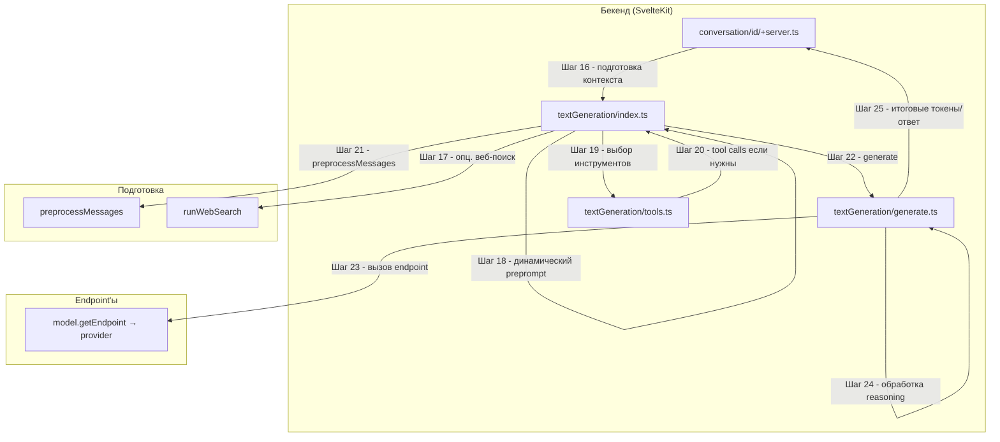

# Поддиаграмма 3: Генерация ответа и инструменты (Шаги 16-25)

## Термины и аббревиатуры

- Endpoint - адаптер к провайдерам моделей (OpenAI, HF Inference, Anthropic, Bedrock, LangServe, Cloudflare, Ollama, Local).
- Tool calls - вызовы инструментов (функций) моделью; результаты возвращаются в модель.
- Reasoning - режим пошаговых размышлений (поток/суммаризация/regex или специальные токены).

## Визуальная диаграмма



## Шаг 16: Подготовка контекста (в точке вызова)

- Действие: формирование контекста генерации (модель, endpoint, ветка сообщений, флаги).
- Тип данных: внутренняя структура `TextGenerationContext`.
- Результат: корректно заполненный контекст.

Исходный файл: `src/routes/conversation/[id]/+server.ts` (строки 450–466)
```typescript
const ctx: TextGenerationContext = {           // Контекст генерации
  model,                                       // Модель и её параметры
  endpoint: await model.getEndpoint(),         // Функция получения endpoint’а
  conv,                                        // Текущий разговор
  messages: messagesForPrompt,                 // Ветка сообщений для контекста
  assistant: undefined,                        // Ассистент (не используется тут)
  isContinue: isContinue ?? false,             // Продолжение
  webSearch: webSearch ?? false,               // Веб-поиск по запросу
  toolsPreference: [                           // Предпочтительные инструменты
    ...(toolsPreferences ?? []),
    ...(hasPdfFiles || hasPdfInConversation ? [documentParserToolId] : []),
  ],
  promptedAt,                                  // Метка начала
  ip: getClientAddress(),                      // IP клиента
  username: locals.user?.username,             // Имя пользователя (если есть)
};
```

## Шаг 17: Веб-поиск (опционально)

- Действие: при необходимости выполняется RAG-поиск (`runWebSearch`).
- Тип данных: запрос к поиску и результаты RAG.
- Результат: дополнение контекста веб-источниками.

Исходный файл: `src/lib/server/textGeneration/index.ts` (строки 60–68)
```typescript
let webSearchResult: WebSearch | undefined;   // Результаты веб-поиска
if (!isContinue && ((webSearch && !conv.assistantId) || assistantHasWebSearch(assistant))) {
  webSearchResult = yield* runWebSearch(conv, messages, assistant?.rag); // Выполняем веб-поиск
}
```

## Шаг 18: Динамический preprompt

- Действие: обработка preprompt ассистента (динамическая подстановка)
- Тип данных: строка preprompt, контент последнего сообщения
- Результат: обновлённое system-сообщение

Исходный файл: `src/lib/server/textGeneration/index.ts` (строки 70–74)
```typescript
let preprompt = conv.preprompt;                 // Базовый preprompt
if (assistantHasDynamicPrompt(assistant) && preprompt) {
  preprompt = await processPreprompt(preprompt, messages.at(-1)?.content); // Динамическая подстановка
  if (messages[0].from === "system") messages[0].content = preprompt;     // Синхронизация system-сообщения
}
```

## Шаг 19: Выбор инструментов

- Действие: выбор инструментов модели по предпочтениям/ассистенту.
- Тип данных: список `Tool[]`.
- Результат: набор инструментов либо `undefined`.

Исходный файл: `src/lib/server/textGeneration/index.ts` (строки 76–84)
```typescript
let toolResults: ToolResult[] = [];                                 // Результаты вызова инструментов
let tools = model.tools ? await getTools(toolsPreference, ctx.assistant) : undefined; // Получение инструментов
if (tools) {                                                        // Если инструменты поддерживаются
  const toolCallsRequired = tools.some((tool) => !toolHasName(directlyAnswer.name, tool)); // Нужны ли tool calls
  if (toolCallsRequired) {
    toolResults = yield* runTools(ctx, tools, preprompt);           // Выполняем инструменты (стрим вызовов)
  } else tools = undefined;                                         // Иначе отключаем инструменты
}
```

## Шаг 20: Tool calls (если требуются)

- Действие: выполнение инструментов, сбор их результатов.
- Тип данных: `ToolResult[]`.
- Результат: результаты инструментов будут переданы в модель.

Исходный файл: `src/lib/server/textGeneration/tools.ts` (фрагменты вызова)
```typescript
// вызов runTools уже указан на шаге 19; здесь формируется toolResults для генерации
```

## Шаг 21: Предобработка сообщений (preprocessMessages)

- Действие: объединение сообщений с результатами веб-поиска/контекстом.
- Тип данных: массив EndpointMessage[]
- Результат: подготовленные сообщения для endpoint’а

Исходный файл: `src/lib/server/textGeneration/index.ts` (строки 86–87)
```typescript
const processedMessages = await preprocessMessages(messages, webSearchResult, convId); // Обогащаем сообщения
```

## Шаг 22: Запуск генерации текста

- Действие: запуск `generate(...)` с контекстом, toolResults и preprompt.
- Тип данных: асинхронный генератор `MessageUpdate`.
- Результат: поток токенов/событий, передаваемый на серверный стрим.

Исходный файл: `src/lib/server/textGeneration/index.ts` (строки 87–89)
```typescript
yield* generate({ ...ctx, messages: processedMessages }, toolResults, preprompt); // Стримим обновления
done.abort();                                                                     // Останавливаем keep-alive
```

## Шаг 23: Вызов endpoint’а провайдера

- Действие: `generate(...)` вызывает выбранный endpoint провайдера (через `endpoint({...})`).
- Тип данных: токены/ответы провайдера.
- Результат: последовательность `generated_text` и `token`.

Исходный файл: `src/lib/server/textGeneration/generate.ts` (строки 46–55)
```typescript
for await (const output of await endpoint({ // Вызов endpoint’а провайдера
  messages,                     // Сообщения (после preprocess)
  preprompt,                    // Preprompt (динамический/базовый)
  continueMessage: isContinue,  // Флаг продолжения
  generateSettings: assistant?.generateSettings, // Настройки модели
  tools,                        // Описание инструментов
  toolResults,                  // Результаты инструментов
  isMultimodal: model.multimodal,              // Мультимодальность
  conversationId: conv._id,                    // Для трассировки
})) {
```

## Шаг 24: Обработка reasoning

- Действие: режим рассуждений (regex/summarize/tokens), выделение reasoning и финального ответа.
- Тип данных: поток `MessageUpdate.Reasoning` и финальные ответы.
- Результат: аккуратный финальный текст + события reasoning.

Исходный файл: `src/lib/server/textGeneration/generate.ts` (строки 23–45, 69–123, 134–199, 201–235)
```typescript
// Инициализация reasoning-мода (если включён в модели)
let reasoning = false; let reasoningBuffer = ""; let lastReasoningUpdate = new Date(); let status = "";
if (model.reasoning && (model.reasoning.type === "regex" || model.reasoning.type === "summarize" || (model.reasoning.type === "tokens" && model.reasoning.beginToken === ""))) {
  reasoning = true; // Начинаем в reasoning-режиме
  yield { type: MessageUpdateType.Reasoning, subtype: MessageReasoningUpdateType.Status, status: "Started reasoning..." };
}
// При получении финального текста — вырезаем служебные токены и корректируем ответ
if (output.generated_text) {
  let interrupted = !output.token.special && !model.parameters.stop?.includes(output.token.text);
  let text = output.generated_text.trimEnd();
  for (const stopToken of model.parameters.stop ?? []) {
    if (!text.endsWith(stopToken)) continue; interrupted = false; text = text.slice(0, text.length - stopToken.length);
  }
  let finalAnswer = text; // По умолчанию финальный ответ = текст
  if (model.reasoning && model.reasoning.type === "regex") { // Извлечение по regex
    const regex = new RegExp(model.reasoning.regex); finalAnswer = regex.exec(reasoningBuffer)?.[1] ?? text;
  } else if (model.reasoning && model.reasoning.type === "summarize") { // Суммаризация reasoning
    yield { type: MessageUpdateType.Reasoning, subtype: MessageReasoningUpdateType.Status, status: "Summarizing reasoning..." };
    try { const summary = yield* generateFromDefaultEndpoint({ messages: [{ from: "user", content: `Question: ${messages[messages.length - 1].content}\n\nReasoning: ${reasoningBuffer}` }], preprompt: "Your task is to summarize concisely...", generateSettings: { max_new_tokens: 1024 } }); finalAnswer = summary; yield { type: MessageUpdateType.Reasoning, subtype: MessageReasoningUpdateType.Status, status: `Done in ${Math.round((new Date().getTime() - startTime.getTime()) / 1000)}s.` }; } catch (e) { finalAnswer = text; logger.error(e); }
  } else if (model.reasoning && model.reasoning.type === "tokens") { // Удаляем reasoning из финального ответа
    const beginIndex = model.reasoning.beginToken ? reasoningBuffer.indexOf(model.reasoning.beginToken) : 0;
    const endIndex = reasoningBuffer.lastIndexOf(model.reasoning.endToken);
    if (beginIndex !== -1 && endIndex !== -1) {
      finalAnswer = text.slice(0, beginIndex) + text.slice(endIndex + model.reasoning.endToken.length);
    }
  }
  yield { type: MessageUpdateType.FinalAnswer, text: finalAnswer, interrupted, webSources: output.webSources }; // Отправляем финал
  continue; // Переходим к следующему output
}
// Поток reasoning-токенов и статусов
if (model.reasoning && model.reasoning.type === "tokens") {
  if (output.token.text === model.reasoning.beginToken) { reasoning = true; reasoningBuffer += output.token.text; continue; }
  else if (output.token.text === model.reasoning.endToken) { reasoning = false; reasoningBuffer += output.token.text; yield { type: MessageUpdateType.Reasoning, subtype: MessageReasoningUpdateType.Status, status: `Done in ${Math.round((new Date().getTime() - startTime.getTime()) / 1000)}s.` }; continue; }
}
if (output.token.special) continue; // Игнорируем служебные токены
if (reasoning) { // В режиме reasoning
  reasoningBuffer += output.token.text;               // Накапливаем буфер
  if (status !== "") {                               // Выдаём статус, если сформирован
    yield { type: MessageUpdateType.Reasoning, subtype: MessageReasoningUpdateType.Status, status };
    status = "";
  }
  if (config.REASONING_SUMMARY === "true" && new Date().getTime() - lastReasoningUpdate.getTime() > 4000) {
    lastReasoningUpdate = new Date();
    try { generateSummaryOfReasoning(reasoningBuffer).then((summary) => { status = summary; }); } catch (e) { logger.error(e); }
  }
  yield { type: MessageUpdateType.Reasoning, subtype: MessageReasoningUpdateType.Stream, token: output.token.text }; // Стрим рассуждений
} else {
  yield { type: MessageUpdateType.Stream, token: output.token.text }; // Обычный токен ответа
}
```

## Шаг 25: Итоговые токены и ответ

- Действие: доставка финальных событий/токенов для сервера → клиента.
- Тип данных: `MessageUpdate.Stream`, `MessageUpdate.FinalAnswer`, `MessageUpdate.Reasoning`.
- Результат: серверный стрим (см. поддиаграмму 4) отдаёт JSONL клиенту.

Исходный файл: `src/lib/server/textGeneration/generate.ts` (строки 220–235)
```typescript
// Завершение генерации: учитываем условия прерывания/отсутствия вывода
const date = AbortedGenerations.getInstance().getAbortTime(conv._id.toString());
if (date && date > promptedAt) { logger.info(`Aborting generation for conversation ${conv._id}`); break; }
if (!output) break; // Защита от пустого вывода
```

## Описание блоков

### conversation/[id]/+server.ts

- Что это: Серверный обработчик, инициирующий генерацию и отдающий стрим клиенту
- Задача: Сформировать `TextGenerationContext`, вызвать `textGeneration` и передавать события в стрим
- Файлы проекта: `src/routes/conversation/[id]/+server.ts`
- Ключевые функции:
  - Формирование контекста (шаг 16)
  - Инициация `textGeneration(ctx)` и проксирование событий (поддиаграмма 4)

### textGeneration/index.ts

- Что это: Оркестратор генерации текста и веб-поиска/инструментов
- Задача: Выполнить веб-поиск, динамически обновить preprompt, выбрать/запустить инструменты, предобработать сообщения и запустить генерацию
- Файлы проекта: `src/lib/server/textGeneration/index.ts`
- Ключевые функции:
  - `runWebSearch()` (шаг 17)
  - `processPreprompt()` (шаг 18)
  - `getTools()`/`runTools()` (шаг 19–20)
  - `preprocessMessages()` (шаг 21)
  - `generate(...)` (шаг 22)

### textGeneration/generate.ts

- Что это: Исполнитель генерации и интеграции с endpoint’ами
- Задача: Вызвать endpoint провайдера, постпроцессинг reasoning и эмит токенов/финала
- Файлы проекта: `src/lib/server/textGeneration/generate.ts`
- Ключевые функции:
  - Вызов endpoint’а (шаг 23)
  - Обработка reasoning (шаг 24)
  - Эмит токенов/финального ответа (шаг 25)

### Endpoint’ы провайдеров

- Что это: Интеграции с внешними сервисами (OpenAI, HF Inference, Anthropic, Bedrock, LangServe, Cloudflare, Ollama, Local)
- Задача: Преобразовать сообщения и параметры в формат конкретного провайдера, вернуть поток токенов/ответов
- Файлы проекта: `src/lib/server/endpoints/*`
- Ключевые функции:
  - Формирование запроса к провайдеру
  - Стриминг токенов/результатов

## Сводка этапа

- Цель: Скоординировать веб-поиск, инструменты и генерацию через endpoint’ы с поддержкой reasoning
- Результат: Поток reasoning/токенов и финальный ответ для стриминга клиенту
- Ключевые моменты: динамический preprompt, выбор инструментов, preprocess, endpoint-агностика, режим reasoning
