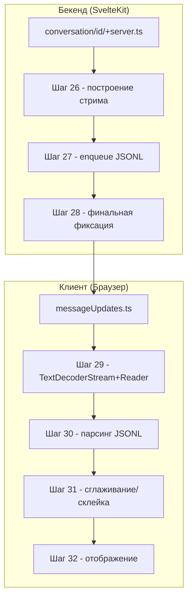

# Поддиаграмма 4: Стриминг ответа (Шаги 26-32)

## Термины и аббревиатуры

- JSONL - формат "один JSON-объект на строку".
- ReadableStream - поток серверного ответа, который порционно отправляет данные клиенту.
- KeepAlive - служебные события для поддержания соединения.

## Визуальная диаграмма



## Шаг 26: Построение стрима на сервере

- Действие: создание `ReadableStream`, определение `start/cancel` и обработчика `update`.
- Тип данных: серверный стрим событий.
- Результат: готовность отдавать построчные JSON обновления.

Исходный файл: `src/routes/conversation/[id]/+server.ts` (строки 341-347, 441-447)
```typescript
const stream = new ReadableStream({               // Создаём поток для ответа клиенту
  async start(controller) {                        // Инициализация при старте
    messageToWriteTo.updates ??= [];               // Инициализируем журнал обновлений сообщения
    async function update(event: MessageUpdate) {  // Обработчик каждого события генерации
      // см. шаг 27 — отправка JSONL, метрики и побочные эффекты
    }
    // ... подготовка и запуск textGeneration(ctx)
  },
  async cancel() {                                 // Отмена клиентом
    // ... сохранение state разговора
  }
});
```

## Шаг 27: Отправка JSONL (enqueue)

- Действие: сериализация событий в JSON и отправка построчно с `\n`.
- Тип данных: JSONL.
- Результат: события доходят до клиента по мере генерации.

Исходный файл: `src/routes/conversation/[id]/+server.ts` (строки 432-438)
```typescript
controller.enqueue(JSON.stringify(event) + "\n"); // Отправляем событие отдельной строкой
if (event.type === MessageUpdateType.FinalAnswer) { // После финального ответа
  controller.enqueue(" ".repeat(4096));            // Толкаем буфер браузера (padding)
}
```

## Шаг 28: Финальная фиксация и возврат Response

- Действие: обновление БД, закрытие стрима и возврат `Response(stream)`.
- Тип данных: финальное состояние и заголовки ответа.
- Результат: корректное завершение потока.

Исходный файл: `src/routes/conversation/[id]/+server.ts` (строки 488-503, 518-522)
```typescript
await collections.conversations.updateOne(         // Финальная фиксация состояния беседы
  { _id: convId },
  { $set: { messages: conv.messages, title: conv?.title, updatedAt: new Date() } }
);
...
return new Response(stream, {                      // Возвращаем поток в качестве ответа
  headers: { "Content-Type": "application/jsonl" } // Указываем JSONL
});
```

## Шаг 29: Декодирование и чтение потока на клиенте

- Действие: преобразование бинарного потока в текст и чтение чанков reader’ом.
- Тип данных: ReadableStream + TextDecoderStream.
- Результат: асинхронный итератор JSON-обновлений.

Исходный файл: `src/lib/utils/messageUpdates.ts` (строки 109-121)
```typescript
async function* endpointStreamToIterator(response: Response, abortController: AbortController) {
  const reader = response.body?.pipeThrough(new TextDecoderStream()).getReader(); // Декодируем текст
  if (!reader) throw Error("Response for endpoint had no body");                 // Валидация
  reader.closed.then(() => abortController.abort());                               // Авто-отмена при закрытии
  abortController.signal.addEventListener("abort", () => reader.cancel());       // Прерывание чтения при аборте
  let prevChunk = "";                                                             // Буфер неполного JSON
  while (!abortController.signal.aborted) {                                       // Читаем до отмены
    const { done, value } = await reader.read();                                  // Читаем chunk
    if (done) { abortController.abort(); break; }                                  // Конец потока
    if (!value) continue;                                                         // Пустой chunk
    const { messageUpdates, remainingText } = parseMessageUpdates(prevChunk + value); // Парсим строки
    prevChunk = remainingText;                                                    // Храним хвост
    for (const messageUpdate of messageUpdates) yield messageUpdate;             // Отдаём обновления
  }
}
```

## Шаг 30: Парсинг JSONL

- Действие: разбивка по `\n`, JSON.parse по строкам, возврат массива событий и хвоста.
- Тип данных: текст → объекты событий.
- Результат: корректный поток структурированных сообщений.

Исходный файл: `src/lib/utils/messageUpdates.ts` (строки 139-159)
```typescript
function parseMessageUpdates(value: string): { messageUpdates: MessageUpdate[]; remainingText: string } {
  const inputs = value.split("\n");               // Разбиваем на строки
  const messageUpdates: MessageUpdate[] = [];       // Сюда — распарсенные события
  for (const input of inputs) {                     // Для каждой строки
    try {
      messageUpdates.push(JSON.parse(input) as MessageUpdate); // Пробуем парсить JSON
    } catch (error) {
      if (error instanceof SyntaxError) {           // Если обрыв JSON — возвращаем то, что есть
        return { messageUpdates, remainingText: inputs.at(-1) ?? "" };
      }
    }
  }
  return { messageUpdates, remainingText: "" };    // Возвращаем события и пустой хвост
}
```

## Шаг 31: Сглаживание/склейка потоковых токенов (опционально)

- Действие: склеивание коротких токенов до целых слов и/или равномерный темп вывода.
- Тип данных: итераторы-обёртки.
- Результат: более плавный UX токенизации.

Исходный файл: `src/lib/utils/messageUpdates.ts` (строки 167-203, 209-268)
```typescript
async function* streamMessageUpdatesToFullWords(iterator: AsyncGenerator<MessageUpdate>) { // Объединяем токены до слов
  let bufferedStreamUpdates: MessageStreamUpdate[] = [];             // Буфер потоковых токенов
  const endAlphanumeric = /[a-zA-Z0-9À-ž'`]+$/;                      // Конец слова
  const beginnningAlphanumeric = /^[a-zA-Z0-9À-ž'`]+/;               // Начало слова
  for await (const messageUpdate of iterator) {                      // Перебираем обновления
    if (messageUpdate.type !== "stream") { yield messageUpdate; continue; } // Пропускаем непотоковые
    bufferedStreamUpdates.push(messageUpdate);                       // Кладём токен в буфер
    let lastIndexEmitted = 0;                                       // Индекс последней отдачи
    for (let i = 1; i < bufferedStreamUpdates.length; i++) {        // Ищем место разбиения
      const prevEnds = endAlphanumeric.test(bufferedStreamUpdates[i - 1].token);
      const currBegins = beginnningAlphanumeric.test(bufferedStreamUpdates[i].token);
      const shouldCombine = prevEnds && currBegins;                  // Склеиваем, если переход внутри слова
      const combinedTooMany = i - lastIndexEmitted >= 5;             // Или по таймауту из 5 токенов
      if (shouldCombine && !combinedTooMany) continue;               // Продолжаем накапливать
      yield { type: MessageUpdateType.Stream, token: bufferedStreamUpdates.slice(lastIndexEmitted, i).map((_) => _.token).join("") }; // Отдаём склейку
      lastIndexEmitted = i;                                          // Обновляем индекс отдачи
    }
    bufferedStreamUpdates = bufferedStreamUpdates.slice(lastIndexEmitted); // Обрезаем буфер
  }
  for (const messageUpdate of bufferedStreamUpdates) yield messageUpdate; // Финальный слив
}

async function* smoothAsyncIterator<T>(iterator: AsyncGenerator<T>) {       // Выравнивание темпа
  const eventTarget = new EventTarget(); let done = false; const valuesBuffer: T[] = []; const valueTimesMS: number[] = [];
  const next = async () => { const obj = await iterator.next(); if (obj.done) { done = true; } else { valuesBuffer.push(obj.value); valueTimesMS.push(performance.now()); next(); } eventTarget.dispatchEvent(new Event("next")); };
  next();
  let timeOfLastEmitMS = performance.now();                                 // Время последней отдачи
  while (!done || valuesBuffer.length > 0) {                                 // Пока есть значения
    const sampledTimesMS = valueTimesMS.slice(-30);                           // Берём последние интервалы
    const anomalyThresholdMS = 2000;                                          // Порог аномалий
    const anomalyDurationMS = sampledTimesMS.map((t,i,a)=>t-a[i-1]).slice(1).filter((t)=>t>anomalyThresholdMS).reduce((a,b)=>a+b,0); // Сумма аномалий
    const totalTimeMSBetweenValues = sampledTimesMS.at(-1)! - sampledTimesMS[0];
    const timeMSBetweenValues = totalTimeMSBetweenValues - anomalyDurationMS; // Чистый интервал
    const averageTimeMSBetweenValues = Math.min(200, timeMSBetweenValues / (sampledTimesMS.length - 1)); // Средний темп
    const timeSinceLastEmitMS = performance.now() - timeOfLastEmitMS;        // Время с последней отдачи
    const gotNext = await Promise.race([                                      // Ждём либо таймер, либо новое значение
      sleep(Math.max(5, averageTimeMSBetweenValues - timeSinceLastEmitMS)),
      waitForEvent(eventTarget, "next"),
    ]);
    if (gotNext) continue;                                                   // Если пришёл next — пересчёт
    if (valuesBuffer.length === 0) continue;                                  // Нечего отдавать
    timeOfLastEmitMS = performance.now();                                     // Обновляем метку
    yield valuesBuffer.shift()!;                                              // Отдаём следующее значение
  }
}
```

## Шаг 32: Отображение в UI

- Действие: UI получает события и обновляет интерфейс (чат/прогресс/ошибки).
- Тип данных: поток `MessageUpdate`.
- Результат: визуальное появление ответа токенами и финального текста.

(Использование зависит от компонентов UI, см. `ChatWindow.svelte` и обработчики.)

## Описание блоков

### conversation/[id]/+server.ts

- Что это: Точка формирования потока JSONL ответа
- Задача: Настроить `ReadableStream`, сериализовать события, корректно завершить поток
- Файлы проекта: `src/routes/conversation/[id]/+server.ts`
- Ключевые функции:
  - `ReadableStream.start/cancel` (шаг 26)
  - `controller.enqueue(JSON.stringify(event)+"\n")` (шаг 27)
  - Финальная фиксация и `return new Response(stream)` (шаг 28)

### messageUpdates.ts

- Что это: Клиентские утилиты чтения стрима и преобразования в события
- Задача: Превратить поток байт в поток `MessageUpdate`, сгладить вывод
- Файлы проекта: `src/lib/utils/messageUpdates.ts`
- Ключевые функции:
  - `endpointStreamToIterator` (шаг 29)
  - `parseMessageUpdates` (шаг 30)
  - `streamMessageUpdatesToFullWords` и `smoothAsyncIterator` (шаг 31)

## Сводка этапа

- Цель: Надёжно передать поток событий от сервера к клиенту в формате JSONL
- Результат: Плавное отображение ответа с метриками и защитами
- Ключевые моменты: padding, keep-alive, парсинг JSONL, сглаживание для UX
