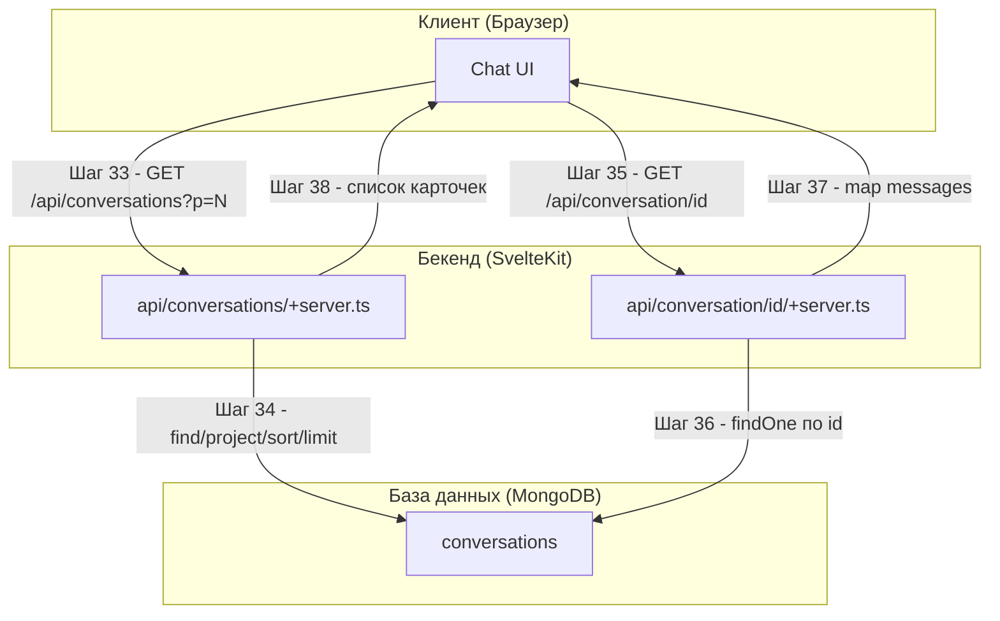

# Поддиаграмма 5: Получение разговоров и сообщений (Шаги 33-38)

## Термины и аббревиатуры

- Пагинация - разбиение списка на страницы параметром `p`.
- Проекция - выбор подмножества полей документа при выдаче.

## Визуальная диаграмма



## Шаг 33: Запрос списка разговоров (клиент)

- Действие: UI запрашивает список разговоров страницы `p`.
- Тип данных: HTTP GET.
- Результат: JSON-массив карточек разговоров.

Пример запроса:
```json
{
  "method": "GET",
  "url": "/api/conversations?p=0"
}
```

## Шаг 34: Поиск и проекция списка (сервер)

- Действие: `find`, `project`, `sort`, `skip`, `limit`, `toArray`.
- Тип данных: операции MongoDB.
- Результат: массив документов в проекции.

Исходный файл: `src/routes/api/conversations/+server.ts` (строки 7–23, 28–38)
```typescript
export async function GET({ locals, url }) {                 // Обработчик списка
  const p = parseInt(url.searchParams.get("p") ?? "0");    // Номер страницы
  if (locals.user?._id || locals.sessionId) {               // Проверка доступа
    const convs = await collections.conversations
      .find({ ...authCondition(locals) })                   // Только для текущего пользователя/сессии
      .project<Pick<Conversation, "_id" | "title" | "updatedAt" | "model" | "assistantId">>({
        title: 1, updatedAt: 1, model: 1, assistantId: 1    // Проекция полей
      })
      .sort({ updatedAt: -1 })                              // Новые сверху
      .skip(p * CONV_NUM_PER_PAGE)                          // Пропуск страниц
      .limit(CONV_NUM_PER_PAGE)                             // Размер страницы
      .toArray();                                           // В массив
    if (convs.length === 0) { return Response.json([]); }   // Пустой список
    const res = convs.map((conv) => ({                      // Маппинг под UI
      _id: conv._id,
      id: conv._id,                                         // legacy для iOS
      title: conv.title,
      updatedAt: conv.updatedAt,
      model: conv.model,
      modelId: conv.model,                                  // legacy для iOS
      assistantId: conv.assistantId,
      modelTools: models.find((m) => m.id == conv.model)?.tools ?? false,
    }));
    return Response.json(res);                              // Ответ JSON
  } else {
    return Response.json({ message: "Must have session cookie" }, { status: 401 }); // Нет доступа
  }
}
```

Ответ:
```json
[
  {
    "id": "656f...",
    "title": "New Chat",
    "updatedAt": "2024-01-01T12:00:00Z",
    "model": "gpt-4o",
    "assistantId": null,
    "modelTools": true
  }
]
```

## Шаг 35: Запрос деталей разговора (клиент)

- Действие: UI запрашивает детали разговора по id.
- Тип данных: HTTP GET.
- Результат: Полная структура сообщений и метаданных.

Пример запроса:
```json
{
  "method": "GET",
  "url": "/api/conversation/656f..."
}
```

## Шаг 36: Поиск разговора по id (сервер)

- Действие: `findOne` по `_id` с `authCondition`.
- Тип данных: MongoDB.
- Результат: Документ разговора или 404/401.

Исходный файл: `src/routes/api/conversation/[id]/+server.ts` (строки 7–15)
```typescript
export async function GET({ locals, params }) {         // Обработчик деталей
  const id = z.string().parse(params.id);               // Валидация id
  const convId = new ObjectId(id);                      // Преобразование в ObjectId
  if (locals.user?._id || locals.sessionId) {           // Проверка доступа
    const conv = await collections.conversations.findOne({
      _id: convId,                                      // Поиск по id
      ...authCondition(locals),                         // Условие доступа
    });
    // ...
  } else {                                              // Нет доступа
    return Response.json({ message: "Must have session cookie" }, { status: 401 });
  }
}
```

## Шаг 37: Формирование ответа с сообщениями (сервер)

- Действие: трансформация сообщений в пригодный для UI формат.
- Тип данных: JSON.
- Результат: подробная структура разговора.

Исходный файл: `src/routes/api/conversation/[id]/+server.ts` (строки 17–37)
```typescript
if (conv) {
  const res = {
    id: conv._id,                     // Идентификатор разговора
    title: conv.title,                // Заголовок
    updatedAt: conv.updatedAt,        // Обновлён
    modelId: conv.model,              // Модель
    assistantId: conv.assistantId,    // Ассистент (если есть)
    messages: conv.messages.map((m) => ({ // Список сообщений
      content: m.content,             // Текст
      from: m.from,                   // Источник (user/assistant/system)
      id: m.id,                       // Id сообщения в дереве
      createdAt: m.createdAt,         // Метка создания
      updatedAt: m.updatedAt,         // Метка обновления
      webSearch: m.webSearch,         // Метаданные веб-поиска
      files: m.files,                 // Вложения
      updates: m.updates,             // Журнал обновлений
      reasoning: m.reasoning          // Поток размышлений (если был)
    })),
    modelTools: models.find((m) => m.id == conv.model)?.tools ?? false, // Инструменты модели
  };
  return Response.json(res);         // Возврат клиенту
} else {
  return Response.json({ message: "Conversation not found" }, { status: 404 }); // Нет документа
}
```

Ответ:
```json
{
  "id": "656f...",
  "title": "New Chat",
  "updatedAt": "2024-01-01T12:05:00Z",
  "modelId": "gpt-4o",
  "assistantId": null,
  "messages": [
    { "id": "msg-1", "from": "system", "content": "..." },
    { "id": "msg-2", "from": "user", "content": "Hello" },
    { "id": "msg-3", "from": "assistant", "content": "Hi!" }
  ],
  "modelTools": true
}
```

## Шаг 38: Список карточек в UI

- Действие: UI отображает список разговоров и позволяет перейти к деталям.
- Тип данных: JSON массива разговоров.
- Результат: список в боковой панели/странице.

(См. компоненты навигации и список разговоров в UI.)

## Описание блоков

### api/conversations/+server.ts

- Что это: Эндпоинт списка разговоров с пагинацией
- Задача: Вернуть список разговоров текущего пользователя/сессии с подмножеством полей
- Файлы проекта: `src/routes/api/conversations/+server.ts`
- Ключевые функции:
  - Параметр `p` для пагинации (шаг 33)
  - Поиск/проекция/сортировка/лимит (шаг 34)

### api/conversation/[id]/+server.ts

- Что это: Эндпоинт деталей разговора по id
- Задача: Вернуть сообщение и метаданные разговора
- Файлы проекта: `src/routes/api/conversation/[id]/+server.ts`
- Ключевые функции:
  - `findOne` с `authCondition` (шаг 36)
  - Маппинг сообщений в ответ (шаг 37)

## Сводка этапа

- Цель: Предоставить клиенту список разговоров и полные детали выбранного
- Результат: Удобные для UI JSON-ответы с пагинацией и полной структурой сообщений
- Ключевые моменты: проекция полей, сортировка по времени, авторизация доступа
