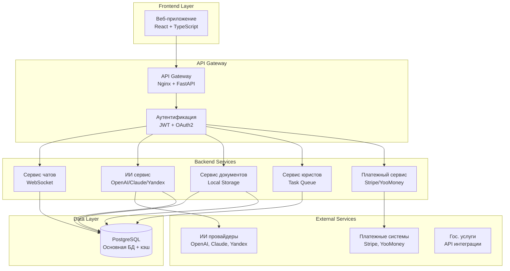

# Архитектура юридического сервиса с ИИ

## Обзор системы

Система состоит из основных компонентов:
1. **Frontend** (React + TypeScript) - Фаза 1
2. **Backend API** (FastAPI + Python) - Фаза 1

## Диаграмма архитектуры

## Требования к производительности

### Нагрузочные характеристики

| Метрика | Значение | Описание |
|---------|----------|----------|
| **Пользователей одновременно** | 5,000+ | Активные пользователи в системе |
| **Запросов в секунду** | 500+ | Общая нагрузка на API |
| **Чат-сообщений в секунду** | 250+ | Сообщения в чатах с ИИ |
| **Загрузок файлов в минуту** | 50+ | Загрузка документов |
| **Запросов к ИИ в секунду** | 100+ | Запросы к ИИ провайдерам |
| **Время ответа ИИ** | < 5 сек | Время генерации ответа |
| **Время ответа юриста** | < 30 мин | Время проверки ответа юристом |

### Масштабирование

#### Горизонтальное масштабирование
- **API серверы**: Автоматическое масштабирование по CPU/памяти
- **База данных**: Read replicas для чтения, Master-Slave для записи
- **Load Balancer**: При необходимости для распределения нагрузки

#### Вертикальное масштабирование
- **CPU**: 8-16 ядер на сервер
- **RAM**: 32-64 GB на сервер
- **Storage**: SSD NVMe для БД
- **Network**: 10 Gbps для внутренней сети

## Безопасность

### Аутентификация и авторизация
- JWT токены с коротким временем жизни
- Refresh токены для продления сессий
- OAuth2 для интеграции с внешними сервисами
- RBAC (Role-Based Access Control) для корпоративных пользователей

### Защита данных
- Шифрование данных в покое (AES-256)
- Шифрование данных в движении (TLS 1.3)
- Автоматическая закраска персональных данных
- Аудит всех операций с данными

### Соответствие требованиям
- GDPR (для европейских пользователей)
- 152-ФЗ (для российских пользователей)
- SOC 2 Type II (для корпоративных клиентов)
