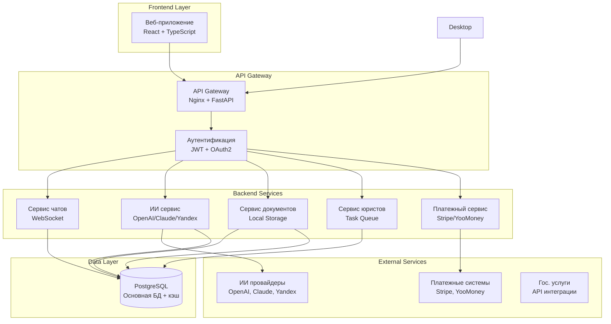

# Архитектура юридического сервиса с ИИ

## Обзор системы

Система состоит из основных компонентов:
1. **Веб-приложение** (React + TypeScript) - Фаза 1
2. **Backend API** (FastAPI + Python) - Фаза 1

## Диаграмма архитектуры

## Требования к производительности

### Ожидаемые нагрузочные характеристики

| Метрика | Значение | Описание |
|---------|----------|----------|
| **Пользователей одновременно** | 1,000+ | Активные пользователи в системе |
| **Запросов в секунду** | 100+ | Общая нагрузка на API |
| **Чат-сообщений в секунду** | 50+ | Сообщения в чатах с ИИ |
| **Загрузок файлов в минуту** | 10+ | Загрузка документов |
| **Запросов к ИИ в секунду** | 100+ | Запросы к ИИ провайдерам |
| **Время ответа ИИ** | < 5 сек | Время генерации ответа |

### Масштабирование

#### Горизонтальное масштабирование
- **API серверы**: Масштабирование по CPU/памяти
- **База данных**: Read replicas для чтения
- **Load Balancer**: При необходимости для распределения нагрузки

#### Вертикальное масштабирование (более дорогой арендуемый хостинг)
- **CPU**: 4-16 ядер на сервер
- **RAM**: 16-64 GB на сервер
- **Storage**: SSD NVMe для БД
- **Network**: 10 Gbps для внутренней сети

### Масштабирование по количеству пользователей

#### ~5000 пользователей

| Провайдер | Тариф | Приблизительная цена за месяц | vCPU | RAM (GB) | Частота (GHz) | Хранилище |
|-----------|-------|------------------------------|------|----------|---------------|-----------|
| AWS EC2 | m7gd.4xlarge | 49,920 ₽ | 16 | 64 | 2.6 | 950 ГБ NVMe SSD |
| Google Cloud | c2-standard-16-lssd | 48,000 ₽ | 16 | 64 | 3.9 | 1.5 ТБ NVMe SSD |
| Microsoft Azure | D64d v5 | 211,200 ₽ | 64 | 256 | 2.8 | 2.4 ТБ NVMe temp disk |

#### ~1000 пользователей

| Провайдер | Тариф | Приблизительная цена за месяц | vCPU | RAM (GB) | Частота (GHz) | Хранилище |
|-----------|-------|------------------------------|------|----------|---------------|-----------|
| AWS EC2 | m7gd.xlarge | 12,480 ₽ | 4 | 16 | 2.6 | 237 ГБ NVMe SSD |
| Google Cloud | c2-standard-8-lssd | 26,400 ₽ | 8 | 32 | 3.9 | 750 ГБ NVMe SSD |
| Microsoft Azure | D16d v5 | 52,800 ₽ | 16 | 64 | 2.8 | 600 ГБ NVMe temp disk |

#### ~100 пользователей

| Провайдер | Тариф | Приблизительная цена за месяц | vCPU | RAM (GB) | Частота (GHz) | Хранилище |
|-----------|-------|------------------------------|------|----------|---------------|-----------|
| AWS EC2 | m7gd.large | 6,240 ₽ | 2 | 8 | 2.6 | 118 ГБ NVMe SSD |
| Google Cloud | c2-standard-4-lssd | 14,080 ₽ | 4 | 16 | 3.9 | 375 ГБ NVMe SSD |
| Microsoft Azure | D2d v5 | 6,560 ₽ | 2 | 8 | 2.8 | 75 ГБ NVMe temp disk |
						

## Безопасность

### Аутентификация и авторизация
- JWT токены с коротким временем жизни
- Refresh токены для продления сессий

### Защита данных
- Шифрование данных в покое (AES-256)
- Шифрование данных в движении (TLS 1.3)
- Автоматическая закраска персональных данных
- Аудит всех операций с данными

### Соответствие требованиям
- GDPR (для европейских пользователей)
- 152-ФЗ (для российских пользователей)
- SOC 2 Type II (для корпоративных клиентов)
