# UML Диаграмма классов - Юридический сервис с ИИ

## Основные сущности системы

```mermaid
classDiagram
    class User {
        +UUID id
        +String email
        +String password_hash
        +String first_name
        +String last_name
        +UserRole role
        +UserStatus status
        +DateTime created_at
        +DateTime updated_at
        +createChat()
        +uploadDocument()
        +makePayment()
    }

    class Chat {
        +UUID id
        +UUID user_id
        +String title
        +ChatType type
        +ChatStatus status
        +DateTime created_at
        +DateTime updated_at
        +addMessage()
        +requestLawyerReview()
    }

    class Message {
        +UUID id
        +UUID chat_id
        +UUID sender_id
        +MessageType type
        +String content
        +MessageStatus status
        +DateTime created_at
        +sendToAI()
        +markAsReviewed()
    }

    class Document {
        +UUID id
        +UUID user_id
        +String filename
        +String file_path
        +String mime_type
        +Long file_size
        +DocumentStatus status
        +String extracted_text
        +DateTime created_at
        +DateTime updated_at
        +processDocument()
        +maskPersonalData()
    }

    class DocumentAnnotation {
        +UUID id
        +UUID document_id
        +AnnotationType type
        +String text
        +Integer start_pos
        +Integer end_pos
        +String masked_text
        +DateTime created_at
    }

    class LawyerReview {
        +UUID id
        +UUID message_id
        +UUID lawyer_id
        +ReviewStatus status
        +String comment
        +Boolean is_correct
        +DateTime created_at
        +DateTime completed_at
        +assignLawyer()
        +completeReview()
    }

    class Payment {
        +UUID id
        +UUID user_id
        +PaymentType type
        +BigDecimal amount
        +String currency
        +PaymentStatus status
        +String payment_intent
        +DateTime created_at
        +DateTime completed_at
        +processPayment()
        +refundPayment()
    }

    class AIRequest {
        +UUID id
        +UUID user_id
        +String prompt
        +String response
        +String model_used
        +Integer tokens_used
        +BigDecimal cost
        +DateTime created_at
        +cacheResponse()
    }

    class CorporateAccount {
        +UUID id
        +String company_name
        +String tax_id
        +String address
        +AccountStatus status
        +DateTime created_at
        +inviteUser()
        +managePermissions()
    }

    class UserPermission {
        +UUID id
        +UUID user_id
        +UUID account_id
        +PermissionType type
        +DateTime granted_at
        +DateTime expires_at
        +grantPermission()
        +revokePermission()
    }

    %% Relationships
    User ||--o{ Chat : creates
    User ||--o{ Document : uploads
    User ||--o{ Payment : makes
    User ||--o{ AIRequest : generates
    User ||--o{ UserPermission : has

    Chat ||--o{ Message : contains
    Chat ||--o{ LawyerReview : requests

    Message ||--|| LawyerReview : reviewed_by

    Document ||--o{ DocumentAnnotation : has

    CorporateAccount ||--o{ UserPermission : grants
```

## Сервисы и контроллеры

```mermaid
classDiagram
    class AuthController {
        +login(credentials)
        +register(userData)
        +refreshToken(token)
        +logout()
    }

    class ChatController {
        +createChat(userId, type)
        +getChats(userId)
        +sendMessage(chatId, content)
        +requestLawyerReview(chatId, messageId)
    }

    class AIController {
        +generateResponse(prompt, context)
        +extractText(documentId)
        +maskPersonalData(text)
        +analyzeDocument(documentId)
    }

    class DocumentController {
        +uploadDocument(userId, file)
        +getDocuments(userId)
        +processDocument(documentId)
        +downloadDocument(documentId)
    }

    class PaymentController {
        +createPayment(userId, type, amount)
        +processPayment(paymentId)
        +getPaymentHistory(userId)
        +refundPayment(paymentId)
    }

    class LawyerController {
        +getAvailableLawyers()
        +assignLawyer(reviewId)
        +submitReview(reviewId, comment)
        +getLawyerReviews(lawyerId)
    }

    class AuthService {
        -UserRepository userRepo
        -TokenService tokenService
        +authenticateUser(credentials)
        +createUser(userData)
        +validateToken(token)
        +generateTokens(user)
    }

    class ChatService {
        -ChatRepository chatRepo
        -MessageRepository messageRepo
        -AIService aiService
        +createChat(userId, type)
        +addMessage(chatId, content)
        +getChatHistory(chatId)
        +requestLawyerReview(chatId, messageId)
    }

    class AIService {
        -OpenAIClient openaiClient
        -ClaudeClient claudeClient
        -YandexClient yandexClient
        +generateResponse(prompt, context)
        +extractText(documentId)
        +maskPersonalData(text)
        +analyzeDocument(documentId)
    }

    class DocumentService {
        -DocumentRepository docRepo
        -FileStorage fileStorage
        -AIService aiService
        +uploadDocument(userId, file)
        +processDocument(documentId)
        +extractText(documentId)
        +maskPersonalData(documentId)
    }

    class PaymentService {
        -PaymentRepository paymentRepo
        -StripeClient stripeClient
        -YooMoneyClient yooMoneyClient
        +createPayment(userId, type, amount)
        +processPayment(paymentId)
        +handleWebhook(event)
    }

    class LawyerService {
        -LawyerRepository lawyerRepo
        -ReviewRepository reviewRepo
        -NotificationService notificationService
        +assignLawyer(reviewId)
        +submitReview(reviewId, comment)
        +getLawyerReviews(lawyerId)
    }

    %% Controller-Service relationships
    AuthController --> AuthService
    ChatController --> ChatService
    AIController --> AIService
    DocumentController --> DocumentService
    PaymentController --> PaymentService
    LawyerController --> LawyerService
```



## Приоритеты реализации

### Фаза 1 (MVP) - 6-8 месяцев
- ✅ User, Chat, Message, Document
- ✅ AuthController, ChatController, AIController
- ✅ AuthService, ChatService, AIService
- ✅ Веб-интерфейс (React + TypeScript)

### Фаза 2 - 4-5 месяцев
- 🔄 DesktopApp (VS Code Extension)
- 🔄 Document, DocumentStatus, DocumentAnnotation
- 🔄 AnnotationType
- 🔄 Payment, PaymentController, PaymentService
- 🔄 LawyerReview, LawyerController, LawyerService
- 🔄 AIRequest (расширенная функциональность)

### Фаза 3 - 3-4 месяца
- ⏳ CorporateAccount, UserPermission
- ⏳ CorporateController, CorporateService
- ⏳ Расширенная система ролей и доступа
- ⏳ Аудит и логирование

## Технические детали

### База данных
- **PostgreSQL 15**: Основная БД
- **Схемы**: public, audit, cache
- **Индексы**: Оптимизированы для запросов
- **Репликация**: Read replicas для масштабирования

### Кэширование
- **PostgreSQL**: Встроенное кэширование
- **AI ответы**: Кэширование в БД
- **Сессии**: JWT токены

### Безопасность
- **Аутентификация**: JWT + OAuth2
- **Авторизация**: RBAC + ABAC
- **Шифрование**: AES-256 для данных
- **Валидация**: Pydantic модели
