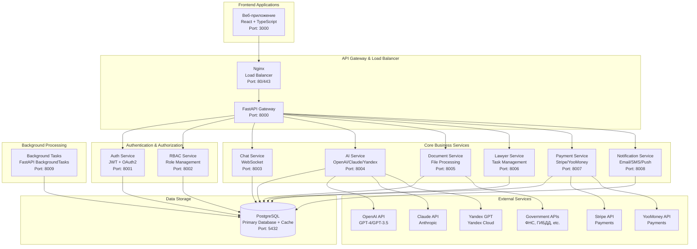
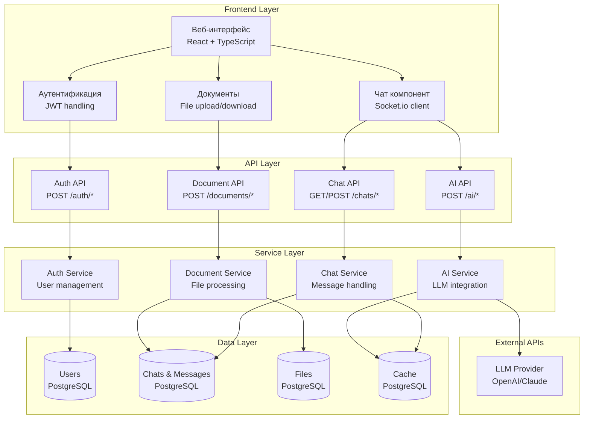
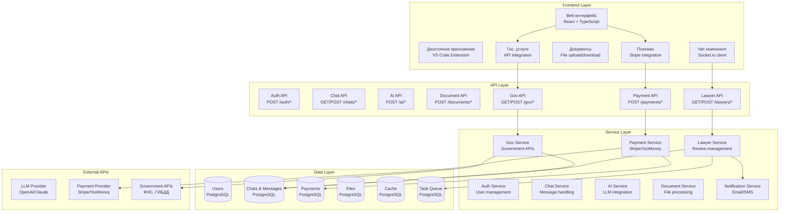
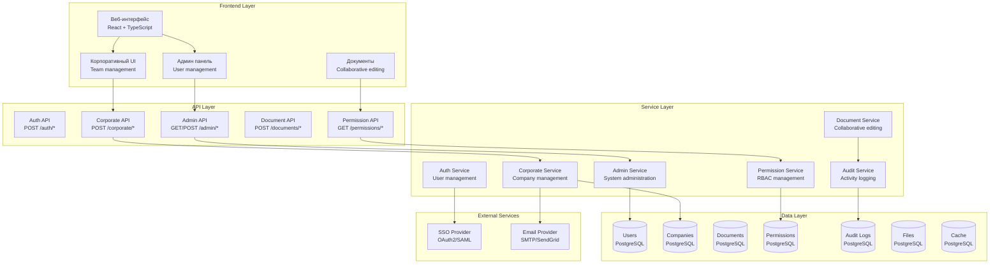

# UML Диаграмма компонентов - Юридический сервис с ИИ

## Диаграмма компонентов системы

## Детальная диаграмма компонентов (Фаза 1 - MVP)

## Диаграмма компонентов (Фаза 2 - Расширенный функционал)

## Диаграмма компонентов (Фаза 3 - Корпоративные функции)

