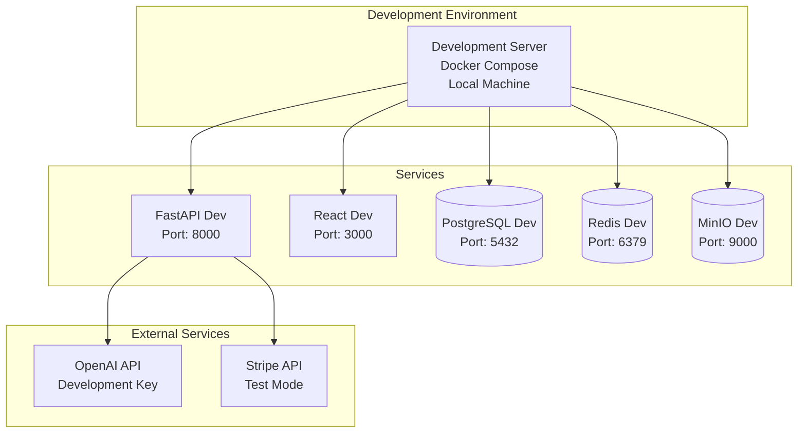
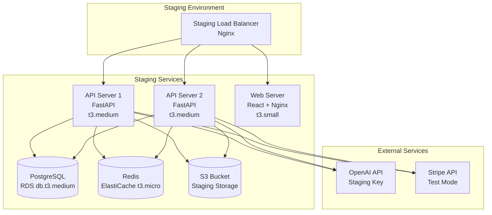

# UML Диаграмма развертывания - Юридический сервис с ИИ

## Диаграмма развертывания (Production)

```mermaid
graph TB
    subgraph "CDN & Load Balancer"
        Cloudflare[Cloudflare CDN<br/>Global Distribution]
        ALB[AWS Application Load Balancer<br/>Health Checks]
    end

    subgraph "Web Tier"
        WebServer1[Web Server 1<br/>Nginx + React<br/>t3.large]
        WebServer2[Web Server 2<br/>Nginx + React<br/>t3.large]
        WebServer3[Web Server 3<br/>Nginx + React<br/>t3.large]
    end

    subgraph "API Tier"
        APIServer1[API Server 1<br/>FastAPI + Python<br/>c5.2xlarge]
        APIServer2[API Server 2<br/>FastAPI + Python<br/>c5.2xlarge]
        APIServer3[API Server 3<br/>FastAPI + Python<br/>c5.2xlarge]
    end

    subgraph "Service Tier"
        ChatService1[Chat Service 1<br/>WebSocket + Redis<br/>c5.xlarge]
        ChatService2[Chat Service 2<br/>WebSocket + Redis<br/>c5.xlarge]
        AIService1[AI Service 1<br/>LLM Integration<br/>g4dn.xlarge]
        AIService2[AI Service 2<br/>LLM Integration<br/>g4dn.xlarge]
        DocumentService1[Document Service 1<br/>File Processing<br/>c5.xlarge]
        DocumentService2[Document Service 2<br/>File Processing<br/>c5.xlarge]
    end

    subgraph "Data Tier"
        DBMaster[(PostgreSQL Master<br/>RDS db.r5.2xlarge)]
        DBSlave1[(PostgreSQL Slave 1<br/>RDS db.r5.xlarge)]
        DBSlave2[(PostgreSQL Slave 2<br/>RDS db.r5.xlarge)]
        RedisCluster1[(Redis Cluster 1<br/>ElastiCache r5.large)]
        RedisCluster2[(Redis Cluster 2<br/>ElastiCache r5.large)]
        RedisCluster3[(Redis Cluster 3<br/>ElastiCache r5.large)]
    end

    subgraph "Storage Tier"
        S3Bucket[(S3 Bucket<br/>Document Storage)]
        EFSVolume[(EFS Volume<br/>Shared File System)]
    end

    subgraph "Monitoring Tier"
        PrometheusServer[Prometheus<br/>Metrics Collection<br/>t3.medium]
        GrafanaServer[Grafana<br/>Dashboards<br/>t3.medium]
        ELKServer[ELK Stack<br/>Logging<br/>r5.large]
    end

    subgraph "Background Processing"
        CeleryWorker1[Celery Worker 1<br/>Task Processing<br/>c5.large]
        CeleryWorker2[Celery Worker 2<br/>Task Processing<br/>c5.large]
        CeleryWorker3[Celery Worker 3<br/>Task Processing<br/>c5.large]
    end

    %% CDN connections
    Cloudflare --> ALB
    ALB --> WebServer1
    ALB --> WebServer2
    ALB --> WebServer3

    %% Web to API connections
    WebServer1 --> APIServer1
    WebServer1 --> APIServer2
    WebServer1 --> APIServer3
    WebServer2 --> APIServer1
    WebServer2 --> APIServer2
    WebServer2 --> APIServer3
    WebServer3 --> APIServer1
    WebServer3 --> APIServer2
    WebServer3 --> APIServer3

    %% Service connections
    APIServer1 --> ChatService1
    APIServer1 --> ChatService2
    APIServer1 --> AIService1
    APIServer1 --> AIService2
    APIServer1 --> DocumentService1
    APIServer1 --> DocumentService2

    APIServer2 --> ChatService1
    APIServer2 --> ChatService2
    APIServer2 --> AIService1
    APIServer2 --> AIService2
    APIServer2 --> DocumentService1
    APIServer2 --> DocumentService2

    APIServer3 --> ChatService1
    APIServer3 --> ChatService2
    APIServer3 --> AIService1
    APIServer3 --> AIService2
    APIServer3 --> DocumentService1
    APIServer3 --> DocumentService2

    %% Database connections
    ChatService1 --> DBMaster
    ChatService1 --> RedisCluster1
    ChatService2 --> DBMaster
    ChatService2 --> RedisCluster2
    AIService1 --> DBMaster
    AIService1 --> RedisCluster3
    AIService2 --> DBMaster
    AIService2 --> RedisCluster1
    DocumentService1 --> DBMaster
    DocumentService1 --> S3Bucket
    DocumentService2 --> DBMaster
    DocumentService2 --> S3Bucket

    %% Read replicas
    ChatService1 --> DBSlave1
    ChatService2 --> DBSlave2
    AIService1 --> DBSlave1
    AIService2 --> DBSlave2

    %% Background processing
    CeleryWorker1 --> DBMaster
    CeleryWorker1 --> RedisCluster1
    CeleryWorker2 --> DBMaster
    CeleryWorker2 --> RedisCluster2
    CeleryWorker3 --> DBMaster
    CeleryWorker3 --> RedisCluster3

    %% Monitoring
    PrometheusServer --> APIServer1
    PrometheusServer --> APIServer2
    PrometheusServer --> APIServer3
    PrometheusServer --> ChatService1
    PrometheusServer --> ChatService2
    PrometheusServer --> AIService1
    PrometheusServer --> AIService2
    GrafanaServer --> PrometheusServer
    ELKServer --> APIServer1
    ELKServer --> APIServer2
    ELKServer --> APIServer3
```



## Диаграмма развертывания (Development)



## Диаграмма развертывания (Staging)



## Конфигурация инфраструктуры

### AWS Infrastructure

#### Compute Resources
```yaml
# EC2 Instances
Web Servers:
  - Instance Type: t3.large (2 vCPU, 8 GB RAM)
  - Count: 3 (Auto Scaling Group)
  - OS: Amazon Linux 2
  - Purpose: Serve React application

API Servers:
  - Instance Type: c5.2xlarge (8 vCPU, 16 GB RAM)
  - Count: 3 (Auto Scaling Group)
  - OS: Amazon Linux 2
  - Purpose: FastAPI backend services

AI Service:
  - Instance Type: g4dn.xlarge (4 vCPU, 16 GB RAM, GPU)
  - Count: 2 (Auto Scaling Group)
  - OS: Amazon Linux 2
  - Purpose: AI model inference

Chat Service:
  - Instance Type: c5.xlarge (4 vCPU, 8 GB RAM)
  - Count: 2 (Auto Scaling Group)
  - OS: Amazon Linux 2
  - Purpose: WebSocket connections

Document Service:
  - Instance Type: c5.xlarge (4 vCPU, 8 GB RAM)
  - Count: 2 (Auto Scaling Group)
  - OS: Amazon Linux 2
  - Purpose: File processing
```

#### Database Resources
```yaml
# RDS PostgreSQL
Primary Database:
  - Instance Type: db.r5.2xlarge (8 vCPU, 64 GB RAM)
  - Storage: 1 TB GP3 SSD
  - Multi-AZ: Enabled
  - Backup: Automated daily

Read Replicas:
  - Instance Type: db.r5.xlarge (4 vCPU, 32 GB RAM)
  - Count: 2
  - Purpose: Read operations

# ElastiCache Redis
Redis Cluster:
  - Instance Type: cache.r5.large (2 vCPU, 16 GB RAM)
  - Count: 3 (Cluster mode)
  - Purpose: Caching and queues
```

#### Storage Resources
```yaml
# S3 Buckets
Document Storage:
  - Bucket: legal-ai-documents-prod
  - Storage Class: Standard-IA
  - Lifecycle: Move to Glacier after 90 days
  - Encryption: SSE-S3

Backup Storage:
  - Bucket: legal-ai-backups-prod
  - Storage Class: Standard
  - Lifecycle: Move to Glacier after 30 days
  - Encryption: SSE-S3

# EFS File System
Shared Storage:
  - Storage Class: General Purpose
  - Throughput Mode: Provisioned
  - Encryption: At rest and in transit
```

### Kubernetes Configuration (Alternative)

```yaml
# Namespace
apiVersion: v1
kind: Namespace
metadata:
  name: legal-ai-prod

---
# API Deployment
apiVersion: apps/v1
kind: Deployment
metadata:
  name: api-server
  namespace: legal-ai-prod
spec:
  replicas: 3
  selector:
    matchLabels:
      app: api-server
  template:
    metadata:
      labels:
        app: api-server
    spec:
      containers:
      - name: api
        image: legal-ai/api:latest
        ports:
        - containerPort: 8000
        resources:
          requests:
            memory: "4Gi"
            cpu: "2"
          limits:
            memory: "8Gi"
            cpu: "4"
        env:
        - name: DATABASE_URL
          valueFrom:
            secretKeyRef:
              name: db-secret
              key: url
        - name: REDIS_URL
          valueFrom:
            secretKeyRef:
              name: redis-secret
              key: url

---
# Service
apiVersion: v1
kind: Service
metadata:
  name: api-service
  namespace: legal-ai-prod
spec:
  selector:
    app: api-server
  ports:
  - port: 80
    targetPort: 8000
  type: LoadBalancer
```

### Docker Configuration

```dockerfile
# API Server Dockerfile
FROM python:3.11-slim

WORKDIR /app

# Install system dependencies
RUN apt-get update && apt-get install -y \
    gcc \
    g++ \
    && rm -rf /var/lib/apt/lists/*

# Install Python dependencies
COPY requirements.txt .
RUN pip install --no-cache-dir -r requirements.txt

# Copy application code
COPY . .

# Expose port
EXPOSE 8000

# Run application
CMD ["uvicorn", "main:app", "--host", "0.0.0.0", "--port", "8000"]
```

```yaml
# docker-compose.yml (Development)
version: '3.8'

services:
  api:
    build: ./backend
    ports:
      - "8000:8000"
    environment:
      - DATABASE_URL=postgresql://user:password@db:5432/legal_ai
      - REDIS_URL=redis://redis:6379
    depends_on:
      - db
      - redis

  web:
    build: ./frontend
    ports:
      - "3000:3000"
    environment:
      - REACT_APP_API_URL=http://localhost:8000

  db:
    image: postgres:15
    environment:
      - POSTGRES_DB=legal_ai
      - POSTGRES_USER=user
      - POSTGRES_PASSWORD=password
    ports:
      - "5432:5432"
    volumes:
      - postgres_data:/var/lib/postgresql/data

  redis:
    image: redis:7-alpine
    ports:
      - "6379:6379"

  minio:
    image: minio/minio
    ports:
      - "9000:9000"
      - "9001:9001"
    environment:
      - MINIO_ROOT_USER=minioadmin
      - MINIO_ROOT_PASSWORD=minioadmin
    command: server /data --console-address ":9001"
    volumes:
      - minio_data:/data

volumes:
  postgres_data:
  minio_data:
```

## Мониторинг и логирование

### Prometheus Configuration
```yaml
# prometheus.yml
global:
  scrape_interval: 15s

scrape_configs:
  - job_name: 'api-servers'
    static_configs:
      - targets: ['api-server-1:8000', 'api-server-2:8000', 'api-server-3:8000']
    metrics_path: '/metrics'

  - job_name: 'chat-services'
    static_configs:
      - targets: ['chat-service-1:8003', 'chat-service-2:8003']
    metrics_path: '/metrics'

  - job_name: 'ai-services'
    static_configs:
      - targets: ['ai-service-1:8004', 'ai-service-2:8004']
    metrics_path: '/metrics'
```

### Grafana Dashboards
```json
{
  "dashboard": {
    "title": "Legal AI Service Metrics",
    "panels": [
      {
        "title": "API Response Time",
        "type": "graph",
        "targets": [
          {
            "expr": "histogram_quantile(0.95, rate(http_request_duration_seconds_bucket[5m]))"
          }
        ]
      },
      {
        "title": "Active Users",
        "type": "stat",
        "targets": [
          {
            "expr": "sum(active_users_total)"
          }
        ]
      },
      {
        "title": "AI Requests per Second",
        "type": "graph",
        "targets": [
          {
            "expr": "rate(ai_requests_total[5m])"
          }
        ]
      }
    ]
  }
}
```

## Безопасность инфраструктуры

### Network Security
```yaml
# Security Groups
API Security Group:
  - Inbound: 443 (HTTPS) from ALB
  - Inbound: 22 (SSH) from Bastion
  - Outbound: All traffic

Database Security Group:
  - Inbound: 5432 (PostgreSQL) from API servers
  - Inbound: 6379 (Redis) from API servers
  - Outbound: None

Web Security Group:
  - Inbound: 80 (HTTP) from ALB
  - Inbound: 443 (HTTPS) from ALB
  - Outbound: All traffic
```

### IAM Policies
```json
{
  "Version": "2012-10-17",
  "Statement": [
    {
      "Effect": "Allow",
      "Action": [
        "s3:GetObject",
        "s3:PutObject",
        "s3:DeleteObject"
      ],
      "Resource": "arn:aws:s3:::legal-ai-documents-prod/*"
    },
    {
      "Effect": "Allow",
      "Action": [
        "rds:DescribeDBInstances",
        "rds:DescribeDBClusters"
      ],
      "Resource": "*"
    }
  ]
}
```

