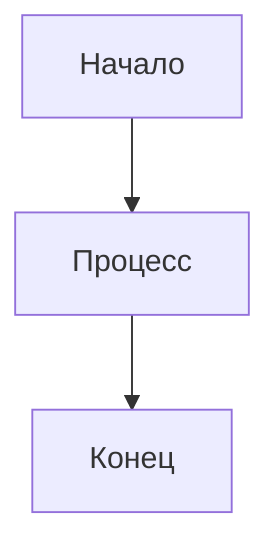
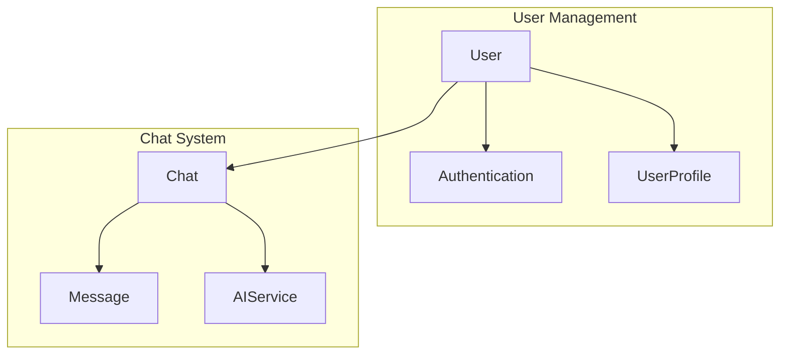

# Визуализация UML диаграмм - Юридический сервис с ИИ

## Обзор

Данный документ содержит инструкции по преобразованию Mermaid диаграмм в изображения для лучшей визуализации, при этом сохраняя текстовый формат для версионирования и редактирования.

## Способы визуализации Mermaid диаграмм

### 1. Онлайн Mermaid Live Editor

**URL**: https://mermaid.live/

**Как использовать**:
1. Скопируйте код диаграммы из документации
2. Вставьте в левую панель редактора
3. Изображение автоматически генерируется в правой панели
4. Экспортируйте в PNG, SVG или PDF

**Преимущества**:
- Бесплатно
- Не требует установки
- Поддерживает все типы диаграмм
- Возможность настройки темы

### 2. GitHub/GitLab встроенная поддержка

**GitHub**:
```markdown

```

**GitLab**:
```markdown

```

**Преимущества**:
- Автоматическое отображение в репозитории
- Версионирование вместе с кодом
- Не требует дополнительных инструментов

### 3. VS Code расширения

#### Mermaid Preview
**Установка**: `bierner.markdown-mermaid`

**Использование**:
1. Откройте .md файл с Mermaid диаграммой
2. Нажмите Ctrl+Shift+V для предварительного просмотра
3. Диаграмма отобразится как изображение

#### Mermaid Diagram Viewer
**Установка**: `tomoyukim.vscode-mermaid-editor`

**Использование**:
1. Создайте файл с расширением .mmd
2. Напишите код диаграммы
3. Автоматическое отображение в реальном времени

### 4. Локальные инструменты

#### Mermaid CLI
**Установка**:
```bash
npm install -g @mermaid-js/mermaid-cli
```

**Использование**:
```bash
# Конвертация в PNG
mmdc -i input.mmd -o output.png

# Конвертация в SVG
mmdc -i input.mmd -o output.svg

# Конвертация в PDF
mmdc -i input.mmd -o output.pdf
```

#### Python библиотека
**Установка**:
```bash
pip install mermaid-cli
```

**Использование**:
```python
import mermaid_cli

# Конвертация файла
mermaid_cli.main(['-i', 'input.mmd', '-o', 'output.png'])
```

## Структура файлов для диаграмм

### Рекомендуемая структура:
```
docs/
├── uml/
│   ├── diagrams/
│   │   ├── class-diagram.mmd
│   │   ├── sequence-diagram.mmd
│   │   ├── component-diagram.mmd
│   │   └── architecture-diagram.mmd
│   ├── images/
│   │   ├── class-diagram.png
│   │   ├── sequence-diagram.png
│   │   ├── component-diagram.png
│   │   └── architecture-diagram.png
│   └── README.md
```

### Пример файла .mmd:


## Автоматизация генерации изображений

### GitHub Actions workflow
```yaml
# .github/workflows/generate-diagrams.yml
name: Generate UML Diagrams

on:
  push:
    paths:
      - 'docs/uml/diagrams/**'
  pull_request:
    paths:
      - 'docs/uml/diagrams/**'

jobs:
  generate-diagrams:
    runs-on: ubuntu-latest
    steps:
      - uses: actions/checkout@v3
      
      - name: Setup Node.js
        uses: actions/setup-node@v3
        with:
          node-version: '18'
          
      - name: Install Mermaid CLI
        run: npm install -g @mermaid-js/mermaid-cli
        
      - name: Generate diagrams
        run: |
          for file in docs/uml/diagrams/*.mmd; do
            filename=$(basename "$file" .mmd)
            mmdc -i "$file" -o "docs/uml/images/$filename.png"
          done
          
      - name: Commit generated images
        run: |
          git config --local user.email "action@github.com"
          git config --local user.name "GitHub Action"
          git add docs/uml/images/
          git commit -m "Update UML diagram images" || exit 0
          git push
```

### Локальный скрипт
```bash
#!/bin/bash
# scripts/generate-diagrams.sh

# Установка зависимостей
npm install -g @mermaid-js/mermaid-cli

# Создание директории для изображений
mkdir -p docs/uml/images

# Генерация изображений
for file in docs/uml/diagrams/*.mmd; do
    if [ -f "$file" ]; then
        filename=$(basename "$file" .mmd)
        echo "Generating $filename.png..."
        mmdc -i "$file" -o "docs/uml/images/$filename.png"
    fi
done

echo "All diagrams generated successfully!"
```

## Интеграция с документацией

### Включение изображений в README.md
```markdown
# Архитектура системы

## Диаграмма классов


## Диаграмма последовательности


## Диаграмма компонентов

```

### Ссылки на исходный код
```markdown
## Исходный код диаграмм

- [Диаграмма классов](docs/uml/diagrams/class-diagram.mmd)
- [Диаграмма последовательности](docs/uml/diagrams/sequence-diagram.mmd)
- [Диаграмма компонентов](docs/uml/diagrams/component-diagram.mmd)
```

## Настройка стилей

### Темы Mermaid


### Доступные темы:
- `default` - стандартная тема
- `forest` - зеленая тема
- `dark` - темная тема
- `neutral` - нейтральная тема

### Настройка цветов
```mermaid
graph TB
    A[Начало]:::start --> B[Процесс]:::process
    B --> C[Конец]:::end
    
    classDef start fill:#e1f5fe
    classDef process fill:#f3e5f5
    classDef end fill:#e8f5e8
```

## Рекомендации

### Для разработчиков:
1. **Храните исходный код** диаграмм в .mmd файлах
2. **Используйте версионирование** для отслеживания изменений
3. **Автоматизируйте генерацию** изображений
4. **Документируйте изменения** в диаграммах

### Для команды:
1. **Согласуйте стиль** диаграмм
2. **Используйте единую терминологию**
3. **Регулярно обновляйте** диаграммы
4. **Проводите ревью** изменений

### Для документации:
1. **Включайте изображения** в README
2. **Ссылайтесь на исходный код**
3. **Обновляйте диаграммы** при изменении архитектуры
4. **Используйте понятные названия** файлов

## Заключение

Данный подход позволяет:
- ✅ Сохранить текстовый формат для версионирования
- ✅ Генерировать качественные изображения
- ✅ Автоматизировать процесс обновления
- ✅ Интегрировать диаграммы в документацию
- ✅ Обеспечить единообразие стиля

Рекомендуется использовать комбинацию GitHub Actions для автоматической генерации и локальных инструментов для разработки.

