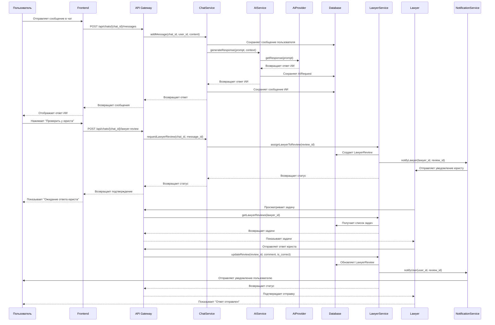
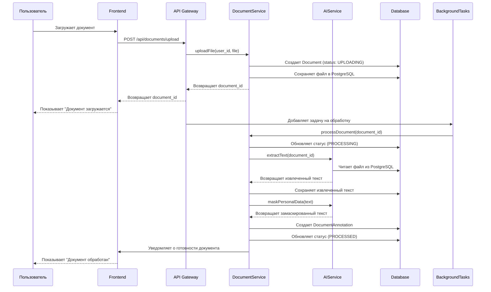
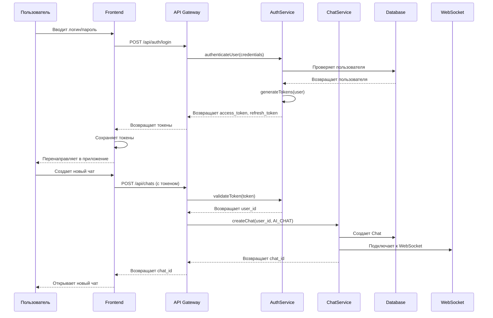
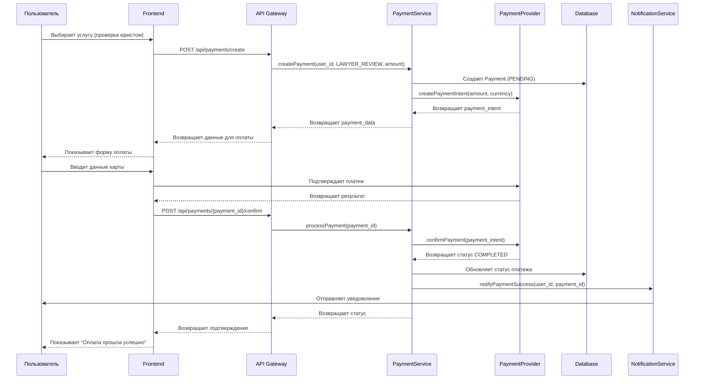
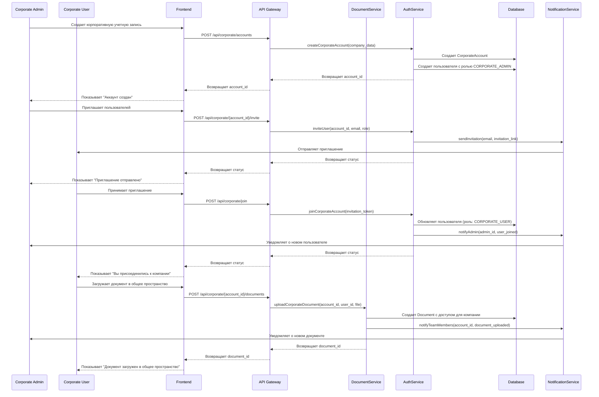
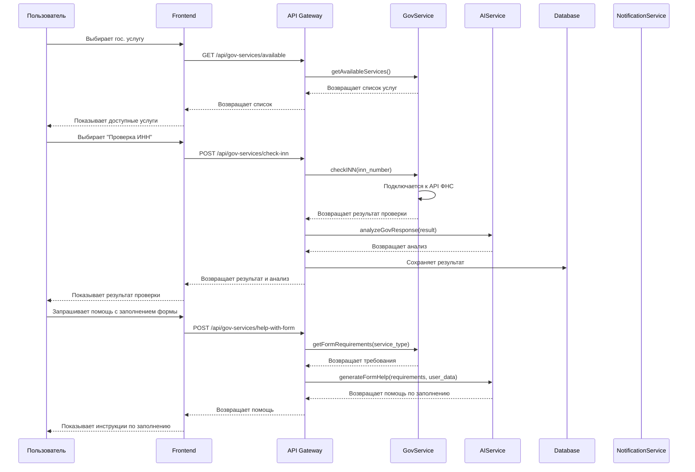

# UML Диаграммы последовательности - Юридический сервис с ИИ

## 1. Сценарий: Чат с ИИ и запрос проверки юристом

## 2. Сценарий: Загрузка и обработка документа

## 3. Сценарий: Аутентификация и создание чата

## 4. Сценарий: Платеж и подписка

## 5. Сценарий: Корпоративная работа с документами (Фаза 3)

## 6. Сценарий: Интеграция с гос. услугами (Фаза 2)

## Приоритеты реализации

### Фаза 1 (MVP) - 6-8 месяцев
- ✅ Сценарий 1: Чат с ИИ и запрос проверки юристом (веб-интерфейс)
- ✅ Сценарий 3: Аутентификация и создание чата (веб-интерфейс)
- ✅ Сценарий 2: Загрузка и обработка документа (базовая версия, веб-интерфейс)

### Фаза 2 - 4-5 месяцев
- 🔄 Десктопное приложение (VS Code Extension)
- 🔄 Сценарий 4: Платеж и подписка
- 🔄 Сценарий 6: Интеграция с гос. услугами
- 🔄 Расширенная обработка документов

### Фаза 3 - 3-4 месяца
- ⏳ Сценарий 5: Корпоративная работа с документами
- ⏳ Расширенная система ролей и доступа
- ⏳ Командная работа с документами
